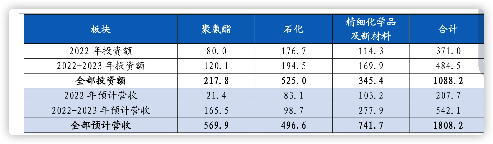
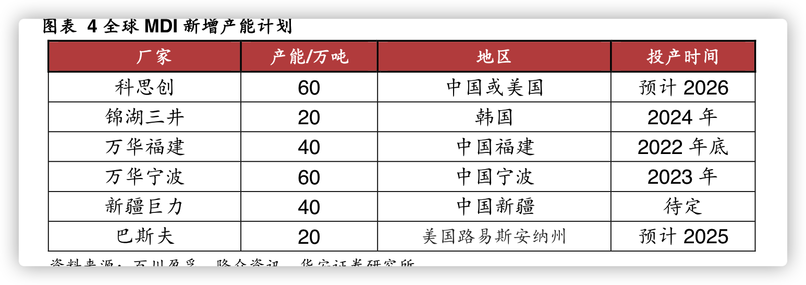
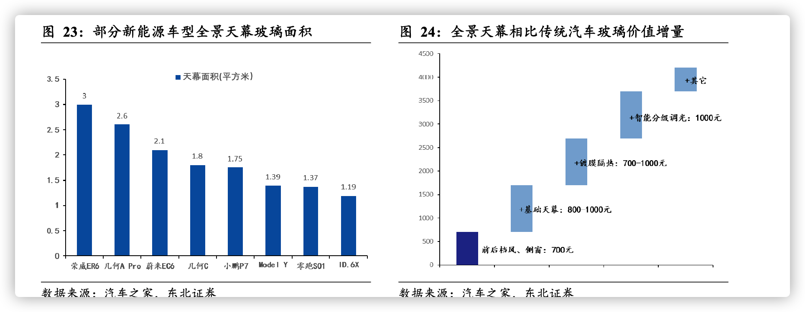

## 协鑫
掌握颗粒硅量产技术，迈入万吨级产能规模。公司未来规划徐州 10 万吨、
乐山 10 万吨以及包头 30 万吨颗粒硅产能。预计 21-22 年公司颗粒硅产
能可达 3/26 万吨，实现大幅提升。颗粒硅产能规模的扩大助力公司具备
规模优势，生产成本有望进一步降低，盈利能力有望逐步提升

目前生产 1 千克颗粒硅耗电
仅 18 度，相较于西门子法 60 度/千克有显著下降；水耗氢耗方面，FBR
方法较西门子法降低 30%/42%。投资方面，颗粒硅每万吨产能仅需要 7
亿初始投资，相较西门子法可降低 1.5-2 亿元，具备成本优势。   

## 甜味剂
与其他糖醇类产品相比，赤藓糖醇不被人体代谢，因此几乎不产生热量，也不引起血糖变化，是正宗的“零热量”天然甜味剂；另外，赤藓糖醇物理属性优异，耐热性较好，性质稳定，易于添加存储，综合优势鲜明突出，获得市场青睐
唯独赤藓糖醇直接通过小肠进入肾脏被尿液排出人体，因此是各糖醇类中人体耐受度最高的低倍甜味剂，
赤藓糖醇生产是在葡萄糖的基础上，接入菌种、添加发酵培养基进行深层发酵，然后经过净化提纯所得。赤藓糖醇是天然零热量的甜味剂，木糖醇是有热量的

抗性糊精由淀粉加工而成，是将焙烤糊精的难消化成分用工业技术提取处理并精炼而成的一种低热量葡聚糖，属于低分子水溶性膳食纤维。作为一种低热量可溶性食品原料，在食品工业中具有的广阔的发展前景。

纯天然甜味剂代糖产品中,赤藓糖醇采用发酵生产, 它溶解于水中时具有吸热效果，溶解度较低、易结晶，所以入口具有清凉感，更适合清爽型的饮料当中。 而阿洛酮糖采用生物法制备,它可以抑制人体血糖的快速升高，调节血糖等有益人体健康的特殊功能，更适合烘培类产品、医药等领域。

阿洛酮糖是一种新型甜味剂，具有降血糖、低热量等优异性能，

化学合成糖目前最好的解决方案是三氯蔗糖，植物提取糖目前最好的解决方案是甜菊糖苷，在生物发酵糖里面目前在国内的解决方案是赤藓糖醇，在海外的解决方案是阿洛酮糖，
 

木糖醇難以被口腔中的細菌分解產生酸性物質，因此不易引起蛀牙，木糖醇代謝時不需要胰島素就可直接進入細胞，並不會引起血糖飆高，糖尿病病人可做為蔗糖替代品，但仍會產生熱量，所以不可過量攝取。

聚葡萄糖和抗性糊精均为可溶性膳食纤维
蛋白质、脂肪、碳水化合物、维生素、矿物质与水并列
可溶性膳食纤维由于具有良好的溶解性，无异味，受到广大食品加工企业追捧，作为增稠剂、乳化剂等运用于食品饮料中

功能与加工性更出众的可溶膳食纤维。抗性糊精是低热量葡聚 糖的一种新型式，是一种重要低分子、非黏性水溶性膳食纤维。由于结构 中存在α-1,2，α-1,3，α-1,6 键，不能被体内的消化酶所分解，在消化道 内也不会被小肠吸收消化，可以直接进入大肠，被大肠内益生菌发酵，作 为膳食纤维发挥各种生理作用。

益生元是指能够选择性地促进肠道内原有的一种或多种有益细菌（益生菌）生长繁殖和/或增加碳水化合物代谢的物质，主要包括各类功能性低聚糖。常见的益生元包括低聚果糖、低聚半乳糖、菊粉、低聚木糖和低聚异麦芽糖等，不同产品物化性能及生理功能有所差异

## 光伏 TCL

目前市场没有认可中环通过使用低等级便宜硅料、提高生产效率来提升利润率的逻辑，对中环Q4业绩预期不高

如果考虑硅片业务技术研发投入已经进入成熟期，而半导体硅片业务（12英寸、IOS硅片、碳化硅等新业务）、组件与电池业务（叠瓦，电池，XBC等）尚处于研发投入高速增长期。

中环210P现有最新客户：晶科（已经上升到第一大客户）、协鑫、东方日升、天合、通威、晶澳等。
其一基于在硅料涨价背景下对供应安全的应对性需求；其二是出于“先抢地，再耕田”的战略性行为；其三是大尺寸硅片呈确定性趋势，硅片产能仍面临结构性供应不足。

## 碳纤维

ZT7、ZT8、ZT9 系列和高模型 M40J 级、M40X 级石墨纤维工程产业化 能力，其中 ZT7 系列产品已正式进入稳定的批量生产阶段，打破了国外对高性能碳 纤维的封锁和限制。公司现已成为国内航空航天领域 ZT7 系列碳纤维产品的批量稳 定供应商。未来，公司将通过自有核心技术改进 ZT9 系列高强度碳纤维产品性能， 攻关 M65J 级高模量石墨纤维等新一代国产碳纤维批量稳定制备技术，同时扩充高 性能碳纤维产能，

## 万科
2021 年公司地产业务收入增速为 7.36%，物业业务 32.1%，物流仓储业务68.9%，商业开发运营业务 20.6%，长租公寓业务 13.9%，多元化布局已初现规模，将成为公司未来发展新的利润蓄水池和增长点

住宅物业服务：作为公司住宅物业服务板块，公司主要以万科物业为品牌提供基础物业服务，主要包括向住宅物业业主或住户提供的清洁服务、秩序维护服务、园艺服务及维修及保养服务。

房屋再装修及美居服务

以 2021 年的业绩来看，万科地产业务收入
同比增长 7.36%，物业业务增速 32.1%，物流仓储业务增速 68.9%，商业开发运营
业务增速 20.6%，长租公寓业务增速 13.9%

### 奥瑞金
2023 年观察青岛啤酒灌装投产后的利润 以及大宗价格下降

### 万华化学

按照 2022年平均价格计算，如果万华化学现有规划项目全部如期投产，预计 2022年将新增营收 208亿元，2022-2023年投产项目将新增年营收累计 542亿元，全部项目均投产后将新增营收 1808亿元。

公司依托自身强大的研发实力和产业链一体化优势，全面进入新能源、营养品、高端国产替代等领域，在抛光液和抛光垫等半导体材料、三元材料和磷酸铁锂等电池材料、PBAT 和PLA 等可降解材料POE 等高端聚烯烃材料、柠檬醛衍生物等材料均有规划布局，根据公司新材料投产进度，尼龙12 已经于近期投产，HDI、柠檬醛及衍生物、顺酐、新增PC、磷酸铁锂等预计2023 年相继投产，POE、PLA、NMP、新增PMMA、聚醚胺等预计2024 年相继投产。站在当前时间节点，新材料板块已经进入快速发展期。根据我们的预测，2022-2024 新材料板块主要项目建成投产后，新增年化营业收入贡献能够达到521.45 亿，未来3 年新材料营收保持60%
MDI有以下特点 1. 行业集中度高 2.未来2年只有万华扩产 3. 欧洲设备老化 检修影响价格

聚合MDI 下游应用中47%用于家电冰柜保温材料中，
是聚合MDI 下游最大的应用领域，24%用于建筑相关领域，包括建筑板材，建筑涂
料等；10%用于胶粘剂中，而胶粘剂下游主要也是用于基建施工，家用包装，建筑制
品等领域，和建筑领域息息相关；6%用于汽车领域，受益于汽车轻量化的需求带动，
聚氨酯材料在汽车结构配件中的应用愈加广泛

下游主要用于生
产软质聚氨酯泡沫及聚氨酯弹性体、涂料、胶黏剂。TDI 下游 70%用于软泡领域，
主要包括海绵类产品，用于坐垫，沙发等家居领域；20%以涂料固化剂的形式用于涂
料中，用于建筑、汽车、电子电器等领域；其余 5%用于胶粘剂中，5%用于弹性体
中使用，TDI 行业景气度和下游家居、汽车、建筑等传统制造业景气度息息相关。

### 福耀玻璃
着汽车智能化程度不断提升，预计科
技功能的渗透率从2021年的5%提升至2026年的30%以上，随着技术的进步，HUD和其
他科技的成本逐渐下降，而天幕处于发展初期，随着科技含量的提升，价格也将持续
增长。在多方因素的作用下，预计2026年汽车玻璃的市场规模将达421.1亿元，年复
合增长率为14.3%
 

三季度公司天幕玻璃、HUD 玻璃等高附加
值产品占比由 5.7%提升至 43.8%。Q3 天然气价格仍处于高位，纯
碱、海运费等成本项目呈现企稳回落趋势，公司综合毛利率为
34.9%，环比增长2.3pct，修复明显。

8 月 30 日公司公
告将对美国福耀增加投资 6.5 亿美元，其中 3 亿用于投资建设镀膜、
钢化夹层边窗生产线；3.5 亿用于建设一窑两线用于生产浮法玻璃、
以及 4 条太阳能背板玻璃加工线和配套厂房。同时，公司在郑州规划
500 亩左右用地，用于未来发展所需。公司新一轮扩产周期开启，以应对全球化的深入以及玻璃量价齐升的需求。

海外业务：三季度SAM收入环比降低15%，亏损环比扩大
360万欧元，主要系欧洲汽车业受供应链扰动影响+天然气与电价格上涨。

汽玻市场空间扩容，天幕玻璃、调光玻璃、HUD 显示玻璃等高附加值汽玻
增量加速兑现。根据测算，2020 年天幕玻璃在新能源车中渗透率约 16.4%，
2021 年增长至 23.5%，天幕玻璃渗透率快速提升

铝饰条业务，德国 SAM 整合接近尾声，国内铝饰条产能布局稳步推进。
目前 SAM 已从原 11 个工厂整合到 2 个生产工厂+1 个备用工厂，硬件改
造到位，新 ERP 系统上线，虽然当前还处于亏损状态但在逐步向好。国
内产能方面，长春工厂两条铝饰条产线已完成建设，预计 2023 年陆续会
有产品交付；此外福清第二条铝饰条产线的扩建工作正在进行，苏州工
厂计划 2023 年开始建设，预计到 2023 年底或 2024 年初，国内会形成 6
条铝饰条生产线的产业布局，成为未来福耀营收的新增长极

2021 年，福耀的全景
天幕玻璃、可调光玻璃、抬头显示玻璃、镀膜可加热玻璃等高附加值产品占比持续提升，同比提升 3.31 个百分点，价值得以体现。据测算，福耀 2021 年汽玻 ASP 为
181 元/平米，较 2020 年提升 7 元/平米。而 2022 年 H1，福耀汽玻 ASP 预期同比增
长 11.6%，单价达到 200 元/平米左右

性价比方面，全景天幕为不可开启式设计，摒弃了
滑动天窗所需的中控驱动、排水系统等复杂结构件，同时避免出现失控、漏水等现
象，较传统天窗有更高的性价比。

幕玻璃的夹层特性，叠加福耀生产关的严格把控，并不会降低车辆安全性能。福
耀生产的全景天幕均采用夹层玻璃，其中夹层材料 PVB 膜具有高粘性特点，比钢化
玻璃具有更高的抗冲击强度。并且在受到外力冲击时，能有效防止玻璃碎片飞溅。
生产方面，福耀进行严格的质量测试，能够保证天幕玻璃在静止状态下可以承受
40MPa 的应力

福耀成功将镀膜隔热、智能调光、LOW-E 隔热三大技术集成于超大玻璃天
幕上，推出“福耀智能全景天幕”，在实现超大视野享受与极佳采光效果的同时，还
能调节光线透过，防晒隔热，减少车辆空调使用能耗，并具备隐私保护的效果，为
智能座舱的发展做出了贡献。

福耀通过特殊材料的印刷工艺，可以在天幕上个性化定制
图案，灯光在玻璃内传导后将图案反射至车内。另外，氛围灯还能与其他设备连接，
随着音乐节奏变换。在节能环保方面，福耀积极推进太阳能天幕的研发。全景天幕
面积大采光好，如果利用天幕将太阳能转化为电能，为车载电器提供电源，可以降
低油耗。福耀提出并设计了太阳能天幕的工作原理，通过在玻璃里加入太阳能电池
组实现能量转换，在未来值得关注。

HUD 加速迭代，W-HUD 成为当前市场主流，AR-HUD 蓄势待发
汽车网联化是未来发展趋势，福耀布局智能玻璃天线

`持续关注铝条饰品的放量`

### 安踏
2016 年，合资引
入 DESCENTE，定位中国高端体育服装，涉及滑雪、综训、跑步等，DESCENTE
已经成为品牌矩阵中新的增长点；2017 年，收购 Kolon Sport 中国经营权，定位为专
业户外（登山）运动，2022H1 流水增速超过 50%；2018 年，与多方财团斥资 371
亿元收购了 Amer  Sports ，并坐拥旗下的顶级户外及运动品牌 ARC'TERYX 、
SALOMON、WILSON 等，覆盖网球、羽毛球、高尔夫、高山滑雪、越野滑雪、滑板、
自行车、越野跑装备、徒步装备及潜水等多种运动项目。

### 奥瑞金

产能扩张落地，盈利结构优化。产能扩张方面，9 月份公司江门工厂
建成投产，自动化制罐生产线已进入产能爬坡期，规划年产能为二片
罐10 亿罐。公司对外延并购的波尔工厂持续进行产能整合与调整，
二片罐产能及产能利用率均有提升空间。随着二片罐业务的盈利增
长，公司盈利端对单一客户的依赖程度有望不断下降，盈利结构将优
化

二片罐方面，啤酒罐化率迎来加速提升期，驱动二片罐下游需求增加。二片罐下游需求以
啤酒为主，其次为碳酸饮料、茶饮料等，

### 晨光生物

赞比亚原料基地将落地叶黄素生产线，明年有望销售叶黄素产品。由于
国内万寿菊种植相较国外成本优势逐渐减弱，明年公司或将优先发展万
寿菊种植面积。赞比亚土地和人工成本低廉，就地生产销售将有力拉高
叶黄素利润水平。

甜菊糖：受益无糖、减糖产品发展，市场潜力巨大。公司上线新工艺，得率逐渐爬
坡至设计水平，同时取得的副产物绿原酸能够摊薄成本。今年甜叶菊产
量同比增长，目前采购工作正在进行，预计明年销量能够实现增长。

### 伊利股份

毛利率稳中有升，费用率拖累盈利表现。受销售费用
率拖累，公司 Q3 扣非归母净利率 5.6%,同比下滑 3.3pct。22Q3 毛利
率为 30.8%（+0.6pct），主要系公司控制买赠促销力度维持价盘稳
定，此外生鲜乳价格 Q3 同比小幅下行。22Q3 销售费用率
18.8%(+3.3pct)，主要系液奶事业部费用率提升以及部分综艺因疫情
影响延期至三季度进行播放 

### 格力电器

安为比亚迪新能源车热管理系统的稳定供应商，核心零部件已突破技术壁垒。盾安目
前已具备为各大新能源车企以及零部件厂商提供高质量产品的能力。目前盾安已与主流
新能源汽车主机厂（比亚迪、理想、蔚来、一汽等）、电池企业（宁德时代、微宏动力
等）、商用车企（宇通、中车等）建立良好合作关系，有望在新能源领域加速产业布局。
格力受让盾安股权之后，其控股子公司格力钛未来有望与盾安开展业务协同，拓展客户，
提升产能、充分发挥资金和产业的规模效应，扩大市场份额，提升格力在新能源领域的
市场优势，实现业务多元化。

### 乐普医疗

城乡居民疾病死亡构成比中心血管疾病占首位，
2020 年农村、城市心血管病死亡率分别为每十万人 135.88、126.91 人，随着老龄化
加速以及精准诊治推及，行业需求处于上行趋势，存在大量未被满足的临床需求，
创新优效的药物和医疗器械潜在市场空间巨大。

药品集采后公司加大器械创新投入，研发强度由此前的 6%左右提升至
2021 年 10%左右，其中 75%以上投入到器械中，以医疗器械收入作为分母则研发强度
超 15%。

随着老龄化加剧、基层市场扩容、集采降价驱动等，对标发达国家的
人均 PCI 例数仍有 2 倍的增长空间，有望达到 300 万例 PCI/年

### 制冷

，我国二代制冷剂作为非原料的产量和消费量已于2013年被冻结，2020年配额削减35%，2025年配额削减67.5%，2040
年以后将完全淘汰。而三代制冷剂2024 年冻结HFCs的消费和生产规模，自2029年才开始削减，因此未来较长一段时间，三代制冷剂将成为主
### 巨化股份

三制冷剂价格稳步上涨是大概率事件，三代制冷剂行业将迎来10年景气周期，这是巨化第一增长曲线

 有三代制冷剂利润后，巨化就会有更多的资源投入研发。高性能、高附加值氟化工高端产品将是巨化未来第二增长曲线

 全球氟化工有限公司在阿联酋氟2万吨134a已经基本建成。巨化拥有三代制冷剂全球最大份额，全球化也许是巨化未来第三增长曲线

 碳交易。2022年欧盟平均碳价预计为88欧元/吨，折合人民币650元。目前国内碳交易一吨58元，未来有十年有10-20倍的上涨空间。三代制冷剂巨化配额换算为碳当量估计5亿吨，三美2.7亿。这是未来的一个想象空间

 混改。8月份巨化股份控股母公司“巨化集团混改资产评估项目”中标公示，22年是混改的收官之年，以此推测，巨化集团混改正进行中

 
 
氟化液：经济社会数字化转型背景下的节能减排最优解 
冷却系统能耗占比为 43%，浸没式液冷技术成为必然选择

相比于传统冷却方式，浸没式液体冷却的优势显著。（1）节能降耗，相对于传
统风冷数据中心能耗降低 90%  ～  95%，降低  PUE  可大幅降低机房的运营成本。
（2）低噪无污染，无需使用风扇，最大限度减少噪声的污染，同时无需担心空气
中的灰尘对高洁净度要求器件的干扰。（3）节约空间，利用浸没式液冷的数据中心
冷却系统所占的空间体积可减小至风冷系统的  1  /3。（ 4）换热能力强，能够满足超
高热流密度器件的散热需

“巨芯冷却液”实现国产高性能氟化液突破，迈入产业化阶段
目前公司间接控股 95%的浙江创氟高科新材料有限公司计划投资 5.1 亿元规划建设 5000t/a
浸没式冷却液项目，产品适用于大数据中心换热所需的冷却介质及尖端产业、电子流体，计划三季度投运。其中一期 1000 吨/年项目已于 2022 年上半年基本建成。
目前，数据中心浸没式冷却液总市场规模达到3 万吨，2025 年有望达到 10 万吨级，
看好公司未来氟化液业务成长

综上，我们坚定看好三代制冷剂价格回暖带来的业绩增量以及巨化氟氯联动带
来的成本优势。同时公司布局含氟新材料，高附加值拉升公司毛利率中枢。预计公
司 2022-2024 年归母净利润分别为 19.25 、26.31 、32.44 亿元，同比增速为
+73.6%、+36.6%、+23.3%。

年报看下应该会超出预期。

配额制定进入尾声，制冷剂行业已进入拐点区间

三代制冷剂配额争夺将于2 0 2 2 年末结束，2 0 2 4 - 2 0 2 9 年的生产配额将依据2 0 2 0 - 2 0 2 2 年间各公司三代制冷剂销售
情况进行分配。

### 半导体

湿法刻蚀是较为原始的刻蚀技术，利用溶液与薄膜的化学反应去除薄膜未被保护
掩模覆盖的部分，从而达到刻蚀的目的。其反应产物必须是气体或可溶于刻蚀剂
的物质，否则会出现反应物沉淀的问题，影响刻蚀的正常进行。通常，使用湿法
刻蚀处理的材料包括硅，铝和二氧化硅等。

随着集成电路的发展，湿法刻蚀呈现出以下局限：不能运用 3 微米以下的图形；
湿法刻蚀为各向同性，容易导致刻蚀图形变形；液体化学品潜在的毒性和污染；
需要额外的冲洗和干燥步骤等

干法刻蚀技术的出现解决了湿法刻蚀面临的难题。干法刻蚀使用气体作为主要刻
蚀材料，不需要液体化学品冲洗。干法刻蚀主要分为等离子刻蚀，离子溅射刻蚀，
反应离子刻蚀三种，运用在不同的工艺步骤中

 等离子体刻蚀是将刻蚀气体电离，产生带电离子，分子，电子以及化学活性很
强的原子（分子）团，然后原子（分子）团会与待刻蚀材料反应，生成具有挥
发性的物质，并被真空设备抽气排出

### 潍柴动力
业务结构和盈利能力不断改善

积极拓展海外市场及战略新兴业务：1）海外市场开拓加速，22Q1-3 公司发动机/重卡整车出口分别同比+40%/+77%，其中 Q3 出口分别同比+60%/+125%，出口对公司的贡献逐渐放大。2）大缸径发动机增长强劲，22Q1-3 实现收入同比+75%，销量超 5000 台，同比+40%，单价继续提升，其中 Q3 实现收入同比+84%。3）上半年雷沃农机实现销量 7.6万台，同比+28%。8 月 30 日发布公告，拟对潍柴雷沃分拆上市，有利于协同本部发展，做强做大高端农业装备业务

1）受订单周期及欧美高通胀带来的供应链压力影响，凯傲 22Q3 出现亏损近 1 亿欧元，若剔除该影响，Q3 公司净利润同比增长超 10%，预计 Q4 起凯傲盈利能力将逐渐好转。中长期来看，到 2025年我国智能物流行业规模有望达万亿，5 年 CAGR 为 10.9%，前景广阔，凯傲+德马泰克的供应链整体解决方案有望助力公司持续增长。2）前瞻布局氢燃料电池产业链，持续积极推进新能源战略落地，有望在未来取得先发优势大缸径发动机应用领域广泛，
包括发电设备、5G 大型数据中心备用电源等工业动力，远洋捕捞、公务用艇及内河航运等船舶动力，以及其他大型机械等领域。

### 安琪酵母
中式面点发酵之外，我国
烘焙行业的扩容拉动酵母制品需求的增长。与发达国家相比，YE在我国食品鲜味剂中的
渗透率还有较大提升空间。而酶制剂、酵母替代蛋白等精深加工产品打开高值化蓝海

国内酵母业务需求刚性，竞争格局稳定，公司具备市场话语权，新一轮扩产扩大规
模领先优势，出海路径逐步清晰；提价、水解糖替代多措并举对冲成本压力，今明
年效果显现，叠加糖蜜价格稳中趋降，未来盈利能力更为稳健；立足酵母同心多元
化发展，在生物发酵、新型包材、动植物营养领域培育新增长曲线。

发酵蛋白：精深加工打开高值化蓝海

酶制剂是酵母产业高附加值延伸的重要方向。酶制剂是微生物发酵产生的具有催
化功能的蛋白质，具有催化效率高、专一性较高、作用条件温和、能耗较低、化学污
染少等优点，其应用领域遍布饮料（啤酒、葡萄酒、白酒、果汁等）、食品（面包烘
焙、制糖、乳品等）、纺织、饲料、洗涤剂、造纸、皮革、医药以及能源开发、环境
保护等方面

 在酵母衍生品领域，酵母提取物 YE 在食品鲜味剂中的渗透率还有较大
 YE 是天然的鲜味剂，顺应健康、营养、美味的消费需求，正在食品加工领
域替代味精，具备发展潜力但 YE 在鲜味剂中的占比差别较大，速冻食品
高达 80.2%，调味品则只有 22.5%左右。横向比较,日本和西欧调味品 YE 使用量在鲜
味剂中占比分别为 83.2%和 45.9%。受益于国内消费升级和食品品质进化迭代，国内
YE 市渗透率仍有较大的成长空间

为拓展海外业务，公司同步优化组织架构。过去每个部门都涉及海外业务，现在
所有海外业务都按区域划分到 6 个海外事业部。每个事业部负责所有产品在当地市场
的业务。此外，公司在新加坡、墨西哥、美国、德国设立，加速融入本地市场。 

树立大食物观，向酵母要蛋白，商业推广已有初步成果。微生物蛋白将成为人
们补充蛋白的新选择，酵母蛋白的发展值得期待。酵母蛋白含有人体必需的 8 种氨基
酸，属于全价蛋白，营养丰富。除此之外，酵母蛋白的消化利用率更高。植物蛋白的
消化利用率是 80%，肉类蛋白为 90%，酵母蛋白则为 95%左右。公司已实现利用酵
母蛋白替代纯植物蛋白制成的素肉中 50%的植物蛋白，使得素肉制品豆腥味减弱、
肉味更浓郁，其质感及纹里更接近肉。公司酵母蛋白在市场上供不应求，预计今年产
量将突破 1 万吨。

### 中科三环

受益下游新能源领域高景气，磁材产销量两旺拉动业绩高增。下游新能源车、变频家
电、节能电梯、风力发电高景气拉动稀土永磁材料需求大幅增长，2021 年以来公司磁
材产品订单大增，下属工厂接近满负荷运行，产能利用率与产销量大幅增长

稀土磁材行业壁垒日益提升。伴随终端应用高效率、小型化场景需求提升，尤其高端
EV/变频空调/消费电子等产品对磁材热稳定性、高磁能积提出更高要求，客户认证、工
艺难度、投资强度等方面要求愈发苛刻，我们认为，稀土磁材行业具有较高的新进入者
壁垒，主要存在四点：
✓ 壁垒一：工艺流程长达 16 道环节，产品一致性、稳定性需要长期经验积累。
✓ 壁垒二：客户深度绑定（认证期 2-3 年），客户不会轻易更换供应商。
✓ 壁垒三：项目周期长达 2-3 年，时间壁垒高。
✓ 壁垒四：投资强度大，万吨级投资 10 亿元+，高端产品 30-40 亿元。

### 中国核电

我国四代核技术世界领先，2021 年 5 月，世界首座钍基熔盐堆—
—甘肃武威钍盐核反应堆主体工程基本完工；同年 12 月，世界首座高温气
冷堆——石岛湾核电站 1 号反应堆首次并网成功

### 今天国际

国外自动化物流系统提供商在
高端物流软硬件技术和行业经验方面具有优势，在一些高端自动化物流系统项目中占有一
定优势。 国内企业在与国外先进的自动化物流系统提供商竞争中不断发展，推出具有自
主知识产权自动化物流产品，凭借较好的本地化服务优势，在一些项目中具备了较强的竞
争优势，并成功进入高端项目领域。

上述 20 多家自动化物流系统提供商在各个应用领域各有优势。如，在烟草行业，今天国
际具有较强的竞争优势；在医药行业，日本大福，美国德马泰克等国外企业具有较强的竞
争优势，国内企业起院在这一行业也具有竞争力；在机场方面，西门子、范德兰德等国外
物流系统集成商具有较强优势

### 思摩尔国际
分业务来看，虽然思摩尔国际的业务收入集中来自于新型烟草行业，但若把思
摩尔国际就此定义为传统的电子烟制造商将有失偏颇，原因有三：（1）公司的核心
雾化技术在特殊雾化设备，如医疗、美容甚至航空等领域有很强的可迁移性；（2）
思摩尔近年以通过专利申请、研发投入等布局医疗、美容及大麻雾化领域并取得了
一定进展；（3）据弗若斯特沙利文数据，全球特殊雾化市场增速亮眼，目前市场规
模为 11 亿美元，预计 2022 年至 2026 年将以 46%的复合增速发展。长期来看，我们
认为思摩尔国际发展更趋向为雾化技术平台型企业，大麻雾化、医疗雾化等特殊用
途的电子雾化设备制造将支撑公司第二增长曲线加速打开。
 

### 中炬高新

厨邦酱油采用南派酿造工艺，用料更高级。①酿造工艺：高盐稀态发酵工

艺生产周期长且成品品质优良，现为酱油行业主流酿造工艺；②原材料：

厨邦酱油原材料为 100%大豆，竞品酱油原材料为大豆+豆粕的组合。油脂含量高，口感更醇厚，且价格比豆粕每斤高 20%以上；③曲种：厨邦

主要采用高产量单菌种，发酵后可强化氨基酸态氮指标。综合对比，厨邦

酱油使用的原材料更高级，酱油品质更高。

厨邦酱油价格位于中等水平，性价比优势突出。厨邦酱油在保证口感美味

品质上乘的同时，价格相对实惠。对比同类高鲜产品，厨邦酱油价格处于

中位，厨邦味极鲜价格为 9.87 元/500ml，相比同等氨基酸态氮含量的李

锦记味极鲜/加加味极鲜/欣和六月鲜特级酱油分别便宜 0.3%/6.9%/37.5%。

对比零添加产品，高鲜酱油氨基酸态氮含量更高，价格更低。综合来看，

厨邦酱油拥有明显的高性价比

鸡精粉：目前鸡精粉行业属于成熟发展阶段，由外资品牌占据主要市场，

厨邦位于行业第三。公司 2012 年推出鸡精粉，相比竞品，厨邦鸡精粉总

氮含量更高，鲜味更足，同时鸡精污染物三氯丙醇（3-MCPD）含量更低，

产品安全健康。鸡精粉主要在餐饮渠道销售，2021 年随着餐饮端需求逐渐

恢复，公司鸡精粉营收同比提升 10.5%

海天定位中低端餐饮，产品主要应用在热菜领域，海天通过高性价

比实现餐饮渗透和高周转，目前海天餐饮渠道占比 60%，在中低端市场形成了

无法撼动的规模优势

对比第二梯队其他参与者：千禾味业餐饮占比约 5%，加加食品餐饮布局处于

起步阶段，餐饮占比仅为 2%。对比之下，公司餐饮渠道占比 25%，叠加拥有完

善的产品矩阵&高性价比优势，在第二梯队中具备突围餐饮渠道的基础

 

差异化+常规化措施并行，有望实现餐饮渠道突围。公司重视餐饮渠道的开拓，目

前主要合作品牌包括西贝莜面村和海底捞，年销售额在千万级别。对标龙头海天味业餐

饮渠道占比约 60%的水平，长期看公司餐饮渠道占比仍有较大提升空间。

差异化措施：以凉菜切入餐饮渠道+推进餐批旗舰店建设

常规化措施：大包装产品&一站式采购+经销商扶持+厨师训练营

2021 年公司较海天扣非归母净利率低 11.7%，核心

差异在管理费用率，2012-2021 年平均管理费用率中炬约为海天的 2.4 倍，近

年来中炬管理费用率呈现持续下降的趋势

管理人员较多：如果将除生产、销售、技术以外的人员归为管理人员，

2018 年中炬管理人员共 1584 人，海天管理人员共 508 人，主要是由于总

部管理人员较多。2019 年公司转为民营体制，积极剥离相关人员，2021

年管理人员数量降低到 637 人； 

➢ 管理层激励不充分，管理效率较低：2021 年海天 16 位高管合计薪酬 3255

万元，12 位高管持股市值合计 655 亿元，中炬高新 22 位高管合计薪酬

3423 万元，无持股，中炬管理层薪酬待遇和人均创收相比海天有较大差

### 宋城演艺

占位优势：卡位一线旅游目的地，占据客流高地

渠道优势：卡位旅行社渠道，拓宽新渠道 

桂林项目卡位高客源景区，张家界项目科技含量高，均处于快速爬坡期

珠海项目拟将100%股权转让给宋城集团，回收4.58 亿元，未来收取

一揽子服务费及后续的管理服务费，我们预计成熟期业绩超0.5 亿元。

 

### 百龙创园

益生元、膳食纤维系列产品目前贡献 90%的收入；毛利方面，

益生元、膳食纤维贡献 80%的毛利；以阿洛酮糖为主的健康甜味剂产品是

公司 2020 年新推出的产品系列，有望逐步成为公司新的利润增长点。

公司产品聚葡萄糖和抗性糊精均为可溶性膳食纤维。可溶性膳食纤维由于

具有良好的溶解性，无异味，受到广大食品加工企业追捧，作为增稠剂、

乳化剂等运用于食品饮料中，既增加营养健康卖点，也可以丰富口感，也

正是由于可溶性膳食纤维出色的生理性能成就了其更广泛的应用领域与下

游市场

抗性糊精可以帮助人体更好吸收微量元素如钙、铁、锌、硒，成就抗性糊

精强大消费概念。根据泰莱公司（Tate&Lyle）实验数据，人们平时喝牛奶

补充钙质大约只有 30%可以被人体吸收，其它的会全部流失掉，而将抗性

糊精与牛奶结合可有效增加 20%的钙吸收量，也就是饮用含有抗性糊精的

牛奶可以将钙吸收量从原来的 30%增长到现在的 36%。 

益生元是指能够选择性地促进肠道内原有的一种或多种有益细菌（益生菌）

生长繁殖和/或增加碳水化合物代谢的物质，主要包括各类功能性低聚糖。

常见的益生元包括低聚果糖、低聚半乳糖、菊粉、低聚木糖和低聚异麦芽

糖等，不同产品物化性能及生理功能有所差异

### 金禾实业

全球麦芽酚产能基本由我国垄断。生产甲、乙基麦芽酚需要用到一种重要原材料——糠醛，糠醛可以从玉米穗轴、麦麸、锯木屑中萃取得到

规划山梨酸钾产业链，食品防腐剂业务未来可期。山梨酸钾是国际粮农组织和卫生组织推荐的高效安全的防腐保鲜剂，广泛应用于食品、饮料、烟草、农药、化妆品、宠物家禽饲料等行业中。其防腐效果是苯甲酸钠的 5-10 倍，而毒性仅为传统防腐剂苯甲酸钠的1/40，

山梨酸及山梨酸钾是国际粮农组织和卫生组织推荐的高效安全

的防腐保鲜剂，它的防腐效果明显高于苯甲酸类，是苯甲酸盐的 5~10；产品毒性低，是苯

甲酸盐的 1/4,与食盐相当；不改变食品特性，参与人体的新陈，代谢，产生二氧化碳和水；

使用范围广泛，在医药、烟草、造纸、化妆品、牙膏、饲料等行业均有很大应用

### 澜起科技

内存接口芯片行业高增长，5G、云计算、AI 发展如火如荼，海量数据对存

储的需求持续推动内存接口芯片量价齐升和市场高速扩容

DDR5 内存性能远超DDR4 的规格上限，配套内存接口芯片性能及技术难度随之提升，

推高内存接口芯片ASP。DRR5 相较于DDR4 单颗DRAM 内存密度提升4 倍至64Gbit，

最大数据传输速率提升一倍达到6.4Gbps，工作电压由1.2V 压低至1.1V 使对应功耗降

低超过20％，故而DDR5 内存将对保证内存数据传输速率和稳定性的内存接口芯片提出

更高要求，进而新一代内存接口芯片在满足更高性能要求的同时技术难度也相应提升，

从而提高新一代内存接口芯片价值量

自主掌握核心技术，牢控话语权。公司是全球可提供从DDR2 到DDR5 内存全缓冲/半缓

冲完整解决方案的主要供应商之一，在内存接口芯片及津逮服务器平台领域核心技术均

基于自主研发，突破了一系列关键技术壁垒，并均已实现量产。公司提出的DDR4“1+9”

架构被采纳为JEDEC 标准，并将在DDR5 世代演化为“1+10”框架，继续作为LRDIMM

的国际标准。公司还牵头制定了DDR5 第一子代、第二子代、第三子代内存接口芯片国

际标准，体现出公司在该领域内享有重要话语权。

科研系内存接口芯片行业主要动能，公司高研发转化率保障产品高速率迭代，毛利率有

望进一步优化。公司在DDR4 时代长期处于业内领先地位，内存接口芯片毛利率常年维

持较高水平。2021 年DDR4 进入产品生命周期后期，DDR5 新兴产品崭露头角，毛利率

短期承压。进入DDR5 世代后，内存接口芯片价值量提升，相关芯片市场规模大幅增长，

有望持续优化产品毛利率水平。2022H1 公司互联类芯片产品线营收 12.36 亿元，同比

+80.04%，毛利率60.08%。 

经过多年耕耘，公司已与三星、SK 海力士、美光等下游主要客户建立长期稳定、良好

的合作关系。公司主业直接下游为DRAM 厂商，根据 IC Insights，2021 年三星市占率

43.6%，SK 海力士市占率27.7%，美光22.8%，三巨头垄断了94%的市场份额。另外

公司外延拓展服务器CPU 等业务，逐渐与全球主流的服务器厂商及软件系统提供商均建

立了长期稳定的合作关系，优质的客户资源和产业生态为公司业务规模的扩大奠定坚实

的基础。