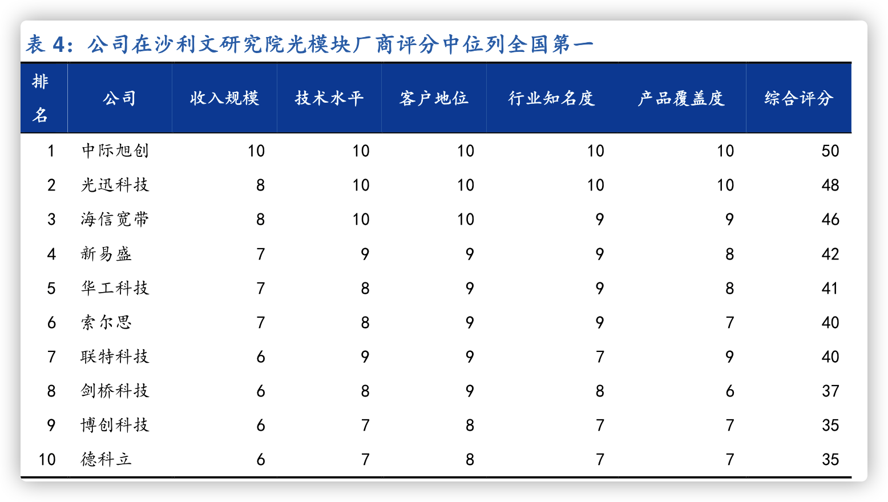

### 国投电力

经营性现金流净额连续5年超200亿元，2023年达280亿元，支撑高分红（分红率50%，股息率4.2%）。
资产负债率62%（行业平均68%），有息负债成本率4.1%（低于行业均值4.8%）。

​自然气候风险​

水电业绩依赖来水，若遇枯水年（如2022年雅砻江来水偏枯10%），净利润可能下滑15%-20%。
​政策波动​

绿电补贴退坡：2025年后陆上风电/光伏可能全面平价，部分项目IRR或降至6%以下。
煤电容量电价政策执行力度影响火电亏损收窄进度。
​新能源竞争加剧​

西北风光大基地竞配激烈（国投2023年竞标成功率约30%），土地、并网成本上升压缩收益。

国投电力凭借雅砻江稀缺资源+风光水储协同，在能源转型中兼具稳健与成长性，需关注：

火电调峰角色：保留部分高效火电（如北疆电厂）用于电网调峰，2023年火电利用小时数降至3,500小时（行业平均4,200小时）。

​来水波动对短期业绩的扰动；
​风光项目竞配与消纳能力；
​火电资产优化进展。
高现金流+低估值适合长期配置，若新能源装机加速，有望实现“价值重估+股息提升”双击。


水电：雅砻江水电（锦屏、两河口等电站）贡献约65%营收，毛利率长期稳定在55%-60%。
​新能源：风电（甘肃、新疆基地）、光伏（青海、宁夏项目）占比25%，毛利率35%-40%。
​火电及其他：占比10%，毛利率受煤价波动影响显著（2023年动力煤均价1,100元/吨，毛利率仅5%）


雅砻江为我国第三大
水电开发基地，自然资源禀赋优越，水量丰富且年际变化不大；流域已建成三大调节
水库，梯级联合调度能力强；受益于以上两点优势，水电的发电利用小时数高且年际
波动小。在目前优质水电资源基本开发完毕的背景下，雅砻江水电作为优质大水电的
稀缺性凸显。

 推进雅砻江水风光一体化建设，项目获取及消纳优势显著，未来新能源成长空间可期。
根据公司规划，到 2025 年公司新能源装机增长空间有望达到 1000 万千瓦。公司依托雅
砻江优质水电资源开展水风光互补，在周边新能源项目获取方面具有先天优势，且水
风光互补可以平滑出力曲线、借已有通道实现打捆外送，公司风电光伏消纳优势明显


火电资产结构优质，盈利有望显著改善。公司火电机组以高参数大容量机组为主，百
万千瓦级机组占 67.5%；公司火电机组集中在沿海等经济发达、电力需求旺盛的地区，
利用小时数有保障；且用煤结构里面海外煤占比高，随着今年海外煤价中枢下降及电
力市场化改革的推进，我们预计公司火电板块的盈利有望迎来大幅改善

### 三美

2023年国内制冷剂市场份额约20%，位居行业前三（仅次于巨化股份、东岳集团）。

​氟制冷剂：营收占比65%（同比+15%），毛利率25%，核心品种R32/R134a产能分别达10万吨/年、7万吨/年；
​氟发泡剂：营收占比20%（同比-5%），毛利率18%，受环保政策限制（R141b为受控ODS物质）需求萎缩；
​氟精细化学品：营收占比15%（同比+30%），毛利率35%，重点拓展电子级氢氟酸（5万吨/年产能）、锂电池电解质（LiPF6）。

​制冷剂：格力、美的等空调厂商（占比60%），海外客户大金、霍尼韦尔（占比20%）；
​电子级氢氟酸：中芯国际、长江存储（认证中），目前以台系半导体厂为主（占比70%）。

```
价格波动风险：
HFCs价格受原材料萤石（2023年涨价20%）、四氯乙烯（进口依赖度70%）成本传导影响；
​技术替代风险：
下一代制冷剂（HFOs）可能冲击HFCs市场（科慕、霍尼韦尔专利垄断）；
​转型不及预期：
电子化学品客户认证进度慢，可能错失半导体扩产窗口期；
​环保政策加码：
含氟废物处理成本上升（2023年危废处置费同比+15%）。
```

​周期投资者：关注HFCs价格走势（百川盈孚报价）及空调排产数据，把握涨价弹性；
​成长投资者：跟踪电子级氢氟酸客户认证进展（如长江存储），左侧布局转型预期；
​风险提示：若制冷剂价格拐点早于预期或LiPF6产能过剩，可能压制估值修复空间。


生产厂家将视情况对有关产品的产能做转产处理,未来也存在配额量少的企业进行委外生产、配额转让的可能。 
随着行情的周期性波动,行业产能逐步向头部企业集中,而一些小、散的产能逐步退


PVDF 在锂电池中主要用于正极粘结剂与隔膜涂覆。PVDF 是一种高分子含氟聚合物，由 VDF
（偏氟乙烯）聚合形成，属于可熔融加工氟树脂，下游可用于涂料、注塑、光伏背板膜、
锂电池等诸多领域。传统应用方面，PVDF 涂料具有耐候、耐腐蚀、抗渗透等性能，具有较
长的使用寿命，同时 PVDF 的加工性能优异，可以通过挤出成型等热塑性加工方法加工为
薄膜、片材、管材、棒材等，在注塑领域应用广泛。新兴领域方面，PVDF 可用于光伏、水
处理、锂电池等。PVDF 由于其耐高压能力强、热稳定性好、易于分散等优良特性可作为锂
电池正极粘结剂，进而降低电极阻抗、减小电池极化。PVDF 还可被用于锂电池隔膜涂覆，
主要起到提高耐高温性能、增加电解液保液量、增加高压状态下电池安全性等作用

由于六氟磷酸锂和 PVDF 供需失衡问题突出，且未来仍有部分新增产能投产，行
业整体盈利能力较差，但相对而言 FEP 供需格局相对较好，因此盈利能力相对较强，预计
2024-2025 年公司含氟聚合物与含氟精细化工品项目整体毛利率为 3%/14.6%.

### 伊利

公司在费用投放上兼顾效率和效果，不断提升费用使用效率，未来销售费
用率有望持续稳中有降。23Q3 归母净利率为9.85%，同比+3.51pct，盈
利水平提升较为显著

### 光模块

光模块是光通信中实现光电和光电转换的光电子器件，是光通信产业的核心部分

光模块产业链由上游的光芯片、光器件等，中游的光模块制造商和下游的设备商、运
营商等组成。光模块上游包括光芯片、光器件、电芯片等，光器件行业的供应商较多，
但高端光器件目前仍主要由国外供应商提供。光模块行业下游主要是包括电信运营
商、互联网及云计算企业等，光模块产品的运营领域涵盖了互联网服务、电信市场等
行业

5G 和 IDC 建设拉动光模块需求，预期带来增量市场

中国光模块厂商凭借劳动力成本等优势，在与海外厂商竞争中不断占据上风。



### 中国移动


​增长驱动

​算力网络：布局智算中心（2025年算力规模达20EFLOPS），构建“算力+能力+连接”一体化服务；
​AI大模型：发布“九天”政务大模型，赋能智慧城市、应急管理等场景；
​国际业务：拓展“一带一路”沿线数字基建（巴基斯坦5G、东南亚数据中心）。
​估值与市场观点

当前市盈率（PE）约13倍​（港股），低于全球电信巨头（Verizon 15x，AT&T 8x），反映市场对国企效率的折价；
​催化剂：数据要素政策落地、移动云分拆上市；
​风险折价：算力需求不及预期、监管压降IDC电价。


​短期：5G用户红利+云业务高增驱动2024年净利润增速8%-10%，高股息提供防御性；
​长期：算力网络与数据要素变现决定成长天花板，若数据交易收入占比突破5%，估值体系有望重构；
​建议关注：
2024年Q2政企DICT订单金额；
700MHz基站利用率；
数据资产入表进展。


中国移动预计 2022 年将投入 480 亿用于算力网络资本开支，其中数据中心将投入 58
亿，公司预计未来算力网络的相关资本开支会逐步增长。2）1H22 中国联通资本开支为284
亿元，同比增长 98.5%，公司将紧抓“东数西算”新机遇，倾力打造“联接+感知+计算+
智能”的算网一体化服务。3）中国电信2022 年的产业数字化资本开支预算同比增长61.7%
至279 亿元，公司2021 年末的算力总规模达到2.1EFLOPS，公司表示将加快算力规模建
设，预计算力总规模将以超过年均80%的复合率增长，预计十四五末期将达到16.3EFLOPS

云业务：运营商接捧互联网成为云计算市场主力军 
政策推动云计算增长动力转向传统行业，三大运营商接捧互联网巨头成云计算市场主力军。
受互联网流量增长 缓及国资云建设等政策影响，云计算行业增长动力逐步由互联网行业
转向传统企业，在此背景下，三大运营商接捧互联网巨头成为政府、金融等行业的云服务
主力军。 

而在算力网络建设及国资云的拉动下，三大运营商云计算业务2Q22 合计实
现营收360 亿元，同比增长108.5%，已成为云计算行业的主要增长极。

运营商等国资企业在云计算行业中重要性提升，云基础设施国产化进程加速。国资云 构
下，云基础设施的建设运营方多为运营商或相关国资企业，例如，中国首个国资监管云服
务由中国电信牵头，联合中国电 、中国电 等多个央企共同完成。在国资云推动下，运
营商等国资企业在云计算行业中重要性提升，市场份额由2019 年的12%提升至2021 年的
23%。我们认为国资云的推广有望加速云基础设施国产化进程。以浙江省国资云为例，其
建设采用全国产化信创服务器作为底层基础设施，依托具有国产自主知 产权的“ 天云”
底座搭建而成。在国资云建设背景下，云基础设施国产化进程有望加速

IDC：规划“4+3+X”数据中心布局，收入增速领先同业 
三大电信运营商占据国内 IDC 市场的主导地位。据 IDC 统计，2021 年三大电信运营商在
国内IDC 市场的总份额达67.9%，其中中国电信、中国联通、中国移动在中国IDC 市场的
份额分别为27%、23%、18%

东数西算带动下，三大运营商丰富机 资源，加快推进 IDC 布局。中国移动在 津冀、长
三角、粤 澳大湾区、成渝四大热点区域中心，持续完善“4+3+X”数据中心布局，部 
42.9 万 机 ；中国电信聚焦 津冀、长三角、粤 澳大湾区、川渝陕四大经济发达区推
进“2+4+31+X+0”布局，部  IDC 超过 700 个，加强边缘计算能力建设，机 规模达到
48.7 万 ，机 资源居于国内首位；中国联通按 “5+4+31+X”总体布局，聚焦 津冀、
长三角、粤 澳大湾区等区域建设IDC 共808 个，机 规模达32.9 万 。截至2022 年上
半年，三家运营商共有机 124.5 万 ，较21 年底新增7.6 万 。据三大运营商2021 年
年报中披露的2022 年IDC 建设规划，下半年运营商机 规模将新增9.8 万 。 

网络、运营及维护费用：中国移动计划不断提高网络能力和质量，算力网络建设等新基
建项目加速建成投产，以支持5G 和产业数字化发展。据公司2021 年年报，公司计划在2022
年底新增开通5G 基站47 万个，计划在2022 年新增IDC 机 4.3 万 ，并加快中心云、
边缘云的建设进度。我们预计随着公司5G 网络和数据中心建设规模的扩大，其网络、运营
及维护费用将相应有 提升，但随着主要算力节点逐步布局完成、5G 网络建设步入尾声，
费用增速将呈现出逐年下降趋势，预计其  2022/ 2023/2024 年总网络运营和维护费用同比增
长12%/9.5%/8%至人民币2,418.4 亿/2648.2 亿/2,860.0 亿

### 中环

​光伏硅片：占营收70%（2023年约550亿元），毛利率15%-18%（行业下行期承压）。
​光伏组件：占营收15%，主打叠瓦技术（差异化竞争），毛利率8%-10%。
​半导体材料：8-12英寸半导体硅片（占营收10%），毛利率30%+，国内替代空间大。
​其他业务：光伏电站运营、半导体器件，占比5%。

Q4 基本盈亏平衡，单瓦盈利环降5-6 分；组
件出货3-3.5GW，整体延续亏损。受价格快速下行影响公司计提减值亏
损约 8-10 亿元；同时处理多晶硅参股公司股权，投资收益亏损 6-8 亿
元，导致Q4 业绩承压。24 年看，硅片环节开工率分化加强+N 型占比
持续提升，公司预计出货150GW+，维持龙头地位。 


### 小米

小 米自动驾驶的目标是 2024 年进入行业第一阵营，小米智能驾驶系统 装备了两颗英伟达 Orin X 芯片，单颗提供 508TOPS 的算力，搭载的 高精度激光雷达能够实现 0.05 米的泊车精度，以及 11 颗高清摄像头、 3 颗毫米波雷达、12 颗超声波雷达。

小米 SU7 定位中大型纯电轿车，零百公里加
速时间 2.78s。小米推出转速高达 21000 转/分钟的电机 V6/V6s 和转速高达 27200
转/分钟的电机 V8s。电池方面推出了 800V 碳化硅高压平台， 5 分钟充电可以实
现 220km 续航，研发的 CTB 一体化电池技术实现了 77.8%的体积效率。续航方
面双电机的小米 SU7 Max 在 CLTC 续航能力可达 800 公里。公司自研小米泰坦
合金，研发了 9100 吨锁模力的小米超级压铸机，能制造 72 个零件合而为一的
一体化压铸后地板，让焊接点减少 840 处，重量减轻 17%。

应用场景不同，超声波雷达主要应用于泊车辅助、以及盲区碰撞预警。主要安装前后保险杠上作为倒车雷达，以及车身侧身测距。而毫米波雷达主要应用于自适应巡航、自动刹车辅助系统等。安装在汽车正前方、车辆后保险杠内、前保险杠内等位置

 
### 三一

​​市场份额提升​​：全球工程机械市场，三一海外市占率仅3%（剔除中国），而卡特彼勒、小松合计占27.2%，替代空间达20倍。
​​新兴市场需求​​：非洲、东南亚等地区基建投资增速超10%，电动化渗透率不足5%，三一计划十年内实现海外千亿收入目标

未来增长逻辑
​海外市场深耕

重点突破欧美高端市场（三一美国工厂2024年投产），目标2025年海外收入占比超50%；
参与“一带一路”标志性项目（如沙特NEOM未来城、印尼雅万高铁）。
​新能源设备放量

电动工程机械2024年目标销量翻倍（超2万台），氢能挖掘机完成中试验证；
布局“光储充换”一体化补能网络（与国电投合作）。
​数字化转型

工业互联网平台“根云”接入设备超80万台，提供预测性维护、能耗优化服务（年服务收入超30亿元）。

当前估值：市盈率（PE）约15倍​（2024年预期净利润100亿元），低于国际龙头卡特彼勒（20倍），反映周期股折价；
​催化剂：
国内基建政策加码（如特别国债项目落地）；
欧美电动设备订单突破；
氢能机械技术商业化进展；
​风险折价：原材料价格反弹、地缘政治冲突、技术迭代滞后。

对海外市场更为乐观：疫情扰动下借助产品力+供需缺口，中国工程机械出口销量大幅增加，
20-22 年我国挖掘机出口销量 CAGR 为 60.21%。23 年下半年海外需求降温+海外供应链恢
复，中国工程机械出海增速有所回落，市场普遍担心 24 年国产品牌海外销售下滑，甚至引
发了对中长期国产品牌出海的悲观。我们认为，国内地产、基建需求反哺下，国产品牌产
品力非常强，随着中国品牌持续布局海外研发、渠道、售后等，未来有望把“产品力”转
化为“品牌力”，我们预计持续完善的海外布局+出口挖掘机吨位提升带来的均价提升有望
支撑 24 年海外收入增长。三一重工作为国内龙头，领先的全球布局有望推动公司成长为全
球龙头。 
 
电动化虽言之尚早，但是长期来看带来的不只是业绩弹性，更重要的是对出海的助力：以
史为鉴，发动机、液压技术等重大技术变革都会重塑工程机械行业格局，电动化作为又一
重大技术变革有望重塑全球竞争格局。参照叉车行业，受益于锂电化浪潮，中国电动叉车
的性能实现了重大突破，开启了中国叉车加速走向世界的新征程。中国“三电”技术全球
领先，电动化趋势下有望助力中国品牌全球化进程。三一电动化布局逐步完善，掌握核心
技术，有望在电动化浪潮下持续领先，并在电动化的助力下完善全球化布局，成长为全球
龙头。

预计毛利率随着海外占比提升、中大吨位占比增加而稳步提高，分别为 34%、
35%、35.5%。

### 牧原


​产能持续扩张​

​出栏量目标：2025年达1亿头（市占率10%），成本目标降至13元/公斤以下；
​屠宰产能匹配：2025年屠宰产能6,000万头/年，鲜销率提升至70%（2023年50%）。
​产业链延伸​

​预制菜布局：推出“牧原厨房”品牌，2025年目标收入200亿元（复合增速50%）；
​种猪出口：向东南亚输出种猪及养殖技术（2023年越南订单超10万头）。
​技术降本增效​

​智能化升级：无人猪场试点（人工成本再降50%），AI疾病预警系统降低死亡率2个百分点；
​饲料配方优化：用小麦、稻谷替代玉米（价差300元/吨），降低饲料成本5%。

周期底部的alpha龙头，静待产业链价值释放
牧原股份凭借极致成本控制+逆周期扩张能力，在猪周期底部展现强韧性，但需突破三大瓶颈：

​屠宰业务扭亏为盈；
​疫病防控能力提升；
​行业产能加速出清。
短期关注点：能繁母猪存栏量变化、猪价反弹持续性；
长期看点：预制菜渠道突破、种猪技术出口。
高安全边际+龙头溢价适合长期投资者，若行业产能去化到位，有望迎来“周期反转+成长双击”。


2023年,公司共计屠宰生猪1,326万头,同比增长80%,产能利用率由2022年的25%提升至46%,但距离理想的产能利用率仍有一定差距。 
由于部分厂区投产时间短,2023年屠宰肉食业务尚未实现盈利,但头均亏损水平已由2022年的120元左右下降至2023年的70元左右。 
2024年屠宰肉食板块会持续开拓市场,优化产品结构和客户结构,加强内部生产运营管理,以争取早日实现盈利。 
 面对当前外部市场形势,公司会合理把控生产经营节奏,规划资本开支水平,持续降低成本,提高整体发展质量。 
同时,公司当前资金储备充足,在融资端也与银行保持稳定的合作关系,能够保证现金流的安全稳定

公司2023年全年的生猪养殖平均成本相比2022年下降了0.7元/kg,成本下降的来源主要是生产成绩的改善和期间费用的下降,如果将料价上升因素剔除,生产成绩
改善和期间费用下降带来的成本下降贡献在0.9元/kg左右

近期猪价上涨具有区域性特点,部分省份仔猪及商品猪价格有一定上涨,主要为节前短期供需变化所致。 
全年来看,预计2024年整体价格表现相比2023年更乐观一些。 
在供给端,当前能繁母猪仍处于较高水平,但整体为下降趋势,2024年生猪供应量预计将低于去年;在需求端,随着经济逐步企稳,2024年需求量预计将有一定上升

 2023年12月底,公司能繁母猪数量为312.9万头,同比增长30万头左右。 
对应今年出栏量也将有一定增长,增长比例预计在10%左右,实际出栏量将会受公司生产经营安排、生产成绩波动等多种因素影响,2024年具体出栏量区间指引将
在2023年年度报告中披露

### 理想

理想将采用自研 800V高压纯电
平台和5C 倍率电池；实现充电 9分 30秒，续航 400公里。充电时间比当前主流
的 1.6C 电池缩短 66%。技术层面，理想 5C 电芯采用超离子环石墨负极技术+活
性面调控技术，保证充电效率。通过低阻抗体系设计、一体化极柱结构设计和电
芯间侧面冷却的热管理方案，保证充放电安全。

高端车型智能驾驶芯片均采用英伟达 Orin，智能座舱芯
片采用高通 8155。感知层面，均采用激光雷达+超声波雷达+毫米波雷达+摄像头
的混合方案。伴随理想 L9上市，产品将具备 L4 级别辅助驾驶硬件，在硬件配置
方面迅速追平行业领先地位

### 蔚来
光瀑式环绕氛围灯，256 色渐变，10 种氛围主题，支持呼吸律动、音乐联动，渲染轻松的家居格调

### 宇通

​新能源渗透率提升​

​国内公交电动化：2025年目标公交电动化率80%（当前约60%），新增需求超20万辆。
​欧洲换电市场：与壳牌合作换电重卡项目（2024年试点），切入欧洲零排放物流场景。
​智能化升级​

​自动驾驶商业化：2025年L4级自动驾驶巴士量产，目标占智能交通收入50%。
​车联网服务：新能源车队管理平台（接入车辆超10万台），年订阅费收入或超5亿元。
​后市场布局​

​电池梯次利用：与宁德时代共建回收网络，2025年目标回收电池10GWh（毛利率20%+）。
​充电桩运营：聚焦高速服务区、城市枢纽，规划2025年充电桩超5万根（市占率10%）


宇通客车凭借技术领先性+全球化布局，在行业洗牌中占据主动，需关注：

​欧洲市场政策风险；
​自动驾驶商业化进度；
​成本控制能力。
短期催化剂：国内公交替换周期（2024年招标量+30%）、欧洲订单放量；
长期壁垒：三电技术迭代、氢能与纯电路线平衡。
低估值+高确定性适合稳健投资者，若智能化与海外市场突破，有望打开第二增长曲线。


英国、 法国、 德国、 丹麦等国公交客车新能源化领先， 占据电动城
市公交超 50%份额

宇通客车 2022 年以 479 辆注册量排名第一（同比+58%） ， 2022 年其欧洲电动
巴士市占率为 11.5%， 同比+2.3pct，

BYD-ADL 排名第二， 2022 年注册量 465 辆（同比+24%） ， 其与英国当地最大的
客车公司 ADL 合作（2015 年开始） ， 比亚迪提供底盘、 三电技术支持， ADL 根据
当地市场需求专门定制外饰、 结构和车型等， 并且给予渠道资源的协助， 双方目
前已生产电动大巴超 1000 辆， 在英国市占率 50%-70%

中国客车市场黄金发展阶段（2009-2014 年） 已过， 同时
存量公交新能源更新基本到位， 未来销量支撑主要来源于 1） 城镇化率提升背景
下， 公交市场持续渗透， 需求较为刚性； 2） 疫情推迟存量替换， 更新需求迫切；
3） 海外市场新能源化促进出口； 4） “双碳” 政策持续推进， 旅游、 团体等公路
客车新能源化持续发展。

房车： 市场规模年均复合增速

技术进步和产品更新风险： 汽车行业属于资金密集、 技术密集型行业。 公司
具备丰富的产品开发和制造经验， 而且历年来始终注重新技术、 新产品的研
究与开发。 新技术、 新产品的研发离不开资金的投入， 如果公司未来在新产
品开发过程中无法持续投入研发或没能及时开发出与新车型相配套的产品，
将面临技术进步带来的风险和经营风险。

### 比亚迪

比亚迪在红海市场中通过​“技术研发+垂直整合+薄利多销”​三角模型实现突围：以巨额研发投入构建技术壁垒，依托全产业链控制成本，通过规模化销量和全球化布局摊薄风险。其核心逻辑在于​“牺牲短期利润换取长期市场主导权”​，并通过持续创新（如超级e平台）重塑行业规则。未来，若能在高端市场（仰望、腾势）和海外扩张中巩固优势，比亚迪有望进一步拉开与竞争对手的差距


竞争加剧：吉利、长安等本土车企加速三电技术研发，特斯拉、大众等国际品牌降价抢占份额。
​技术落地成本：兆瓦闪充等新技术需配套4000座超充站，电网负荷和储能系统建设可能推高短期投入。
​海外市场风险：地缘政治、贸易壁垒及本土化适配（如充电标准、法规）增加拓展难度

目前公司拥有刀片电池、 DM 混动、 e3.0 平
台、 CTB 电池车身一体化、易四方、云辇和 DiLink 智能网联系统等领先科
技

腾势 N7 搭载智驾硬科技，未来可期。 公司首款智能豪华猎跑 SUV 腾势 N7
正式上市，新车搭载智能座舱（ Link 超感交互智慧座舱，智慧六联屏，配备
6nm 制程芯片， 5G 智能网联系统）、智能底盘（标准版配备自研云辇-A 智
能空气车身控制系统）、智能驾驶（搭载腾势 Pilot 高阶智能驾驶辅助）三大
智能科技，为用户带来卓越的智能驾驶体验

比亚迪插电式混合动力技术（ DM 技术）积累始于 2006 年，现已形成主打“超强动
力”的 DM-p 王者混动和主打“超低油耗”的 DM-i 超级混动两大技术平台。 DM-i 超
级混动作为以电为主的混动技术，围绕大功率电机驱动和大容量动力电池供能为主，发
动机为辅的电混架构，颠覆传统混动技术以油为主的设计架构， 达到超低油耗、静谧平
顺、卓越动力的整车表现。 DM-p 王者混动，以电四驱超强动力，重新定义了四轮驱动，
带来极速、安全、经济，三大极致用车体验。实现零到百公里加速在 5 秒以内，动力表
现超越传统大排量燃油车。

e3.0 平台让“电动”带来的智能优势、高效优势、安全优势、美学优势充分释放。 百
公里电耗比同级别车型降低 10%，续航里程最大可突破 1000 公里。电池可承受 50 吨
重卡碾压，满足“超五星”碰撞安全标准。

2023 年 1 月，公司正式发布易四方技术。 易四方技术平台是一套以四电机独立驱动
为核心的动力系统，从感知、控制、执行三个维度围绕新能源汽车的特性进行了全面
重构，彻底颠覆以往燃油车的动力系统能力体系感

辇产品矩阵包含云辇-C、云辇-A、云辇-P 等产品，将从舒适、
操控、安全、越野等维度大幅提升消费者的驾乘体验。云辇能够有效抑制车身姿态变化，
显著降低车辆侧翻的风险，减小驾乘人员坐姿位移。同时云辇系统可以在雪地、泥地、
水域等复杂路况下，有效保护车身， 防止地形造成的整车磕碰损伤，提升驾乘舒适及安
全性，实现对人和车的双重保护。

全场景数字钥匙提供多种车辆解锁方式，包括 App 远程遥控、蓝牙钥匙和手机 NFC
车钥匙。 最新一代 NFC 数字钥匙不仅与 iPhone、 Apple Watch 等设备兼容，还支持其
他品牌设备。手机 NFC 数字钥匙具备高性能、超便捷、快分享、强兼容四大优势，适
用于多种品牌手机，可以取代传统车钥匙，在无网络和电源的情况下也可以进行车辆解
锁闭锁操作

区别于传统汽车，新能源汽车最核心的技术是“三电”，
包括电池、电机、电控。其中电机又称电驱系统，包括驱动电机、传动结构、控制器等，
承担了新能源车运动相关的所有功能。电机的扭矩是否精确对新能源车的效率和性能至关
重要。电控又被称为电源系统，包括 DC/DC 变换器、 OBC、高压配电盒，是传统发动机变
速箱的替代，性能直接决定了电动汽车爬坡、加速、最高时速等指标。成本上来看，据钜
大锂电，驱动电机、电控系统成本分别占到新能源汽车总成本的 6.5%/5.5%，是新能源车
的重要组成

### 重卡

今年宏观经济处于弱复苏阶段，基建投资与物流运输需求温和，重卡
行业处于恢复性增长阶段。明后年宏观经济复苏进程加快后，与投资
相关的工程建设用车以及与快递快运相关的物流用车将持续增长。同
时，在“到 2025 年新能源和国六排放标准货车保有量占比力争超过
40%”的目标约束下，叠加国三、国四淘汰政策的催化，更新置换需求
将有力支撑重卡市场恢复。此外，海外市场的需求持续增长，打开了
重卡行业的增量空间，

工程建设与物流运输是重卡的主要应用需求，因此固定资产投资与消费是重卡
新增需求的核心驱动力。重卡的新增需求是指重卡市场的经济效益在增加，不断吸
引着新进入者，导致重卡市场的绝对规模在增长。从应用场景来看，重卡产品主要
应用于长途物流运输、工程建设、城市环卫、消防等场景。其中，物流运输用车需
求由国内消费景气度决定，工程建设用车需求则由房地产开发投资与基建投资决
定。因此，重卡的销量涨跌更容易受到宏观经济周期更替的影响。

重卡出口的驱动力在于进口国经济增长与出海政策红利。目前我国重卡出口的
目的地主要集中在“一带一路”沿线国家，占比超过 55%。其中，俄罗斯、越南、
菲律宾、巴基斯坦等国是我国重卡出口的主要目的地。非洲、拉美地区也是重卡出
口的主要地区。因此，重卡出口增速与新兴经济体的实际经济增速基本保持一致。
同时，“一带一路”政策下，中国基建企业出海也带动了重卡出口销量。

### 电力

煤电容量电价按照回收煤电机组一定比例固定成本的方式确定。其中，用于计算容量电价的煤电机组固定成本实行全国统一标准，为每年每千瓦330元；通过容量电价回收的固定成本比例，综合考虑各地电力系统需要、煤电功能转型情况等因素确定，2024～2025年多数地方为30%左右，部分煤电功能转型较快的地方适当高一些，为50%左右。2026年起，将各地通过容量电价回收固定成本的比例提升至不低于50

 由于华北地区基准电价较高，公司整体电价水平并不低，另一方面，2021年深化电力体制改革方案提出，煤电市场化交易浮动范围提高为上下20%，高耗能企业市场交易电价不受限制，内蒙古地区高耗能占比接近50%，电价具备上涨弹性。

 ### 中国化学

 实业及新材料业务：中国化学始终以市场为导向，坚持“创新驱动”，积极发展
实业及新材料业务，建立了“1 总院+多分院+N 平台”的技术创新平台体系，在
新材料领域，已研发和掌握己内酰胺、己二腈、气凝胶等化工新材料领域核心技
术，并达到国际先进水平。22 年以来公司气凝胶、PBAT、己二腈项目陆续投产，
预计2022-2024 年实业及新材料业务的营收分别为74/130/156 亿元；目前国内
己二腈产能有限，短期内己二腈项目可获得较高的利润率，预计 2022-2024 年
实业及新材料毛利率分别为25%/22%/20%

### 贵研铂业

催化剂是什么？机动车尾气中含有一氧化碳（CO），碳氢化合物（HC），氮氧化合物（NOx）和颗粒物（PM）
等污染物，会对人类健康和环境产生直接和间接危害。汽车尾气催化剂是最为有效的净化汽车尾气的处理方
式，处理过程简单概括则为通过氧化反应把 CO 和 HC 变成二氧化碳和水，通过还原反应把 NOx 变成二氧化碳
和氮气

催化剂由四部分结构组成。分别是贵金属活性组分、催化剂载体、涂层及助剂；其中贵金属活性成分为催化
剂的核心部分，主要是将金属铂、铑、钯的物质成分喷涂在蜂窝状陶瓷或金属为基体的载体上(也有颗粒型
及 SiC 泡沫型)，而涂层及助剂层则是为了提高铂铑钯的分散度。催化剂活性组分的用途

贵金属资源循环回收业务：公司国内龙头地位进一步强化

随着贵金属矿产资源的不断开采，高品位资源严重匮乏，矿产金、银、铂族金属生产加工成本不断上升，贵
金属再生资源越来越成为重要的贵金属原料供应来源。铂族金属再生不仅有利于保证供应和资源循环利用，
同时具有明显的经济效益。由于资源短缺，欧美日等发达国家很早就开始对废旧贵金属加以回收利用，把二
次资源回收作为重要的产业关键环节加以布局和扶持，在这方面具有较为系统的管理和运作机制。从地域分
布来看，铂族金属的回收区域主要为欧洲、北美以及日本等经济发达地区，一些新兴国家的回收也开始显现。
回收来源包括电子废料、废催化剂、失效化工催化剂、首饰等

金属价格大幅波动，汽车产销不及预期，产能释放不及预期，贵金属新材料市场拓展规模不及预期

### 旗滨

​浮法玻璃：占比约60%，传统优势板块，用于建筑门窗、幕墙等。
​光伏玻璃：占比约25%，近年重点扩张领域，受益于新能源需求增长。
​节能玻璃（Low-E）​：占比约10%，高端建筑节能材料。
​电子玻璃：占比约5%，用于手机盖板、车载显示等，技术壁垒较高

建筑玻璃：与万科、碧桂园等头部房企合作，工程渠道占比超40%。
光伏玻璃：绑定晶科能源、天合光能等组件龙头，2023年订单覆盖率超70%。
汽车玻璃：福耀玻璃、信义玻璃间接供应商。

​优势：多元化业务对冲周期波动，光伏与电子玻璃打开成长空间。
​风险点：浮法玻璃盈利受地产拖累，光伏玻璃产能过剩风险。
​估值弹性：若电子玻璃放量及光伏出口超预期，PE有望向20倍修复。

旗滨集团正从传统浮法龙头向“光伏+电子”高端制造转型，短期看光伏产能释放与成本优势，长期需跟踪UTG技术突破及地产链复苏。当前低估值具备安全边际，适合周期成长型投资者配置。

超薄电子玻璃（0.33mm）打破国外垄断，应用于折叠屏手机盖板。
光伏玻璃良品率提升至85%（行业平均80%），单线窑炉规模达1,200吨/天（行业领先）。
研发投入占比约4%，累计专利超600项。


电子玻璃（高铝超薄）已量产，打破美国康宁、日本旭硝子垄断。

中性硼药用玻璃性能优于钙钠玻璃和低硼硅玻璃。 药用玻璃是指专门用于药品
包装的玻璃，一般指玻璃瓶罐及器皿。 药品的稳定性易受温度、湿度、空气、光、微
生物等影响而变化，因此需要特殊的药用玻璃作为包装材料。 根据药用玻璃的材料，
目前药用玻璃可以分为钠钙玻璃、低硼硅玻璃、 中硼硅玻璃和高硼硅玻璃四类。 化学
性能是衡量药用玻璃质量高低的重要标准之一，其中， 最重要的参数是线热膨胀系数

我国药用玻璃国产替代空间广阔。 我国药用玻璃市场规模在 2020 年达到 234 亿
元，然而，国产仅占比 15%， 进口占比 85%，国产替代空间广阔

公司药玻良品率逐步提升。 中性硼硅玻璃生产技术门槛高，需解决熔化过程气泡
不易排出、易产生节瘤、成型时间短、尺寸精度要求高等技术难题。 公司持续技术突
破，实现良品率的逐步提升，良品率由初期的约 30%提升至如今的 60%，与国际龙
头企业肖特的良品率差距大幅缩小。
、

### 山推股份

公司向潍柴动力采购发动机、从林德液压采购液压件、从山重建机采购
挖掘机等，实现动力总成、液压件、变速箱、变矩器、四轮一带、研发
等方面的资源共享，发挥“1+1＞ 2”的集合效应，实现了集团内部的
优势互补，形成了人无我有的资源优势，极大提升了公司的核心竞争力

公司是推土机行业龙头，形成多样化主机及配件的完整布局。 国产大马
力推土机国内独家， 实现外资品牌替代， 出口订单充裕逐步放量； 受益
于山东重工集团的整合优势，公司的主机产品型谱逐渐完善， 挖机和装
载机渗透率提升空间大。 各项业务关键假设如下：
1）推土机：大马力推土机出口需求旺盛，且公司定增募投项目产能释
放，假设大马力产品销量高增；中小马力产品受国内基建需求影响，预
计 23 年国内需求有所下降，随后企稳回升。
2）装载机和挖掘机： 22 年并入上市公司体内，基数较低，借助集团海
外销售渠道，受益于工程机械出口，预计收入迅速增长；假设毛利率维
持稳定。
3）配件：具备耗材属性，预计增速保持稳定略有增长；由于 23 年一
季度钢材价格下滑，假设 23 年毛利率提升，后续维持稳定。

### 钢研高钠

​客户资源与认证壁垒
​军工准入：通过AS9100D（航空）、NADCAP（特种工艺）认证，进入中国航发、GE航空、赛峰等供应链。
​深度绑定：
航空发动机：参与涡扇-10、涡扇-15等型号配套。
燃气轮机：为东方电气、上海电气提供重型燃机叶片。
3. ​产能扩张与国产替代
​募投项目：2023年定增募资15亿元，扩建航空航天用高温合金精铸件产能（200吨/年），2025年达产后市占率有望突破35%。
​国产化率：国内航空航天高温合金自给率不足50%，钢研高纳在变形合金领域市占率超60%（细分第一）。


​优势：军品高壁垒+国产替代刚性需求，业绩增长确定性高。
​风险点：原材料成本压力、民品拓展不及预期。
​估值逻辑：2024年动态PE 45倍（行业平均40倍），溢价反映其技术稀缺性，长期看产能释放+军民融合打开空间。

民品市场开拓：
开发汽车涡轮增压器、氢能源储运装备用高温合金，降低军品依赖。

生产技术门槛高， 独家供应享主导地位。 ODS 合金目前属于国外封锁技术，生产技术难度大，
进入门槛很高。 据招股说明书， 公司是我国目前唯一具备 ODS 合金生产技术的企业，且唯一
实现了量产，生产的该类产品全部应用在航空航天发动机关键部件，处于独家供应状态。公
司目前已拥有自行设计的机械合金化装备与特种工艺技术，在 ODS 合金领域处于事实上的主
导地位

高温抗氧化和耐碳、硫腐蚀之“王”，高温组织稳定性
好，热膨胀系数低，冷、热和机加工性能好，耐温高达
1350℃。

### 国电南瑞

​短期：受益2024年特高压密集开工（预计开工5条直流项目），柔直业务增速或超25%；
​长期：新型电力系统重构催生万亿级市场，南瑞作为“电网大脑”卡位核心环节；
​建议关注：
电网投资政策落地节奏（能源局年度计划）；
虚拟电厂分润机制政策进展；
海外市场订单突破（如中东柔直项目）。

​催化剂：
特高压新项目核准（如藏东南-粤港澳直流工程）；
虚拟电厂商业化政策落地（负荷聚合收益明确化）；
电网侧储能大规模招标启动。

电网建设投资于两大方向，一是以特高压直
流为主的跨区跨省输电，来解决新能源大基地送出问题。二是加强配电网建设，来应对
日益增长的分布式电源发展、电动汽车接入等需求。我国电网建设的大背景是以新能源
为主体的新型电力系统建设，而我国清洁能源主要分布在西部和北部地区，需要高效运
输新能源需要发挥电网的资源配置优势。配电网领域需要进行数字化赋能，构建以数字
电网建设支撑的新型电力系统和新型能源体系

整体来看，国电南瑞子公司占所有61 家国家电网2022 年度中标企业中标份额超过49%，
占比近半，国电南瑞行业龙头地位显著

### 中核科技

中核科技凭借核级阀门垄断地位+中核集团资源支持，在核电赛道具备强确定性，但需应对：

​政策审批不及预期风险；
​原材料成本传导压力；
​民用领域竞争白热化。
短期催化剂：核电新机组核准提速、四代核电技术商用；
长期看点：核技术医疗/环保应用、海外项目突破。
适合投资者：偏好高端装备、政策红利赛道，能承受行业周期波动的中长期投资者。

华龙一号”公司单机组核岛阀门价值量2.69 亿元，至2030 年公司国
内核电阀门价值量约40 亿元，十倍增长空间。公司在核电机组切断类
阀门市占率50%以上，依据纽威股份招股说明书，切断类阀门包括括闸
阀、截止阀、隔膜阀、旋塞阀、球阀、蝶阀等，该类阀门在核岛阀门中
占比为83%。公司单台机组核岛阀门价值量约2.69 亿元。至2030 年，
公司新增核岛阀门价值量约26.85 亿元，维修阀门价值量约15.41 亿元。
而公司2022 年核电核化工产品收入近4.31 亿元，还有约十倍的增长空
间

核电阀门是民用核安全设备，竞争格局清晰。

气液联动执行机构突破，单机组价值量仍有望提升。公司在气液联动执
行机构研发方面取得了突破，在漳州核电、国核示范快堆等项目上已实
现供货，目前在手订单几千万

产能逐步扩充，应对产能瓶颈。公司目前已按实施产能扩充方

三倍核能宣言有望打开核电出口市场。根据中国核电网，美国等二十二
国发布《三倍核能宣言》，核心内容包括共同努力推进到2050 年将全
球核能容量增加两倍，达到目前容量三倍的目标，

核电站建设加速有望带来乏燃料后处理方向的投资额提升。

我国坚持闭式循环，希望解决燃料可持续问题。通常来讲，压水堆核电
站铀资源的利用率仅为0.6%左右，如果对乏燃料进行后处理，用“榨”
出来的铀在压水中再循环一次，可节省天然铀25%；若如此多次循环，
则铀资源的利用率可以达到1%；若将后处理得到的钚与铀富集后剩下
的贫铀制成快堆燃料，铀资源的利用率可以达到60%到70%。同时，
经过后处理的乏燃料长期放射性毒性降低。以百万千瓦压水堆核电站为
例，每年产生的乏燃料为25 吨至30 吨，乏燃料中有大量的放射性元素，
毒性大、半衰期长，要在地质处置过程中衰变到天然铀矿水平需10 万
年以上，但经过后处理等环节后，其放射性摄入毒性降到天然铀辐射水
平的时间可减至千年以

公司深度参与后处理工程。公司在后处理的关键阀门供货中承担了重要
任务，取得了穿地阀等重要核心阀门订单，未来有望成为公司第二增长
曲线

高温气冷堆有望突破，打开公司业绩增长第三

四代核电愈行愈近，在可持续性、经济性、安全与可靠性、废物最小化、
防扩散和实体保护等领域有较大优势。第四代核能系统国际论坛（GIF）
发起了有关未来核能系统的联合研究。中、法、韩、日、俄、美、欧盟
之间由此展开了积极合作。GIF 提出了六大领域的技术目标和相关评估
指标：可持续性、经济性、安全与可靠性、废物最小化、防扩散和实体
保护。六类最有前景的核系统被选中，其中两类为气体（氦）冷却反应
堆，另两类是液态金属（钠、铅合金）冷却堆，还有一类超临界水冷堆，
最后一类是熔盐冷却

甘肃武威 2MW 钍基熔盐堆获得运行许可。钍基熔盐堆核能系统以
LiBeNaZr 等的氟化盐与溶解的U、Pu、Th 等的氟化物熔融混合后作燃
料，在600-700°C的高温低压下运行，其中LiF﹑NaF﹑BeF2 和ZrF4 为
载体盐，UF4 和PuF3 为裂变材料，ThF4 和UF4 为增殖燃料，吸收中子
后产生新的裂变材料U 和Pu。我国具有丰富的钍资源，钍基熔盐堆亦
被视为增殖核燃料的一条途径。中科院上海应物所正在研究设计2MW
的试验反应堆和20MWe 模块化钍基熔盐堆研究堆及科学设施。钍基熔
盐堆技术仍有很多问题有待解决，而且要建立一套以铀钍循环为基础的
核燃料循环工业体系

工业阀门上游主要包括原材料、铸件、锻件及阀门设计：阀门产品制
造的最重要的原材料是钢材料与铜材料，其成本占阀门制造企业主营成
本的70%左右；中游按照不同阀门结构分为闸阀、压力阀、蝶阀、球
阀、旋启阀。下游应用行业较多：其中占比较大应用较多的为石油化工、
冶金、电力、水处理等行业。阀门在机械产品中比重较高，是石油、化
工、电站、长输管线、造船、核工业、宇航以及海洋采油等国民经济各
部门不可缺少的流体控制设备。从下游应用分布来看，油气、能源、炼
化、化工等是工业阀门的主要下游，占比分别达到17%、14%、13%
及11%，四个主要下游合计占比近55%

国内炼化一体化建设持续推进，全球
LNG 运输船有望迎来集中交付。目前国内工业阀门市场参与者众多、竞争格局
分散，进出口价差大，国产阀门向高端定制升级。公司在工业阀门高端市场拓展
有所成效，已与中石化、上海卓然等签订战略合作协议，入围中石化和中石油的
年度框架；海外及新下游领域稳步拓展，有望进一步巩固阀门龙头优势

核电进入批量化周期：我们
详细梳理并测算了核电行业及核岛阀门行业的市场空间，截止2023 年12 月15 日，
核准待开工核电机组8 台，选址通过待核准机组有14 台，受理选址环评机组共3
个厂址、6 台机组。经测算，国内核电站年均投资额1860 亿元，从2020 年开始至
2028 年核电投资额CAGR 约 22%

我们预计公司 2023-2025 年收入为 18.31/23.89/29.24 亿元，归母净利润为
2.53/3.55/4.73 亿元，对应 EPS 分别为 0.66/0.92/1.23 元，对应 PE 分别为

核电核化工产品：公司作为核岛阀门核心供应商，①持续聚焦高端核岛
阀门主业，在手订单饱满，核电新开工机组数有望上行；②扩充单机组
价值量，盈利能力有望再上台阶；③后处理建设刻不容缓，有望打开公
司第二增长曲线；④高温气冷堆在规划中，公司有望打开第三增长极。
我们预计 2023-2025 年核电核化工产品收入增速分别为 55.89%、
64.79%、36.13%，毛利率分别为35.00%、36.00%、37.00%

公司在核电站用关键阀门领域基本具备二代、三代核电机组阀门成套供货能力,四代核电机组关键阀门供货能力;在核燃料真空阀及浓缩铀生产关键阀门领域,四大
类国产化关键阀门总体性能达到或超过进口产品水平,具备成套供货能力。 

### 湖南黄金

​短期：受益锑价高位运行及黄金避险属性，2024年净利润有望突破10亿元；
​长期：新能源需求重塑锑产业逻辑，公司“黄金+锑”双轮驱动成长性明确；
​建议关注：
锑品库存周期（企业库存通常滞后价格1-2季度）；
光伏玻璃产能扩张进度（信义光能、福莱特等大厂扩产计划）；
湖南省国资改革动向（资产注入预期）。

锑性质独特，在广泛的应用领域发挥着关键作用，享有“工业味精”的美称。从物理性质
上看，锑具有低熔点（630.74°C）、高沸点（1750°C）、无延展性的特征，是电和热的不良
导体。锑热缩冷胀的特性可以使合金的硬度发生变化，常应用于军事武器；从化学性质上
看，锑具有双重属性，既亲铜又亲氧，低温时亲硫成矿，高温时亲石分散。此外，锑不溶
于一般的酸碱溶液，只有王水、浓酸等溶液才会将其溶解。锑具有耐腐蚀和高强度特性，
作为转轴生产的关键材料应用于机械齿轮；锑与卤族元素易生成相应的卤化物，产生大量
卤化物白烟。利用锑的低燃点特性，西方发达国家强制要求在如建材产品、电子电器产品、
塑料制品等易燃材料中添加卤化锑作为阻燃材料，当前还未发现比锑更好的阻燃代替品。

1）价格假设 
金价假设：2023 年黄金均价为 450 元/克。美联储加息周期已经结束，预计美联储正式释
放降息信号后实际利率逐步回摆，推动金价上行。我们预计 2024-2025 年金价分别为
485/490 元/克。（2024 年初至今黄金均价为 480 元/克） 
锑价假设：2023 年锑锭均价为 8.15 万元/吨。全球锑矿供给增量有限，需求端光伏新增
装机高增带来锑金属长期需求动能，预计全球锑供需平衡维持短缺且缺口具有扩大趋势。
我们预计 2024-2025 年锑锭均价为 8.5/8.7 万元/吨。（ 2024 年初至今锑锭均价为 8.48 万
元/吨） 
钨价假设：公司自有矿山及外购钨精矿生产仲钨酸铵，2023 年仲钨酸铵均价为 17.9 万元
/吨，我们预计 2024-2025 年仲钨酸铵价格维持 2023 年水平。（2024 年初至今仲钨酸铵均
价为 18.1 万元/吨） 
（2）成本假设 
自产金成本：公司自有矿山分为纯黄金矿和金锑伴生矿，伴生矿山成本由黄金和锑分摊，
由于 2023 年公司矿山停产影响，成本上涨较为明显，预计 2024-2025 年成本有所回落，
预计 2023-2025 年公司综合自产金生产成本分别为 250/245/245 元/克。 
自产锑成本：公司锑品分为自有矿山和外购原料生产，自有矿山成本较为可控，产品毛利
率较高，属于公司高盈利能力产品。我们预计 2023-2025 年公司自产锑品中含量锑生产成
本维持 2.7 万元/吨。

### 猪
公司生猪养殖成本下降的根本在于养殖生产效率的提升,核心在于猪群的健康管理,最终体现至成活率、料比、生长速度等生产指标的全面改善。 
在疫病防控方面,公司当前正在搭建“猪病天网工程”,对生猪相关的多种疾病进行全面深入的研究,配备环控系统、生物安全管理、检测体系、免疫管理等措施,
将研究成果落地生产管理

### 铝
铝土矿本身不稀缺，但分布严重不均。主要的制造业和工业品输出国比如我们中国，还有日韩等，铝土矿大量依赖进口。大储量高品质易开采的铝土矿分布在澳大利亚、几内亚等制造业规模规模并不庞大的国家。这导致了铝土矿的供需矛盾在全球进入一个相对“无序”的状态下的会变得紧张。

，铝股的弹性，几乎是大宗商品股票里面最强。铝股在大宗商品上涨的周期里，动不动就是几倍十倍的涨幅，比如05-07年的铝股大涨，几乎都是五六倍七八倍的涨幅。最近一次大宗商品暴涨让美国铝业的股价涨了差不多20倍，中国铝业则也涨了4倍多。一旦未来铝土矿再次大幅度上行，铝股的涨幅大概率会比较大。未来即使铝土矿价格没有大幅度上涨，长期保持高位，那铝股的盈利能力也是非常强的

铝股的位置相对还算安全，铝价未来有较大的上涨空间，因此我几乎是没有犹豫的买入了云铝股份。云铝股份本身有一定的铝矿，同时享有比较好的电力资源（电力成本是决定铝价的重要因素），同时作为央企的子公司，它拥有更好的风险管理能力和庞大市场。还有一些财务和产销上的细节在这里不做赘述。之前我买入过神火股份，有一个不错的收益，但后面复盘发现神火主要跟的是媒，这也算是歪打正着。神火目前价格已经被炒得很高了，虽然估值看起来比较低，但综合考虑而言没有云铝那么有弹性了。中国铝业这些当然也可以，都是一波的，但在确定性比较足的情况下我选择爆发性最好的那个。

现货价格他们都在高位，整体维持涨价，加上美元降息预期，股价低位，所以存在修复逻辑，未来行业业绩能见度高，业绩反转之后，最少也是高息股逻辑。赔率和胜率兼备

绿电铝龙头，成本优势凸显：公司产能全部位于云南，用电结构中水电
比例约达88.6%；得益于云南低价水电，云南地区电解铝企业综合用电
成本长期位于全行业前20%分位水平。且随着欧洲碳税政策加码，公司
未来有望享受显著成本优势

吨铝市值行业最低，涨价弹性领先行业：根据各公司电解铝权益产能和
市值，我们测算可得云铝股份吨市值为可比公司最低，仅为2 万元，远
低于可比公司。当电解铝价格上涨10%时，公司2022 年PE 有望从 11
倍下降至6 倍，涨价弹性可观

国企改革持续推进，管理层购股参与
分红；财务报表和资产结构优化，业绩释放可期。2018 年至2022 年，
公司 ROE 大幅增长、资产周转率和销售净利率也迅猛提高，公司资产
结构显著优化，盈利质量和资产质量明显提升

电解铝的原料氧化铝不足以自给，中铝作为稳定的上游资源供应商，使得云铝无需保持

长期氧化铝高库存，降低了氧化铝存货波动

铝（Al）是一种银白色金属，在地壳中含量仅次于氧和硅，具有轻便性、高导电性、
高导热性、耐腐蚀性等优良特性，是机械、电力、航空航天、船舶制造、汽车制造、包
装、建筑、交通运输和房地产等行业的重要材料，在国民经济中占有重要地位

汽车轻量化拉动：根据国际铝协数据，2020 年国内传统乘用车/纯电动/混动新
能源乘用车单车用铝量分别为 138.6/157.9/198.1kg，其预计到 2025 年中国传统燃油车/
纯电动/插电混动车的单车用铝量能分别提升至180/227/238kg。

得益于电解铝下游地产开工回暖，汽车轻量化和光伏电站建设旺盛，电解铝迅速去
库；根据我国主要市场（上海、无锡等地）电解铝库存数据，2023 年4 月20 日库存仅
为86 万吨，同比下滑19%、周度环比下滑14%。

公司在铝土矿—氧化铝及铝用炭素方面的资源优势为公司控制生产成本，规避大宗
原辅料价格波动风险提供坚强保障。

绿电铝龙头，成本优势凸显。依托云南省丰富的绿色电力优势，2022 年公司生产
用电结构中绿电比例达到约88.6%。公司依托绿色能源生产的绿色铝与煤电铝相比，碳
排放仅为煤电铝的约20%左右。水电铝相比火电铝，除了用电成本更低，还有很好的减
排效果。生产一吨水电铝，要比火电铝减少碳排放 10 吨以上，降幅达 90%，同时减少
粉尘量4 吨以上。尽管云南省政府从2021 年9 月份取消了0.25  元/千瓦时的优惠电价政
策，但相较于全国其他省份，云南省电价仍处于全国低位。云铝股份因产能全部位于云
南，可以充分享受云南低价水电带来的成本优势，生产成本位于行业前20%的低位水平。

### 华能国际

​`火电业务`

​装机容量：煤机93,143兆瓦，燃机13,508兆瓦，仍是核心产能。
​利润贡献：火电税前利润71.38亿元，同比增1548%（增幅67.04亿元），得益于煤价下降及燃料成本控制。
​利用小时数：煤机利用小时数减少103小时，但度电盈利提升至0.0193元，同比增0.0182元。
`​新能源业务`

​装机规模：风电18,109兆瓦（含海上风电5,490兆瓦），光伏19,836兆瓦，合计占低碳清洁能源装机35.82%。
​发电量增长：风电/光伏上网电量同比增16.07%/66.13%，税前利润分别达67.72亿/27.25亿元，贡献增量利润15.4亿元。
​资本投入：2024年新能源投资649亿元（占比超80%），计划2025年风电/光伏资本开支达362亿/150亿元，加速低碳转型

#### 成本优化原因
火电成本优化核心因素
​燃料成本下降（主导因素）​

​煤炭价格下跌：2024年国内电煤采购价同比下降8.27%，直接降低度电燃料成本（占火电总成本约70%）。
​长协煤比例提升：长协煤覆盖率超80%，锁价保供对冲市场煤波动风险。
​燃料管理效率：通过掺烧低热值煤、优化库存周期等措施进一步降本。
​折旧摊销影响（次要因素）​

​资产结构优化：淘汰低效机组（2024年关停煤机约300兆瓦），减少低效产能对应的折旧负担。
​新增产能折旧平滑：近年新增高效机组折旧年限较长（如超超临界机组按25-30年折旧），单位折旧压力较小。
​具体数据：2024年火电折旧摊销约80-90亿元，占总成本约10%，同比下降约3%（主要因资产处置）

`​正向作用：淘汰老旧机组减少无效折旧，新增高效机组提升产能利用率，摊薄单位折旧成本。`
​局限性：折旧是会计政策结果（非现金流支出），实际降本效果弱于燃料成本下降。
​数据佐证：火电业务税前利润增长1548%​中，燃料成本下降贡献约90%，折旧优化贡献约3-5%

负债与资金

​资产负债率：连续2年下降至65.40%（2022年74.82%），债务压力缓解。
​财务费用：同比减少14.27亿元至74.41亿元，利息负担减轻。
​分红与股东回报

​现金分红：拟每股派0.27元，合计42.38亿元，分红比例58.78%，高于2023年的57.14%。
​股息率：当前股价对应股息率2.92%，吸引力增强

​短期：火电盈利修复与容量电价政策支撑2024年业绩，净利润有望突破100亿元；
​长期：新能源装机加速驱动成长，火电角色转向“调节性电源”；
​建议关注：
月度煤价走势及库存管理策略；
大基地项目并网进度（如陇东特高压配套新能源）；
绿电交易量价数据（电力交易中心披露）。

​火电盈利修复+容量电价托底

煤价中枢下行叠加容量电价补偿（预计贡献年收入50-80亿元），火电从“周期性”转向“稳定性”。
​新能源装机高增长

2024年计划新增风光装机8GW（同比+60%），目标2025年清洁能源占比超40%；
探索“风光火储一体化”模式（如内蒙古乌兰察布项目）。
​绿电与碳资产运营

开发CCER（国家核证自愿减排量），预计2025年碳交易收益超10亿元；
拓展绿电直销高耗能企业（如数据中心、电解铝）。

​核心业务：中国五大发电集团之一华能集团的旗舰上市平台，以火电为主、新能源加速转型的综合能源企业。

​火电：装机容量占比约65%（截至2023年，煤电装机超1亿千瓦），主力布局沿海经济发达地区（如广东、江苏）；
​新能源：风电+光伏装机占比提升至25%（2023年新增风光装机5GW，累计达30GW）；
​其他：水电、生物质发电及供热业务。

公司实际控制方为国务院国资委，直接控股股东是华能集团。华能集团是中国核心电力
集团企业之一，作为行业龙头在业务布局、规模效应、资源整合等多方面具有显著优势。
华能集团直接持有公司9.91%的股权，通过中国华能集团香港有限公司和华能国际电力
开发公司分别间接持有公司3.01%和32.28%的股权

但随着煤电上
网电价的提升以及新能源发电量增长，公司收入规模持续提升且盈利能力有所改善，亏
损幅度较2021 年有所收窄。受益于2023 年煤炭价格中枢回落和电量同比增长，以及境
外电力资产盈利提升，2023H1 公司实现归母净利润63.1 亿元，同比大幅增长309.7%，
业绩增速突出，扭亏为盈。 

火电仍是最大营收来源，清洁能源盈利能力高位持稳。 
➢ 营收结构方面：电力及热力业务占比达95.3%，以火电为主，但随着公司向清洁能
源转型，风电和光伏发电的营收占比逐渐增大，其中风电营收增长明显，从 2018
年占整体营收的3%逐步扩张到2022 年的6%。 
➢ 利润贡献方面：近两年，受煤价上涨影响，火电处于大幅亏损状态，风电成为公司
利润的主要来源。 
➢ 盈利能力方面：由于 2021 年前集中式光伏电站、工商业分布式光伏项目和新核准
陆上风电并网项目均享受补贴政策，公司风、光毛利率维持在50%以上水平。

分红方面，公司现金分红政策规定公司在当年盈利及累计未分配利润为正，且公司现金
流可以满足公司正常经营和可持续发展的情况下，现金分红比例不少于当年实现的合并
报表可分配利润的50%。2021-2022 年，出于归属于本公司股东的净利润为负、公司转
型发展的投资需求以及资产负债率上升等原因，公司决议不分红。随着公司业绩扭亏为
盈，盈利能力提升，预期未来将回归合理分红水平。

辅助服务市场机制不断完善，容量电价呼之欲出，火电调峰收益兑现。各省市纷纷出台
相关的政策措施，助力火电充分发掘容量和调峰特性，驱动火电灵活性改造，并为未来
火电盈利再开源

机组分布集中沿海地区，区位优势突出。公司境内电厂分布在 26 个省、自治区和直辖
市，多数位于沿海沿江地区，经济发展快，用电量和电价水平较高；内陆电厂大多分布
在环绕首都和燃料陆运直达区域，有利于多渠道采购煤炭、稳定供给。同时公司拥有港
口及码头资源，对提高集约化燃料管理起到了极大的支持作用，有利于公司统一库存、
发挥淡储旺耗的功能，加速煤炭周转，减少滞期费用。此外，公司在新加坡全资拥有一
家营运电力公司，在巴基斯坦投资一家营运电力公司。公司电厂的境内外区域布局可以
形成优势互补、增强抵抗经营风险的能力

2019-2022 年，华能国际风电、太阳能装机容量分别以年复合增长率 32%和 66%的速
度增长，远超于全国风电、太阳能装机容量年复合增长率 20%和 24%，增速领先全行
业。公司2022 年风电发电量为280.68 亿千瓦时，同比增长34.72%，太阳能发电量为
60.8 亿千瓦时，同比增长69.65%，分别占全国风电发电量的3.68%和1.42%，实现快
速增长。 
 
 ；2022 年公司上网结算电价已经有近 20%的涨幅，我们预计在现
有电价政策下后续趋于稳定，但一旦电改相关政策推进，仍有上涨空间。

清洁能源板块：公司致力于新能源转型，并且在“十四五”期间保持风电光伏
装机较快增速，2023 年已为“十四五”中期，我们预计后两年装机增速将会进一步提升
以完成公司的十四五装机目标。叠加硅料及光伏组件价格加速下降，以及 CCER 和绿电
交易机制进一步推广，公司的新能源项目盈利能力将进一步增强。我们预计 2023-2025
风电与光伏装机规模增量分别为2.5/3.5/5GW 和6/8/10GW，风光利用小时数仍将保持
稳定
 
### 中石油

 公司在不同国家和地区经营，与属地政府、企业、人
员交流增多，由于受到经营所在国各种地缘政治、经济、宗教、人文、政策变化、科技变
革、信息网络安全、法律及监管环境等因素影响，包括政治不稳定、财税政策不稳定、进
入壁垒、合同违约、税务纠纷、法律纠纷、商秘纠纷或泄露、技术装备和信息能力无法满
足竞争需求等，可能加大公司境内外业务拓展及经营的风险

 汇率风险：由于公司持有美元债务以及在境外多个国家和地区开展业务，涉及多种
货币的收支活动，人民币兑相关外币的汇率波动及货币间的兑换会影响公司运营成本，公
司通过对汇率走势进行定期研究和分析，缩小汇兑风险敞口，管控汇率风险。

6、油价下跌风险：若全球经济增长放缓，能源需求可能会减少，导致油价下跌。然
而，如果经济增长放缓导致供应过剩，则可能会对油价产生负面影响

 
### 博迈科

2024年公司实现营业收入26.40亿元，同比增长46.76%；归母净利润1.01亿元，同比扭亏为盈
主要得益于海洋油气开发模块收入激增146.34%​，贡献23.88亿元收入，毛利率提升15.72个百分点至16.55%

2024年毛利率从4.33%提升至16.23%，净利率转正至3.81%，主要因高毛利FPSO订单占比提升及成本管控（如建造管理平台优化效率）。机构预测2025年净利率将进一步升至7.4%，2027年达12.3%

`​海洋油气业务突破`
公司斩获巴西、圭亚那及苏里南的FPSO（浮式生产储卸油船）高端订单，例如埃克森美孚UARU项目，标志其进入国际高端市场。南美地区FPSO需求爆发式增长，成为未来核心增长点


盈利预测：多家机构预计2025-2027年归母净利润为2.57/3.88/5.33亿元，CAGR超35%，EPS 0.91/1.38/1.89元。
​催化因素：中东LNG订单落地、FPSO项目提前交付、俄罗斯项目重启预期。
​股价弹性：历史数据显示，订单签订滞后1-2年反映至业绩，2025年或迎业绩与估值双升

博迈科凭借模块化技术+全球化客户网络在海洋工程领域占据一席之地，但需应对：

​地缘政治导致的订单不确定性；
​原材料与汇率波动对利润的挤压；
​低碳业务商业化进度不及预期。
短期催化剂：国际油价反弹、新项目中标（如中东FLNG订单）；
长期看点：氢能/CCS模块化业务放量、矿业智能化升级。
适合投资者：熟悉能源周期、能承受高波动的成长型投资者，需紧密跟踪油气资本开支动向及公司订单获取能力。

博迈科与全球两大 FPSO 总包商深入绑定，并不断开拓高端客户。公司自 2013 年起与
Modec 合作，至今已签订十余项合同，其中主要为上部模块建造工作，2018 年自 MV30
FPSO 起公司开始涉及 Modec 分包下的设计工作，2023 年以来签订 Errea Wittu FPSO 和
BM-C-33 FPSO 合同均包含上部模块的详细设计、加工设计、材料采购、建造等工作，订单
金额分别达到 10.86 亿元和 10.18 亿元，体现 Modec 对于博迈科能力的认可和合作度进一
步提升，并且为公司首次与埃克森美孚建立联系，突破进入圭亚那海上油气产区市场，助力
公司迈入行业高端。同时，公司于 2020 年第一次与 SBM 合作，也是公司首次承接 FPSO
上部模块总装及调试业务，总金额达 9.02 亿元，为公司截至 2020 年最大订单，2023 年 6
月公司成功交付。公司未来有望与全球两大 FPSO 总包商持续深入合作，并不断开拓高端客
户，为公司奠定稳固优质订单基础。
 
 天然气仍然是能源转型优质的过渡选择。2023 年全球天然气产量 4.06 万亿立方米，同
比上年上涨 0.3%，2013-2023 年全球天然气产量 CAGR 为 1.9%，当前美国、俄罗斯、伊
朗、中国为天然气主要生产国，其中美国仍居于全球领先地位，2023 年产量达 1.04 万亿立
方米，占全球天然气总产量比例达 25.51%；其次俄罗斯产量为 0.59 亿立方米，占比 14.45%。
2023 年全球天然气消费量 4.01 万亿立方米，其中美国为天然气最大消费国，占全球消费总
量 22.11%。IEA 预计 2024 年全球天然气需求将增长 2.5%以上，全球天然气需求或在 2040
年后达到峰值。2023 年天然气占全球一次能源消费比例为 23.23%，随着全球能源转型的加
 

公司新增订单的确认至业绩兑现存在一定滞后性和持续性。分业务来看，公司 FPSO 板
块和 LNG 板块收入的兑现均滞后于新增订单的签订节点，主要是由于公司主要业务为工程
建造，存在一定建造周期，收入是按照工作量完成情况进行确认。从公司各年分版块收入及
分版块新增订单量来看，FPSO 项目收入兑现对于 FPSO 项目的新增订单确认的时点会持
续约 1-2 年，2020 年签订 FPSO 大额的订单量有力支撑公司 2021 年和 2022 年 FPSO 板
块收入增长 132.67%和 15.80%。LNG 项目相对工程期更长，收入兑现对于新增订单时点会
持续约 2-3 年，2014 年公司签订 Yamal LNG 大单很大程度上支撑了公司 2014-2017 年的

### 氢燃料

未来安全技术趋势
​低温化：研发中温（500℃）SOFC（如使用GDC电解质），降低密封与材料老化风险。
​自愈合材料：如可逆相变陶瓷，修复微裂纹（欧盟H2020项目“CELL3DITOR”）。
​数字化监控：AI预测性维护（如西门子MindSphere平台监测电池衰减）。

### 新开源

短期：新能源需求驱动PVP放量（2024年化工板块营收增速或达25%）；
​长期：医疗健康板块技术转化与商业化能力决定天花板；
​建议关注：
月度PVP出口数据及大客户订单；
肿瘤早筛产品入院数量及检测量；
锂电池新技术路径对PVP需求的影响。

### 通策医疗

总院标杆效应：以杭州口腔医院（杭口）为核心总院，通过品牌、技术、管理输出，在浙江省内快速复制分院，形成区域高市占率（浙江省内口腔医疗服务市占率超30%）。

​蒲公英计划：2021年起加速下沉，向县级市场扩张，单院投资额控制在1000-1500万元，轻资产模式降低扩张成本。

省外复制：通过武汉、西安、成都等总院试点，探索跨区域扩张，但省外盈利周期较长（需3-5年培育期）。


收入结构（2023年中报）​
口腔医疗：占比超95%，其中儿科正畸、种植牙、综合治疗为主力项目。
辅助生殖：占比约3%，收入增速较快（同比+25%）。
​毛利率：长期维持在40%-45%（口腔服务高附加值），显著高于综合医院。

```
​长期投资者：行业β（老龄化+消费升级）+公司α（管理效率+区域垄断），逢低布局。
​短期交易者：关注集采放量进度、省外分院盈利拐点及政策风向，警惕估值波动。
​风险提示：若省外扩张持续亏损或行业竞争加剧，可能压制股价表现。
```

### 锦欣生殖

核心业务：中国及美国领先的辅助生殖服务（ARS）提供商，专注于不孕不育治疗，核心服务包括：
​试管婴儿（IVF）​：贡献约70%收入，单周期价格3-5万元（国内）；
​人工授精（AI）​：辅助生殖技术（ART）初级手段，单周期价格约5,000元；
​辅助生殖衍生服务：冻卵/冻胚、基因检测（PGT）、生育力保存等。

​业务结构：中国内地（65%）、美国（30%）、其他（5%），美国业务毛利率超50%（高于国内40%）。

客单价：国内IVF周期均价4.2万元（同比+5%），美国周期均价2.8万美元（约合人民币20万元）。

​市场竞争加剧

公立医院扩建生殖科室（如郑州大学一附院年周期量超1.5万），挤压民营机构空间；
美国市场华人竞争对手涌现（如加州FSAC生育中心）。

```
未来增长逻辑
​国内渗透率提升

下沉市场扩张：2024年计划在成都、武汉新建2家生殖中心，目标覆盖中西部二三线城市；
医保政策放量：若辅助生殖全国医保落地，预计IVF渗透率可提升至20%（对应市场规模500亿元）。
​高端服务升级

推广PGT业务（单价8-10万元/周期），2024年PGT周期目标占比提升至15%（2023年为10%）；
拓展生育力保存（冻卵/冻胚）需求，与医美机构合作导流高净值女性客户。
​全球化协同

中美双向导流：国内客户赴美使用代孕服务（美国合法），美国华人回国治疗；
东南亚布局：探索越南、泰国市场（政策宽松、成本低），输出管理经验。
```

短期：医保试点城市扩围驱动2024年国内收入增长25%+；
​中期：PGT及冻卵业务提升毛利率至50%+；
​长期：东南亚市场复制中国模式，打开新增长极；
​建议关注：
每月IVF周期量及成功率数据； 
新生殖中心牌照获取进度；
医保报销政策细则变化。


### 招商银行

​财富管理收入下滑
大财富管理收入376.47亿元，同比下降16.84%，主要因代销基金、保险等手续费收入减少，战略转型仍需突破市场波动周期

​一、核心优势：零售银行龙头+财富管理护城河
1. ​零售金融的绝对领先地位
​零售AUM（管理资产）​：2023年H1突破13万亿元，居股份行首位，相当于“零售之王”工行的40%（但客户数仅为工行1/5），高净值客户黏性强。
​信用卡业务：流通卡量超1亿张，交易额长期稳居行业第一，活卡率超70%（行业平均约50%）。
​零售贷款占比：54%（2023年H1），显著高于同业（平安银行约60%，但风险更高），结构以房贷（28%）、小微贷（18%）、消费贷（8%）为主。
2. ​财富管理：轻资本模式的核心
​非息收入占比：36.5%（2023年H1），领先同业（兴业银行28%，平安银行26%），其中代销基金、理财、保险贡献超70%。
​明星产品：
“招银理财”规模2.8万亿元（全市场第二，仅次于工银理财）；
公募基金代销市占率长期居前（2023年H1非货基保有量超7000亿元）。
3. ​金融科技：数字化转型标杆
​App生态：招商银行App与掌上生活App MAU（月活）合计1.6亿，居银行业首位，场景覆盖消费、投资、生活服务。
​科技投入：2023年H1研发费用66亿元，占营收比例3.2%，推动智能风控、精准营销等数字化能力。


### 双环传动

​核心业务：中国高精度齿轮制造龙头，专注于齿轮及传动系统研发生产，产品覆盖：
​汽车齿轮：新能源汽车减速器齿轮（占比60%）、传统燃油车变速箱齿轮；
​工业齿轮：工程机械（挖掘机、盾构机）、机器人（RV减速器）、风电齿轮箱；
​精密传动部件：高端数控机床齿轮、航空航天齿轮。
​市场地位：
​新能源汽车齿轮：国内市占率超30%，特斯拉、比亚迪、蔚来核心供应商；
​机器人RV减速器：国内首家量产企业，2023年市占率15%（仅次于日本纳博特斯克）。


​需求驱动因素

​新能源汽车爆发：2023年中国新能源车渗透率超35%，带动减速器齿轮需求（单车价值约2,000元）；
​机器人产业升级：2025年国产机器人RV减速器市场规模或达50亿元（年复合增速25%）；
​高端制造国产替代：工程机械、数控机床齿轮进口替代加速（国产化率从30%提升至50%）。
​技术与政策支持

​齿轮精度要求提升：新能源汽车电机转速突破20,000转/分钟，齿轮精度需达ISO 3级（传统车为5级）；
​政策扶持：《“十四五”机器人产业发展规划》明确突破RV减速器等核心部件，补贴国产化研发。
​竞争格局

​汽车齿轮：与精锻科技、中马传动竞争，双环传动凭借规模与客户绑定优势领先；
​RV减速器：日本纳博特斯克（全球市占率60%）、双环传动、中大力德三强格局。

```
核心竞争力
​技术壁垒与工艺优势

​齿轮精度：量产能力达ISO 3级（行业普遍为5级），寿命超20万小时（国际标准15万小时）；
​RV减速器突破：攻克摆线轮精密加工、轴承一体化技术，良率从60%提升至85%。
​客户绑定与认证壁垒

​汽车领域：特斯拉Cybertruck减速器独家供应商，比亚迪DMI混动齿轮份额70%；
​机器人领域：埃斯顿、新松机器人核心供应商，通过库卡、ABB认证测试。
​产能与响应速度

全球布局：国内6大生产基地（浙江、江苏、重庆等），墨西哥工厂2024年投产（供应北美市场）；
交期优势：从订单到交付缩短至15天（行业平均30天）。


、未来增长逻辑
​新能源汽车齿轮放量

特斯拉Cybertruck量产（2024年目标50万辆）、比亚迪高端车型“仰望”系列增量订单；
800V高压平台普及催生齿轮涂层升级需求（单价提升30%）。
​机器人RV减速器突破

2024年产能扩至30万台/年（2023年为15万台），目标市占率提升至25%；
人形机器人市场布局：与优必选、智元机器人合作开发谐波减速器。
​全球化与高端化

墨西哥工厂投产（2024年Q2），供应特斯拉北美及德国工厂；
风电齿轮箱进入金风科技、明阳智能供应链（2025年目标营收占比10%）。
```

短期：新能源汽车订单驱动2023年营收增长40%+；
​中期：RV减速器放量（2025年目标营收占比20%）提升估值；
​长期：人形机器人赛道打开10倍级增长空间；
​建议关注：
每月新能源汽车销量及特斯拉订单数据；
RV减速器良率及客户拓展进度；
墨西哥工厂投产及北美客户认证进展。


### 谐波减速器凭借其精度和紧凑性，在精密传动领域不可替代，但需根据负载、寿命需求综合选型。国产替代加速下，绿的谐波等企业正逐步突破技术壁垒，未来在人形机器人、半导体设备等领域潜力巨大。

### 海泰新光

海泰新光核心业务聚焦医用内窥镜整机系统及光学核心部件，覆盖“硬镜+光学+配套器械”全链条，是4K荧光内窥镜国产替代的核心厂商，同时布局工业激光、生物识别等光学技术外延场景。

荧光硬镜能够提高微创外科手术的成功率，降低手术难度。由于可见光无法穿透血液和组织，外科医生在观察手术创面时，只能看到表面特征，无法发现深层次的结构（如肿瘤、淋巴结、血管）。荧光成像能够提供更清晰的病灶边界，在肝脏、胃肠、胸外、妇科等多个科室中能够发挥巨大作用

业务结构（2023年中报）​
​医用内窥镜整机：占比约45%（收入增速+35%），主打4K荧光硬镜系统（胸腹腔微创手术）。
​光学器件：占比30%，包括内窥镜镜头、模组（供应史赛克等国际巨头）。
​其他医疗产品：占比15%（如骨科内镜、耳鼻喉镜）。
​工业与消费光学：占比10%（激光雷达光学元件、指纹识别模组）。

技术壁垒
​荧光导航技术：国内独家掌握4K荧光成像技术（精准区分组织/血管），打破美国Novadaq垄断。
​光学设计能力：超高清内窥镜物镜组（分辨率≥4K，畸变<1%），全球仅奥林巴斯、史赛克、海泰新光等少数厂商能量产。
​一体化制造：自主生产光学镀膜、精密机械结构（良率95% vs 行业平均85%）。

```
长期投资者：逢回调布局，关注3D内镜临床进展及海外新客户拓展（如美敦力合作预期）。
​短期交易者：博弈政策利好（贴息贷款落地进度）及季报超预期，但警惕市场风险偏好变化。
​风险提示：若3D内镜研发进度延迟或海外大客户订单下滑，可能引发估值回调。

```

### 华东医药

​业务结构：医药商业（65%）、医药工业（25%）、医美（8%）、其他（2%），医美板块毛利率超70%（显著高于工业板块60%）。

核心业务：​医药工业+医美+医药商业三驾马车驱动，核心板块包括：
​医药工业：聚焦抗肿瘤、内分泌（如糖尿病）、免疫抑制剂三大领域，核心产品包括阿卡波糖（糖尿病用药）、奥硝唑（抗生素）、利拉鲁肽（GLP-1类似物）；
​医美业务：全资子公司Sinclair（英国）控股全球高端医美品牌，如Ellansé®（少女针）、Silhouette®（埋线）、CoolSculpting®（酷塑冷冻溶脂）；
​医药商业：浙江省医药流通龙头，覆盖医院、零售终端超5万家。

```
、未来增长逻辑
​创新药放量

利拉鲁肽2024年目标销售额15亿元（拓展减重适应症）；
IMGN853预计2025年上市，峰值销售额或达30亿元。
​医美产品矩阵扩张

引进Silhouette® Instalift™（新一代埋线，2024年国内获批）；
自研胶原蛋白填充剂（2025年临床），对标长春圣博玛。
​国际化突破

Sinclair美国市场收入目标翻倍（2024年10亿元），合作梅奥诊所推广CoolSculpting®；
ADC药物海外权益转让（参照百济神州与诺华交易模式）。
```


### 达仁堂

​核心大单品：
​速效救心丸​（国家保密品种）：年销售额超15亿元，心血管中成药市场占有率第一（约30%），受益老龄化与基层市场放量。
​京万红软膏​（国家级非遗）：皮肤创面修复领域龙头，2023年H1收入同比+25%。
​二线品种：清肺消炎丸（呼吸科）、胃肠安丸（消化科）、藿香正气软胶囊（OTC）等，多个品种收入过亿。
​大健康延伸：达仁堂制药厂文旅项目（工业旅游）、药食同源产品（如阿胶糕）。


行业前景：政策红利与消费升级
1. ​政策驱动
​中药振兴：十四五规划明确“中药守正创新”，经典名方简化审批（如达仁堂持有20余个经典名方批文）。
​医保支持：2023版医保目录新增12个中成药，速效救心丸等品种持续受益。
2. ​消费升级
​老龄化红利：心脑血管、慢性病用药需求刚性增长（中国60岁以上人口达2.8亿）。
​品牌溢价：老字号在OTC市场的消费者信任度（京东平台达仁堂品牌搜索量年增40%）。
3. ​竞争格局
​心血管领域：与复方丹参滴丸（天士力）、通心络胶囊（以岭药业）形成差异化竞争。
​津京冀主场：天津公立医院市场份额超60%，区域龙头地位稳固。

### 安井食品

​核心业务：中国速冻食品龙头，聚焦“速冻火锅料+速冻面米制品+预制菜”三大板块，核心产品包括：
​火锅料制品：鱼糜制品（鱼丸、虾滑）、肉制品（撒尿肉丸、蛋饺），占比约50%；
​速冻面米：手抓饼、红糖馒头、馅饼，占比约30%；
​预制菜：小龙虾、酸菜鱼、佛跳墙等，通过并购新宏业、新柳伍布局水产预制菜。

业务结构：火锅料（50%）、面米制品（30%）、预制菜（15%）、其他（5%）。

```
​家庭便捷化消费：疫情后C端速冻食品需求增长（2023年C端占比提升至40%）；
​餐饮连锁化：火锅、麻辣烫等连锁餐饮扩张带动B端需求（安井B端占比60%）；
​预制菜爆发：2023年中国预制菜市场规模超5,000亿元，年增速20%+。

预制菜加速渗透

小龙虾预制菜目标2024年收入40亿元，切入酸菜鱼、烤鱼等大单品；
布局餐饮定制化（如为湊湊火锅供应虾滑+酸菜鱼组合套餐）。
​渠道下沉与国际化

县域市场拓展：2024年计划新增300个县级经销商；
海外布局：东南亚建厂（越南、泰国）供应华人餐饮，试点出口北美。
​产品高端化

推出高毛利品类：锁鲜装高端鱼丸（溢价30%）、植物基素肉丸（合作星期零）；
冷链技术升级：-35℃速冻工艺保持口感，与三全形成差异化。

短期：小龙虾预制菜旺季（Q2-Q3）驱动2024年Q2营收增长30%；
​中期：产能释放+渠道下沉支撑2025年营收突破200亿元；
​长期：预制菜全球化+高端化提升净利率至10%+；
​建议关注：
每月经销商进货数据及新品动销率；
鱼糜、猪肉价格波动；
预制菜渠道结构优化进展（高端KA占比）。
```

### 华熙生物 

原料业务：占比约25%（收入同比+8%），全球透明质酸原料市占率44%（2022年），食品级、医药级毛利率超70%。
​医疗终端：占比20%，包括医美注射针剂（润致娃娃针、御龄双子针）、骨科注射液（海力达）。
​功能性护肤品：占比50%（收入同比+35%），四大品牌矩阵：
​润百颜​（玻尿酸次抛精华，年销超15亿）
​夸迪​（抗衰线，2023年H1 GMV同比+50%）
​米蓓尔​（敏感肌修护）
​BM肌活​（糙米发酵液）。
​功能性食品：占比5%，推出玻尿酸水“水肌泉”、软糖等，尚处市场培育期。


​发酵工艺：全球唯一掌握“微生物发酵法+酶切法”规模化生产不同分子量透明质酸，成本比动物提取法低70%。
​研发储备：合成生物技术平台（天津中试基地），布局重组胶原蛋白、人源化弹性蛋白。
​资质壁垒：医药级透明质酸获美国FDA、欧洲EDMF认证，国内唯一拥有注射级产品文号企业。

市场空间
​透明质酸：全球原料市场2023年约800吨（CAGR 15%），中国医美注射类终端规模超500亿元。
​合成生物：全球市场规模2025年将超300亿美元，华熙生物在胶原蛋白、麦角硫因等新原料布局领先。

​长期投资者：逢低布局合成生物赛道红利，关注胶原蛋白/麦角硫因商业化进展。
​短期交易者：博弈Q4电商大促（双11）销售数据，警惕营销费用超预期压制利润。
​风险提示：若护肤品增速放缓或医美政策进一步收紧，可能导致估值中枢下移。

### 格林达

```
​先进制程突破

3nm显影液通过台积电验证（2024年Q3），切入HBM封装供应链；
开发High-NA EUV配套蚀刻液（与上海微电子合作）。
​产能释放与出海

武汉基地达产后全球产能提升至15万吨（市占率目标25%）；
东南亚建厂（马来西亚）供应当地封测厂（日月光、通富微电）。
​横向拓展

切入CMP抛光液领域（2024年中试），对标卡博特、富士胶片；
布局电子特气（高纯氨、六氟乙烷），打造平台化材料供应商。
```


短期：武汉基地投产驱动2024年营收增长40%；
​中期：先进制程材料放量（2025年3nm产品占比超30%）；
​长期：平台化材料布局对标德国默克；
​建议关注：
每月晶圆厂扩产进度及材料认证进展；
原材料黄磷价格波动；
海外专利诉讼结果。


### 统一企业

​饮品：占比45%（茶饮料、果汁、即饮咖啡）。
​方便面：占比30%（“汤达人”、“老坛酸菜”为主力）。
​乳制品与烘焙：占比15%（统一鲜奶、贝纳颂咖啡）。
​其他：占比10%（包括零售、饲料等）。

​行业需求韧性：饮料业务（占收入63.4%）持续领跑增长（2024年+8.2%），无糖茶、电解质水等健康品类贡献增量；方便面业务通过产品升级（如非油炸面）维持稳定现金流。
​成本控制能力：原材料成本（棕榈油、糖等）仍处于下行周期，叠加产品结构优化，预计2025年毛利率有望维持32%以上。


​品牌矩阵：

​饮料：统一冰红茶、阿萨姆奶茶（市占率大陆奶茶类第一）、茶里王（无糖茶）。
​方便面：高端线“汤达人”（年销超50亿元）、经典款“老坛酸菜牛肉面”。
​乳制品：统一鲜奶（台湾市占率第一）、贝纳颂冷藏咖啡。
​渠道网络：

​零售终端：通过持股47%的统一超商（7-Eleven）覆盖超6500家门店（台湾），大陆则与罗森合作。
​电商布局：天猫/京东旗舰店、社区团购（美团优选、多多买菜）渗透下沉市场。
​供应链整合：

自建原料基地（如新疆番茄酱工厂），降低采购成本。
智能化生产（如昆山饮料厂无人化生产线）。

```
行业趋势与竞争格局
​方便面市场：

​高端化：10元以上产品增速超20%（汤达人市占率约15%），但康师傅“御品盛宴”紧追。
​健康化：非油炸面（统一“茄皇”）、低钠汤底推出。
​饮料市场：

​无糖风潮：统一“茶里王”无糖系列增速+40%，但市占率仍落后于农夫山泉“东方树叶”。
​咖啡混战：贝纳颂vs. 雀巢即饮、瑞幸瓶装。
​零售渠道：

​便利店主導：7-Eleven鲜食销售占比超30%，自有品牌（如“御料小馆”）毛利更高。
​社区团购冲击：低价倾销扰乱价格体系，统一加强控价。
```

​高端产品矩阵：

方便面：“满汉大餐”单价20元+，定位高端代餐。
饮料：“A-Ha”发酵果汁（益生菌概念），瞄准健康人群。
​绿色低碳转型：

瓶装茶改用30%再生塑料（PCR），获碳足迹认证。
推出植物基产品（如燕麦奶咖啡）。
​东南亚扩张：

越南饮料厂投产，主攻东南亚即饮茶市场（年需求增速12%）。
菲律宾7-Eleven门店突破3000家，复制台湾零售经验。

​长期投资者：关注高端产品放量及东南亚扩张进展，当前股息率4.2%（具防御性）。
​短期交易者：博弈Q4消费旺季（春节备货）带来的营收反弹，但需警惕成本端波动。
​风险提示：若棕榈油价格再度飙升或大陆市场竞争恶化，可能进一步压制利润空间。

### 康师傅

​业务结构：饮品（56%）、方便面（42%）、其他（2%），饮品毛利率32%（高于方便面25%）。

​健康化转型滞后

无糖茶市场份额不足5%（统一“茶里王”、农夫山泉“东方树叶”占比超20%）；
方便面“高盐高油”标签难破除，年轻客群流失。
​渠道利润压缩

经销商利润率跌至3%，部分转向今麦郎、白象等高毛利品牌；
社区团购低价窜货冲击价格体系。
​舆情与食安风险

老坛酸菜事件后品牌信任度下降（2023年方便面收入同比-3%）；
塑料包装环保争议（欧盟限塑令影响出口）。

```
​产品结构升级

加速高端化：2024年推出“汤大师PLUS”（添加真材实料），目标高端面收入占比提升至35%；
健康化布局：零糖冰红茶、低钠方便面（钠含量减少30%）。
​渠道数字化改革

搭建“康师傅e销通”平台，赋能经销商库存可视化管理；
加码即时零售（美团闪电仓、京东到家），目标线上占比提升至20%。
​全球化与跨界

东南亚建厂（印尼、越南）供应海外华人市场；
联名IP营销（如与故宫文创合作国风包装），吸引Z世代消费者。

```

​短期：成本端改善（2024年棕榈油价格预计回落10%）推动净利率修复至4.5%；
​中期：高端化与健康化决定收入能否突破千亿；
​长期：东南亚市场拓展与ESG转型（如可降解包装）重塑估值；
​建议关注：
月度方便面/饮品出货量及终端动销数据；
棕榈油、PET粒子价格波动；
新品用户复购率及线上渠道占比。

### tips
HVDC: 高压直流

电力传输：HVDC技术适用于长距离、大容量的电能传输，如跨区域电网互联和海底电缆输电。
数据中心供电：在数据中心，HVDC系统可以将交流电转换为直流电，为服务器提供更高效、更稳定的电源。

### 云铝股份

政策与产能布局
​碳中和机遇
水电铝碳排放强度0.8吨CO₂/吨铝（煤电铝12吨），纳入欧盟碳关税（CBAM）豁免清单；
参与全国碳交易市场，2023年碳配额盈余收益约1.2亿元。
​产能扩张
2024年文山50万吨绿色铝项目投产，全部达产后电解铝总产能达355万吨​（全国占比升至8%）；
加码高端铝箔（电池箔、电子箔），加工毛利提升至3,500元/吨（普通铝材2,000元）。

```
估值与投资策略
​相对估值
当前PE（TTM）​10.3倍，低于神火股份（12.5倍），高于中国铝业（8.7倍）；
吨铝市值约4,200元（神火5,100元），水电成本溢价未被充分定价。
​催化剂
云南电价下调（丰水期预计降至0.3元/度）；
地产政策放松提振铝消费（建筑用铝占比26%）。
​操作建议
​长线配置：电解铝行业产能刚性+绿色溢价，合理PE区间12-15倍；
​波段机会：沪铝价格突破19,000元/吨时关注量价共振
```

​核心逻辑：水电低成本+产能扩张+碳中和壁垒，周期波动中具备超额收益潜力；
​监测指标：LME铝价、云南降水量、电池箔出货量增速；
​风险对冲：搭配铝期货空单或配置神火股份（煤电铝弹性更高）。

### 海兰信

 ​海洋装备矩阵
​智能航海系统：自主研制船舶综合导航系统（INS）、雷达（X波段/S波段），适配L3级自动驾驶船舶，已通过挪威船级社（DNV）认证。
​海底监测网：海底接驳盒、水下机器人（ROV）组网技术，实现南海1000米级海底观测数据实时回传。
​核心专利：累计获得发明专利237项，海底高压供电技术（专利号ZL201810539022.3）打破国际垄断。
2. ​海底IDC革命性创新
​节能优势：利用海水自然冷却，PUE（能耗比）低至1.076（传统IDC平均PUE=1.5），单舱功率密度达35kW/柜。
​技术验证：海南示范项目已部署5个海底数据舱，2023年实测宕机率＜0.1%，优于陆上IDC。


```
政策驱动
​海洋强国战略：十四五规划明确2025年海洋经济占比达10%，海底观测网专项投资超50亿元。
​东数西算延伸：海南、广东等沿海省份将海底IDC纳入新基建规划，目标替代30%高能耗陆上数据中心。
2. ​市场需求
​智能船舶：全球L3级自动驾驶船舶市场规模预计从2023年82亿美元增至2030年290亿美元（CAGR 19.7%）。
​数据爆炸：全球数据总量2025年将达175ZB，海底IDC可节省冷却能耗成本约40%。
```

成长性估值：2023年海底IDC业务营收占比预计提升至18%，若2025年实现50舱部署，该板块估值可达150亿元（对标Digital Realty PS=8x）。
​催化剂：东南亚海底IDC订单落地、L3级智能船舶批量交付、军方新一代舰载系统升级招标。
​关键观察点：2024年Q2海南自贸港跨境数据试点政策、公司海底高压供电技术迭代进展。

PUE是数据中心绿色化的“体温计”，但需结合具体场景和技术路径辩证看待。从海兰信的海底IDC到谷歌的液冷革命，PUE突破1.1标志着人类在算力与可持续发展的平衡上迈出关键一步。

### 良品铺子

产品策略：金字塔结构分层运营

​头部10%产品​（如每日坚果、蛋黄酥）：贡献60%营收，集中供应链资源保障品质
​腰部30%产品：高频迭代（季度上新100+SKU），测试市场反馈
​长尾60%产品：区域化定制（如武汉热干面味麻花），提升门店差异化


供应链护城河

​全球直采：与美国碧根果、澳洲牛肉等200+基地建立直供合作
​品控体系：设立6级质量检测（包括重金属/农残快检实验室）
​柔性生产：武汉/杭州智能工厂支持小批量定制（最小起订量500盒）

```
未来增长点
1. 出海战略

东南亚市场：已在马来西亚开设5家门店，主打中式糕点（榴莲酥/月饼）
跨境电商：Temu/Shein渠道铺货，2023年境外营收突破2亿元
2. 健康零食升级

与江南大学共建功能食品研究院，研发益生菌坚果（预计2024年上市）
收购胶原蛋白肽生产企业，布局美容零食赛道

3. 会员深度运营

推出“黑金会员”年费制（399元/年），提供专属新品试吃/线下品鉴会权益
私域流量转化：企业微信沉淀1000万用户，复购率提升至55%
```

估值与投资逻辑
​PE对比：当前动态PE 28x（三只松鼠22x，洽洽食品25x），溢价反映高端化预期
​催化剂：健康新品放量、东南亚门店规模化盈利、自有工厂产能释放
​风险提示：食品安全二次暴雷、加盟商大规模退出的连锁反应

良品铺子凭借 ​高端品牌壁垒+全渠道韧性，在休闲零食红海中守住增长，但需警惕成本与食安风险。短期看健康化产品升级与会员运营提效，长期胜负手在于 ​供应链自主可控度 和 ​全球化能力。若2024年净利率突破5%，市值有望冲击200亿关口。

### 华友钴业

​钴产品：全球钴盐市占率25%（2023年），年产钴金属量3.5万吨
​三元前驱体：产能25万吨（2023年），客户涵盖LG新能源、宁德时代、特斯拉
​镍/锂资源：印尼6万吨镍湿法项目投产，阿根廷盐湖锂资源储量500万吨LCE

1. 高壁垒产品突破

​9系单晶高镍​（Ni95, Co2, Mn3）：循环寿命超2500次，获宝马4680电池定点
​磷酸锰铁锂：能量密度提升15%，2024年量产线落地广西基地
2. 回收闭环体系

年处理8万吨废旧电池，金属回收率钴≥98%、镍≥97%，成本较原生矿低30%

 价格波动风险

2023年钴价从40万/吨暴跌至25万/吨，拖累毛利率3pct，镍价受印尼出口政策扰动
2. 地缘政治风险

刚果（金）矿业税上调至10%（原3.5%），印尼拟限制镍原料出口
3. 技术替代风险

钠离子电池/无钴电池商业化加速，2027年或替代5%的三元电池需求

```
1. 锂资源放量

阿根廷盐湖2024年投产，2025年锂业务贡献利润占比将超15%

2. 欧洲本土化布局

芬兰前驱体基地（规划产能10万吨）获欧盟绿色补贴，切入Northvolt供应链

3. 材料体系创新

固态电池专用高镍正极材料研发中，与清陶能源达成战略合作
```

华友钴业凭借 ​资源-材料一体化能力 构筑护城河，短期承压于金属价格波动，中长期成长性取决于 ​锂资源开发节奏 与 ​高镍技术领先度。若2025年锂业务占比突破20%，估值体系有望向锂业龙头靠拢，市值目标剑指2000亿。


### 公牛

​转换器（插座）​：市占率超60%（2023年），连续25年第一，年销量超8亿只
​渠道网络：线下终端网点超110万家（五金店/建材城/商超），覆盖全国2800+县区
​品牌价值：2023年BrandZ中国品牌100强，电工领域唯一入选企业

高端化突破：G系列高端插座（均价50-200元）占比提升至18%，毛利率达55%
​降本增效：慈溪智能工厂人均产值提升至150万元/年（行业平均80万元）

价格带分化：低端市场（＜30元）陷入价格战，高端市场（＞100元）毛利率超50%
​跨界竞争：小米/华为通过生态链切入，但公牛凭借线下服务网络实现差异化

```
1. 增长天花板显现

插座市场渗透率超95%，存量替换需求主导，行业增速降至5%-8%

2. 智能化转型阻力

智能产品研发投入高（软件团队占比不足10%），用户习惯培养周期长

3. 原材料价格波动

铜价占插座成本40%，2023年沪铜均价同比+14%，侵蚀毛利率2pct

```

未来增长点
1. 全球化突破

东南亚设厂（越南基地2024年投产），主攻插座/照明，本地化设计防潮防雷击功能
跨境电商：阿里国际站上线“公牛Pro”品牌，欧美市场客单价达国内3倍
2. 新能源场景延伸

推出新能源专用插座（支持16A大电流）、充电桩保护箱，切入比亚迪/特斯拉服务商体系
3. 服务化转型

试点“电工服务包”（年费299元）：包含上门电路检测/智能设备调试，复购率超60%

催化剂：海外工厂产能释放、智能家居生态合作落地、高分红率（股息率3.5%）

公牛电器凭借 ​极致安全口碑+渠道下沉密度 筑就护城河，但需在智能化与全球化上实现突破。短期看新能源场景与高端化升级支撑增长，长期估值空间取决于 ​智能家居生态卡位 与 ​海外市场渗透率。若2025年智能业务占比超20%，有望对标国际巨头施耐德估值体系，市值目标剑指1500亿。

### 联影医疗
。医学影像设备是医疗器械行业中技术壁垒最高的
细分市场之一
25 年医学影像市场有望迎来拐点，高端国产替代和县域基层市场潜
力巨大。自 24Q4 开始，设备更新落地明显改善，25 年市场有望迎来拐点，公
司作为国内龙头也将受益

维保：收入占比持续提高，改善盈利能力

政策红利驱动
受益于中国​“健康中国2030”​政策和高端医疗设备国产化替代战略，政府采购向本土品牌倾斜。
2023年国家卫健委《大型医用设备配置规划》明确支持国产设备采购比例提升。

全产业链布局
从硬件（设备制造）到软件（AI辅助诊断）、服务（远程医疗）的全链条覆盖，形成“设备+数据+临床”生态闭环。
典型案例：联影uAI平台已接入超1,000家医院，提供智能影像分析服务。

```
​高端化：加码超高端设备（如术中MRI、质子治疗系统），抢占科研型医院市场。
​全球化：在欧美设立研发中心，通过本土化团队突破市场壁垒。
​智能化：推动AI与设备深度融合，构建“硬件+软件+云服务”商业模式。
​跨界合作：与华为、腾讯等科技企业合作，探索5G远程诊断、元宇宙医疗等新场景。
```


​国际巨头的压制：GPS通过降价、本土化生产（如西门子深圳CT工厂）反攻中端市场。
​技术迭代压力：如光子计数CT、7.0T MRI等下一代设备研发需持续高投入。
​海外政策风险：欧美市场对国产设备的准入壁垒（FDA认证周期长）、地缘政治摩擦（如中美技术脱钩）。
​盈利可持续性：高研发投入和海外扩张可能导致短期利润承压。


### 舜宇光学

​核心业务：
​光学零部件：手机镜头、车载镜头、安防镜头等。
​光电产品：手机摄像头模组、车载模组、AR/VR光学模组。
​光学仪器：显微镜、医疗光学设备等。
​市场地位：
全球手机镜头市占率第一（约35%），车载镜头市占率第一（约30%）。
华为、小米、特斯拉、奔驰等头部企业核心供应商。

垂直整合与规模效应
从玻璃熔炼、镜片研磨到模组组装的完整产业链布局，成本控制能力优于同行。
浙江余姚、广东中山等地建有智能化工厂，月产能：
手机镜头：1.5亿颗
车载镜头：2,000万颗
摄像头模组：1亿组

增长驱动因素
​智能手机升级：
多摄像头趋势（单机4-5颗镜头）+ 高像素化（2亿像素普及），拉动手机镜头需求。
折叠屏手机兴起，带动超薄光学模组需求。
​智能汽车爆发：
L3+自动驾驶渗透率提升，单车摄像头用量从5-8颗增至10-15颗。
激光雷达光学元件（舜宇为禾赛、速腾聚创供应商）成为新增长点。
​AR/VR市场启动：
2024年苹果Vision Pro上市带动行业热度，舜宇为多家头部厂商提供光学方案。

```
未来战略方向
​高端化转型：
提升高附加值产品占比（如10倍潜望式镜头、车载激光雷达光学元件）。
发力8P（8片塑料镜片）手机镜头、玻塑混合镜头等高技术壁垒领域。
​车载业务扩张：
扩大ADAS镜头产能，切入激光雷达、HUD（抬头显示）光学系统。
与车企联合研发智能座舱光学解决方案（如DMS驾驶员监控系统）。
​AR/VR生态布局：
加快Pancake模组量产，抢占下一代AR/VR设备市场份额。
投资光波导、Micro LED等前沿技术，构建“硬件+内容”生态。
```

### 中国神华

股息分析：1. 政策环境鼓励分红+保供支持，降低股息削减风险。 2. 煤炭行业需求韧性+价格稳定，神华盈利下行风险有限。3. 神华现金流充沛且资本开支压力小，高分红具备可持续性

中国神华股息持续性高度确定，核心支撑如下：

​高盈利+低成本：煤炭主业盈利韧性极强，现金流充沛。
​低负债+低资本开支：资产负债率32%，资本开支压力小，分红资金无忧。
​政策托底+行业刚性需求：能源保供与国企分红要求形成双重保障。
预期：未来3-5年股息率有望维持7%-9%，分红比例保持在60%左右，具备长期配置价值。


中国神华是全球领先的综合能源企业，业务覆盖煤炭、电力、运输及煤化工全产业链。作为国家能源集团的核心上市平台，其核心竞争力体现在资源整合能力与成本控制优势。

煤炭板块

​产量与储量：2023年商品煤产量3.1亿吨，探明储量超300亿吨，国内市占率约15%。
​成本优势：露天矿占比高（如哈尔乌素矿），吨煤完全成本约150元（行业平均250元）。

​电力板块

​装机规模：控股电厂装机容量38GW，火电占比85%，煤电机组效率（供电煤耗290g/kWh）行业领先。
​煤电联营：自供煤比例超70%，对冲煤价波动风险。
​运输网络

​铁路：自有铁路2,150公里（朔黄铁路等），年运力超5亿吨，毛利率稳定在40%+。
​港口：黄骅港（煤炭下水能力2.5亿吨/年）保障东部沿海市场供应。

```
​增长驱动因素

​保供政策红利：国家发改委要求煤炭产能“应增尽增”，神华新街台格庙矿区（亿吨级）加速开发。
​电价市场化：2023年火电市场化交易电价上浮20%，提升度电利润。
​新能源转型：规划“十四五”新增风光装机15GW，布局氢能及储能。
​主要风险

​煤价波动：2024年长协煤价或下调至700元/吨（2023年725元/吨），影响利润弹性。
​碳中和压力：煤电装机增长受限，碳排放成本或增至50元/吨（当前试点价约30元）。
​资本开支增加：新能源项目投资拉低ROE，2023年资本开支超500亿元（同比+25%）。
```
​优势：全产业链抗周期波动、高股息防御属性、低负债稳健财务。
​风险点：能源转型资本开支压力、煤价长协机制削弱弹性。
​估值逻辑：2024年动态PE 8倍（行业平均7倍），溢价反映其综合能源龙头地位，若新能源转型加速或煤价超预期，存在估值修复空间。
中国神华是“传统能源保底+新能源拓增量”的典范，短期受益于煤电协同及高分红，长期需验证清洁转型成效。投资者可关注其绿电装机进度及氢能商业化突破。

### 兖矿能源​

​煤炭开采：国内（山东、内蒙古）及海外（澳大利亚）煤矿，2023年煤炭产量1.5亿吨。
​煤化工：甲醇（年产能240万吨）、醋酸（100万吨）、煤制油（陕西未来能源项目）。
​电力与新能源：参控股电厂装机容量5GW，布局光伏（榆林300MW项目）、氢能（10座加氢站）。

```
核心竞争力
​国际化布局：
澳洲基地（兖煤澳洲）年产煤8,000万吨，占公司总产量53%，享受亚太高价市场红利。
海外资产规避国内保供限价政策，2023年澳洲煤业务毛利率达50%（国内35%）。
​煤化一体化：
陕西榆林煤制油项目（百万吨级）实现油品成本4,000元/吨（国际油价对应盈亏平衡点50美元/桶）。
醋酸产能国内前三，下游延伸至EVA光伏胶膜原料，切入新能源材料赛道。
​成本控制：
吨煤完全成本国内约300元（行业平均350元），澳洲基地成本80澳元/吨（FOB）。

```

1.增长驱动因素
​国际能源安全：俄乌冲突后亚太煤炭缺口扩大，2023年澳洲纽卡斯尔港动力煤均价180美元/吨（同比+40%）。
​化工品需求：甲醇制烯烃（MTO）、醋酸酯类需求随光伏EVA、锂电池隔膜产能扩张增长。
​新能源转型：氢能项目获山东政府支持，规划2025年绿氢产能1万吨/年。
​2. 主要风险
​煤价波动：2024年国际煤价或回落至120美元/吨，澳洲业务利润承压。
​碳排放成本：国内碳交易市场扩容，吨煤碳排放成本或增至20-30元。
​地缘政治：澳洲资源税政策变动（当前税率30%）及中澳关系波动。


​煤炭主业升级：
智能化矿井改造（山东本部矿井100%智能化），目标2025年人工成本降20%。
拓展高热值煤种（如澳洲Hunter Valley矿区冶金煤）。
​化工高端化：
投资50亿元建设榆林煤基可降解塑料（PGA）项目，规划产能20万吨/年。
​新能源加速：
联合国家电投开发鄂尔多斯风光氢储一体化基地，配套10万吨绿氢项目。
探索煤炭地下气化制氢（济宁试验项目已产氢2,000吨/年）。


总结：兖矿能源是兼具周期弹性与成长潜力的综合能源巨头，短期受益于海外高煤价，中长期看化工高端化与氢能转型。建议关注澳洲煤价走势及榆林PGA项目投产进度。

 
### 海尔
净利润增速显著高于营收增速，主要得益于高端化战略、数字化转型及海外市场盈利修复

公司拟每10股派现9.65元，分红总额近90亿元，分红率48.01%，对应股息率3.44%（按A股收盘价28.06元计算）

四季度收入增长超10%，卡萨帝高端品牌Q4收入增速超30%，全年在1.5万元以上冰箱、洗衣机市场份额分别达39.3%和84.1%，高毛利优势显著 （观察格力）

核心品类：冰箱（收入832亿元，+1.26%）、洗衣机（630亿元，+2.02%）稳居全球市占率第一；空调业务（490亿元，+7.44%）受益于东南亚产能释放及外销增长45.7%

### 中远海能

### 神火股份

营业收入​​：一季度实现96.32亿元，同比增长17.13%

归母净利润7.08亿元，同比下降35.05%，主要因煤炭价格下跌和铝产品原材料（氧化铝）成本上涨导致毛利率压缩。

 ​​煤炭业务量价双杀，拖累整体利润​

 ​`​电解铝业务成本压力凸显​`

 氧化铝价格2024年同比上涨38%，直接拉高电解铝生产成本