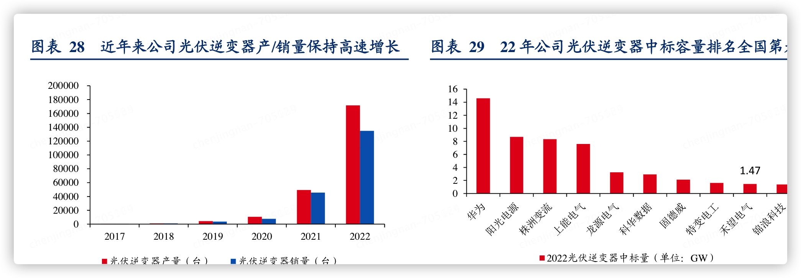
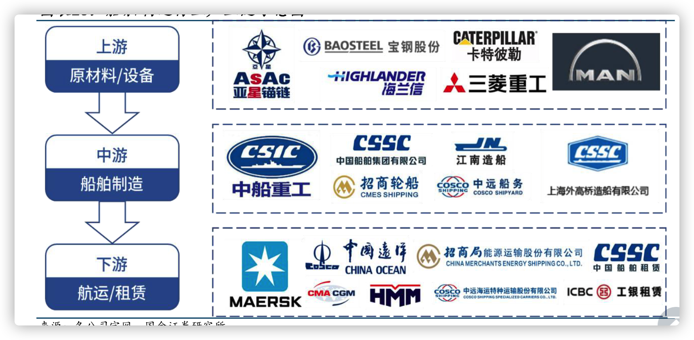
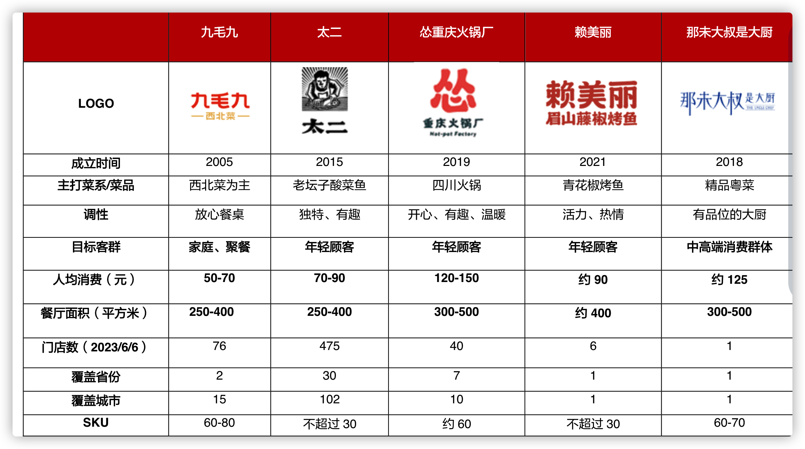
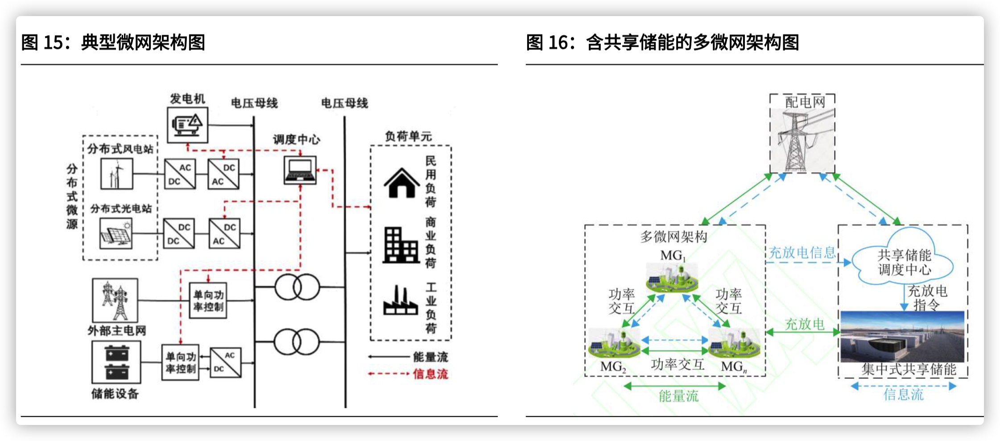
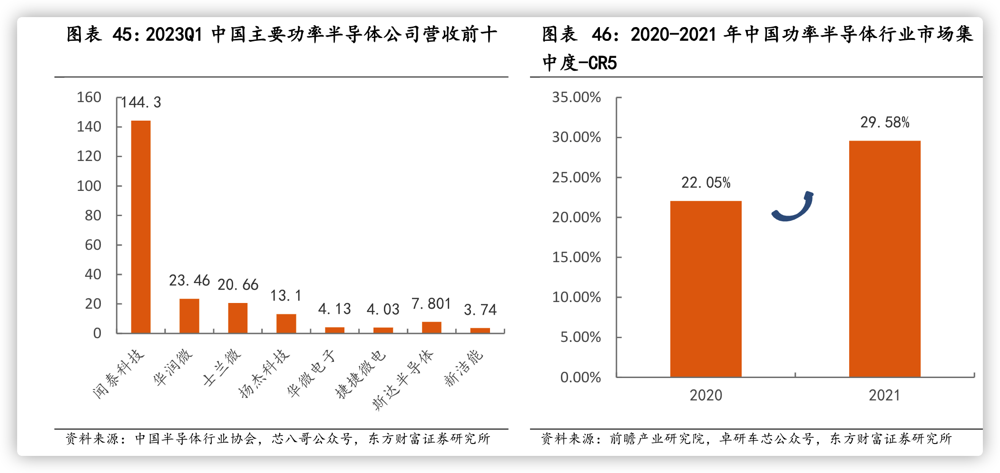

建议关注鼎龙股份，公司是国内唯一一家全面掌握 CMP 抛光垫全
流程核心研发技术和生产工艺的 CMP 抛光垫供应商，在国内抛光
垫市场中处于领先地位

建议关注濮阳惠成，公司专注顺酐酸酐衍生物和功能中间体产品的
研发和生产，受益于我国电子信息产业的快速发展、我国智能电网、

重点推荐合盛硅业，公司在工业硅及有机硅产业链完整，具备规模
优势、成本优势，上下游协同效应有望持续加强，随着在建项目的稳
步推进，公司业绩有望持续向好。 v 


美现役战斗机均为较为领先的三代机和四代机，占比分别为 83%和 17%，而我国
仍有近 50%的二代机亟需替代,四代机仅有 19 架，占比约为 2%，远低于美国。另外，当前美
国战斗机仅有重型和中型，而我国战斗机中轻型战斗机占比仍然较高；我们认为当前航空装
备需求迫切且确定性高，未来方向是数量升+结构优


### 特步  股息

集团总收入同比增长6.5%至135.77亿元（2023年：127.43亿元），主要驱动因素：
​主品牌特步：收入增长3.2%至123.27亿元（占比90.8%），稳守大众市场。
​专业运动分部（索康尼+迈乐）​：收入激增57.2%至12.50亿元（占比9.2%），成为第二增长曲线。
​产品结构：鞋类占比提升至59.3%（2023年：54.5%），服装占比下降，反映跑步鞋技术优势。

​盈利能力提升

毛利率从41.8%提升至43.2%，主要因高毛利产品（如专业跑鞋）占比增加及供应链优化。
经营溢利增长9.3%至19.66亿元，净利增长20.2%至12.38亿元，创历史新高。
​专业运动分部：经营溢利暴增829.5%至0.78亿元，显示高端品牌盈利潜力释放。


​集团总收入：135.77亿元（+6.5%），主要由特步主品牌（+3.2%）和专业运动分部（索康尼+迈乐，+57.2%）驱动。
​特步主品牌：123.27亿元（占比90.8%），稳居大众市场主导地位。
​专业运动分部：12.50亿元（占比9.2%），成为增长引擎。

​毛利率：43.2%（+1.4个百分点），主因产品结构优化及高毛利专业运动业务占比提升。
​经营溢利：19.66亿元（+9.3%），主品牌经营利润率稳定（15.9%），专业运动分部扭亏为盈（经营溢利7820万元，+829.5%）。
​净利润：12.38亿元（+20.2%），创历史新高。

​特步主品牌

特步通过“主品牌稳大盘+专业品牌拓增量”策略实现韧性增长，跑步生态与DTC转型为长期动能。需关注消费复苏节奏、索康尼高端化成效及供应链效率优化。短期高股息回报吸引投资者，长期看好其在细分市场的品牌壁垒与ESG价值。

​策略：聚焦跑步市场，强化“专业影响大众”战略，六大马拉松赛事中跑鞋穿着率居首（全局22.4%）。
​渠道优化：成人门店减少189家至6,382家，儿童门店减少119家至1,584家，转向高效零售模式。
​产品创新：推出“160X 6.0 PRO”“260X 2.0”等跑鞋，技术升级（碳板、轻量化设计）提升竞争力。

专业运动分部（索康尼+迈乐）​

​索康尼：收入突破10亿元，门店增至145家，通过DTC模式深化高端市场布局，马拉松穿着率稳居国际品牌前三。
​迈乐：聚焦户外市场，产品功能性与多场景适用性增强，全渠道销售表现优异。

现金流与负债

​经营现金流：12.28亿元，保持稳健。
​现金及等价物：29.79亿元（较上年略降3.15亿元），负债比率18.1%（改善2.2个百分点），财务结构健康。

盖世威将推出专业网球运动体育用品，
以强调品牌的网球基因，而帕拉丁将推出反映年轻消费者喜好的产品
截至2023H1，公司鞋履自产占比28%、外包占比72%；服装自产占比12%、
外包占比 88%。

特步主品牌同增高单位数，其中竞速系列销量同增 90%，抖音店播同增
73%；索康尼同增 98%，系天猫运动鞋行业头部品牌增速第一；迈乐同增
101%，徒步鞋品类销售同增 150%，MOAB3 登短途登山鞋热卖榜第一；
盖世威同增 149%，京东平台同增 297%；帕拉丁同增 114%，其中服装同
增1305%，抖音同增243%。

时尚运动方面，盖世威和帕拉丁在中国内地进行全面品牌重塑，升级产品
组合和店铺布局，成功增强品牌知名度及大幅提升店效；加快在中国内地
高线城市的开店步伐。盖世威拟推出专业网球运动产品，强调品牌网球基
因；帕拉丁增强对年轻消费者的吸引力，改善产品供应和零售网络。

### 森马服饰 股息
全年实现营收146.26亿元，同比增长7.06%，主要得益于童装业务稳定增长及四季度业绩反弹（Q4营收同比增9.8%）

​扣非净利润10.84亿元，同比增长6.16%​，显示主营业务盈利能力有所改善

```
2024年经营活动现金流净额为12.63亿元，同比大幅下降34.94%。这一下滑主要归因于：

​存货占用资金增加：Q4备货导致库存采购支出增加12.7亿元；
​回款周期延长：应收账款周转天数同比增加2天至36天；
​应付账款周转天数增加：从86天延长至92天，供应商账期压力加大
```

派息率提升至83%（股息率5.3%）

`童装业务核心地位`

巴拉巴拉品牌贡献营收近70%（2023年达93.73亿元），稳居国内童装市场份额第一。
童装板块多品牌矩阵（如迷你巴拉、马卡乐）覆盖不同消费群体，但市场竞争加剧导致毛利率承压

`净利润大幅反弹`
归母净利润达3.82亿元，同比增长32.1%，扭转了前三季度净利润同比下降9.25%的颓势。
扣非净利润3.49亿元，同比增幅更高达42.4%，反映主营业务盈利质量明显改善

目前出海仍面临资金管制、文化壁垒、政策动荡等多重障碍，
落地和执行尚需时日，但二次出海成功确定性明显增强，原因主要在于，第一，国内市场增
长放缓，寻找海外增长空间成为共识，疫后全球经济逐步复苏；第二，公司是国内休闲服饰
和儿童服饰的龙头，森马和巴拉巴拉品牌享有高知名度，对海外代理商有较强的吸引力；第
三，公司前期积累的出海经验成为宝贵的无形资产，可以帮助规避“合作摩擦”，适应“国
际本土化”；第四，路径上，公司选择将东南亚、中东作为重点开拓的区域市场，三处区域
市场位于“一带一路”沿线，具备政策友好、消费活跃、品牌服饰萌芽等明显优势

柔性供应链的价值在于提高售罄、减少库存、提升周转。供应链之于时尚品牌是底盘和
生命线。得益于优质供应商的稳定合作、订货制改革以及数智化升级，公司的快反周期由
2000 年初的 3 个月缩短至 2 周以内，逼近优衣库、H&M、ZARA 等国际快时尚企业快反水
平，2018-2022 年公司的库存压力、存货减值保持在健康可控状态

公司的资本性支出以投资和股利分配为主，2018 年收购Kidiliz 占用8.44
亿元，分红常态化且分红比例领跑同行，近五年分红比例为 75%+。

存量博弈、红海持续的新背景下，依托品牌势能、渠道壁垒以及柔供等全方面领
先优势，公司有望在渠道变革和海外探索机遇上取得新突破，引领业绩量质齐升

柔供是当下解决产销不对称的最好方式。服装行业产销不对称，天然会造成库存。柔供
成于优衣库，被国内服装品牌竞相学习，极致于 Shein，凭借小单快反最大化抵消时间差，
仍然是当下解决产销不对称的最好方式。柔供帮助公司渡过行业库存危机时期，同时将库存
控制在可控范围内，当前库存问题主要是疫后的动销转弱所致规模是柔供的必要条件。长期稳定的产供合作关系可以提前锁定供应商产能和进行快速
匹配，小单快反对供应商提出更大的成本挑战，需要通过采购规模来平衡。中小企业实现柔
供的难度较大，公司的营收体量居于头部水平，优质供应商采购集中度持续提升

电商主推线上线下同价，盈利提升。2022 年服装线上渗透率为 37%，近 3 年仅增长 3pp。
公司一方面积极布局抖音等机会赛道；另一方面，主推线上线下同价，营收阶段性受损，但
盈利明显提升，2023H1 线上毛利率为 41.68%，较 2019 年提升 10.93pp。线上线下同价是
平衡电商和门店利益的稳态格局，越来越多企业达成共识，头部企业先行，中小企业跟随，
业绩逐渐从“增收不增利”过渡到“营收滞后于盈利”，最终实现“量质齐升”

公司作为休闲服饰和童装的双龙头，品牌、渠道壁垒和柔供能力突出。巴拉巴
拉二三线购物中心加密、森马基本店+家庭店试水、出海进展成为重要成长机遇。预计
2023/2024年公司归母净利润分别为11.1/15.5亿元，同比增速为74.67%/39.16%，对应
EPS为0.41/0.57元/股，对应P/E为14/10倍。首次覆盖，给予“买入”评级

分产品看，巴拉巴拉品牌是国内童装龙头，童装修复
速度预计好于成人休闲装（23H1 童装/成人装收入增速分别同比-
15.06%/+6.34%）。单季度来看，公司 23Q1/Q2/Q3 营业收入分别同比-
9.3%/+9.7%/+1.1%，受基数、天气及消费弱复苏等因素影响，收入恢
复节奏存在季度波动；归母净利润分别同增48.9%/295.8%/89.4%

毛利率提升明显，存货规模同比改善。盈利能力：23Q1-Q3 公司毛利
率同比+3.71pcts 至 44.13%，预计主因公司有效控制终端折扣，线上、
线下同款同价比例提升且毛利率更高的直营渠道收入占比提升

存货：截至23Q3，存
货规模同比-21.78%至36.53 亿元，公司有望在Q4 销售旺季及促销节日
加大存货清理力度，优化新老品结构，助力明年轻装上阵。

### 地产

今年1-11 月住宅竣工面积同比+18.5%，2024H1 竣工仍有望延续韧
性，支撑明年家装需求稳健释放。

2023 年 1-11 月，房屋新开工面积 8.75 亿平方米，同比-21.66%。
2023 年 1-11 月，房屋累计施工面积 83.13 亿平方米，同比-7.20%

根据中指重点监测的100城数据，2023年，一线城市新
建商品住宅累计销售面积同比小幅增长约4%，市场整体
稳定；二线、三四线代表城市同比分别下降4%、11%

### 杂项
酒就两个用途，一，上级驯服属下的测试工具。二，味觉退化或酒精上瘾的中老年男士。真是人间清醒，一针见血，振聋发聩。

制造端汇聚中东，推动光伏产业发展。光照资源优势、制造成本低廉和电价补贴等政策计划向好带来光伏
市场新机遇，吸引TCL中环、协鑫科技、天合光能等中国厂商纷纷加速布局中东。中东1-11月累积进口13
GW中国组件，同增约71%，超越22年8.4GW拉货量，预计仍将保持高速增长，市场前景广阔

产能释放供给过剩，各环节将加速下跌至成本线，预计价格持续低位。二三线加快出清，盈
利或在24年中见底，龙头阿尔法逐渐体现

硅料瓶颈解决， 24年硅片过剩进入激烈竞争阶段。据我们统计，24年底硅片产能合计1068GW，
对应可供装机890GW，由于石英砂相对紧张，硅片盈利有支撑
◆ 硅片两超多强，格局相对稳定。我们预计24年隆基/中环市占率27%/25%，CR2约为52%。

BC结构由于正面无遮挡，天然具备效率
优势。在单面市场，爱旭ABC组件功率610W+，高于同版型TOPCon30W，效率优势明显。
在 双 面 市 场 ， 爱旭ABC 依靠背面银浆方案，双面率可达70% ，随24 年中/ 底成本打平
TOPCon/PERC，竞争优势持续凸显

与TOPCon在不同版型下对比，HJT均拥有更高组件效率及功
率瓦数，标准版型领先约10W优势。。受益于效率及发电性能优势，同时当前HJT外销规模
较小，报价1.28元/W，较TOPCon1.03元高0.25元/W，整体溢价明显。

钙钛矿效率持续提升，稳定性逐步验证中。截至23年底，钙钛矿头部组件厂效率陆续突破
18%：极电光能1.2*0.6m单节组件效率18.2%，并通过IEC61215/IEC61730测试；协鑫光电
1m×2m量产效率破18%。GW级产线陆续启建，预计24年量产效率可达20%+。

中期，2024 年春季来临，需求复苏，TOPCon 技术持续迭代过程
中，出货量与利润分化将持续；c）中长期看，龙头扳手腕持续，优
质企业将在低谷时期保持扩张节奏，市占率进一步提升

### 晶盛

公司前三季度实现营业收入134.62亿元,同比增长80.39%;归母净利润35.14亿元,同比增长74.94%。 
未完成设备订单287.50亿元,其中半导体设备订单33.03亿元。

石英坩埚、金刚线等硅材料业务快速放量，多领域材料实现突破

凭借单晶炉较高市占率，公司拓展石英坩埚、金刚线等耗材业务。受石英砂
紧缺及需求高增影响，21 年 9 月至今光伏石英坩埚价格增长约 900%，2024
年高价有望维持。据我们测算，24-25 年国内石英坩埚年均市场市场有望超
400 亿元，23-25 年 CAGR 为 29.3%。公司 22 年市占率约 19.6%，未来有
望依托“超级坩埚”进一步巩固坩埚龙头地位。金刚线细线化成为趋势，钨
丝金刚线有望成为主流。我们预计 25 年金刚线国内市场规模 123.9 亿元，
23-25 年 CAGR 14.8%。公司自制钨丝母线并积极扩产，有望实现弯道超

公司碳化硅衬底进入大规模量产倒计时，碳化硅外延设备市占率领先 
据 Yole，全球 SiC器件市场规模 2027年有望达 63.0亿美元，21-27年 CAGR
为 34%，其中碳化硅衬底占器件成本达 47%。公司依托泛半导体长晶技术，
6 英寸衬底良率、性能等指标位于行业头部梯队，现已形成 5000 片/月产能，
核心设备如长晶炉等均为自制，并拓展 8 英寸衬底。公司预计在 25 年实现
25 万片 6 英寸及 5 万片 8 英寸衬底年产能。碳化硅外延片对外延设备要求
较高，公司 6 英寸双片式碳化硅外延设备已实现批量销售，市占率位居国内
前列，8 英寸单片式碳化硅外延设备处于客户验证中。衬底与外延设备有望
在外延厂发挥协同作用，助力公司强化碳化硅布局。

衬底片性能优越，与中芯集成等达成合作

光伏设备是晶盛机电成长的第一曲线，第二曲线是光伏耗材
和半导体耗材的放量，第三曲线是碳化硅设备+材料和半导体设备的放量。我们维
持公司2023-2025 年归母净利润为47/58/70 亿元，对应PE 为11/9/8 倍，维持“买
入”评级。

低氧技术是单晶炉下一步迭代方向，超导磁场单晶炉降氧效果显著

第五代超导单晶炉夯实公司单晶炉龙头地位，设备延伸至光伏全产业链布局

半导体硅片生产设备中，单晶炉投资占比 25%，有望率先实现进口替代。从产业链来看，
芯片的生产环节包括硅片制造、晶圆制造、封装测试，对应的设备包括硅片制造设备、前
道工艺设备（晶圆制造）、后道工艺设备（封装测试）。根据集微咨询预计，20-22 年中国大
陆硅片设备需求约 570-800 亿元，其中长晶设备约占设备总投资的 25%，则对应的单晶炉
市场规模为 140-200 亿元。根据中商产业研究院，目前半导体用单晶炉国产化率不足 20%，
随着国内企业在拉晶环节持续突破，有望率先实现进口替代

蓝宝石是一种氧化铝单晶，由于具有强度大、硬度高、耐腐蚀等特点

公司半导体石英坩埚的主要客户为中环领先、上海新昇、奕斯伟等公
司，光伏石英坩埚的主要客户为 TCL 中环、晶科能源、弘元新材料等

公司自制钨丝母线降低成本，积极扩产迎合行业扩容 

碳化硅衬底良率是考核企业产品性能及经济性重要指标，大尺寸衬底是行业趋势。SiC 衬
底制备重难点主要是晶体生长和切割研磨抛光环节，是整个衬底生产环节中的重点与难点，
成为限制碳化硅良率与产能提升的瓶颈。加工的难点在于碳化硅材料硬度高、脆性大、化
学性质稳定，因此传统硅基加工的方式不适用于碳化硅衬底.目前 4 英寸、6 英寸主要采用
多线切割设备，将碳化硅晶体切割成厚度不超过 1mm 的薄片。

公司导电型碳化硅衬底已形成 5000片/月产能，新增 30万片产能建设，核心设备均为自制。
2017 年公司开始碳化硅晶体生长设备和工艺研发，公司坚定电阻法技术路线，在切片环节
引入激光切割与多线切割设备并行，并在 2020 年开始建立长晶实验线和中试线，相继开发
6 英寸、8 英寸碳化硅晶体和衬底。目前公司中试线形成月产 5000 片 6 英寸衬底产能。公
司长晶和核心加工设备均为自制，设备国产化率达到 90%以上，实现了 6 英寸-8 英寸碳化
硅晶体生长和加工技术的自主可控。据晶盛机电微信公众号显示，公司于 2023 年 11 月 4
日举行签约仪式，预计新增产能 25 万片 6 英寸碳化硅衬底、5 万片 8 英寸碳化硅衬底。

公司 6 英寸碳化硅衬底达到业内一流水平，8 英寸衬底 2024 年实现与 6 英寸品质同步。截
至 2023 年 11 月公司碳化硅投产签约仪式，公司中试线产出的 6 英寸碳化硅衬底片在直径、
微管密度、位错、电阻率、弯曲度、翘曲度等关键参数均达到或者优于业内技术水平。产
品已获得下游领先企业的验证和认可，已签约并交付批量订单。从具体指标来看，量产改
善方面，公司 6 英寸核心缺陷快速迭代改善下降，量产 TSD 稳定＜100，BPD＜400，达
到业内一流水平，最新研发成果方面，位错持续改善，研发试产基本稳定实现 TSD＜10，
BPD 小于 50。8 英寸方面，公司已实现 8 英寸产品小批量生产+下游验证，可供应高质量
500um 和 350um8 英寸碳化硅衬底，全产线可实现 6-8 英寸碳化硅衬底。目前公司全产线
可实现 6 英寸和 8 英寸产品兼容，公司预计 2024 年可实现 8 英寸产品与 6 英寸产品品质
达到同步

碳化硅设备：碳化硅外延设备国产替代空间广阔，公司外延设备国内市占率领先 

外延片占碳化硅器件产业链成本 23%，仅次于碳化硅衬底。碳化硅晶体生长的过程中会不
可避免地产生缺陷、引入杂质，导致质量和性能不足，而外延层的生长可以消除衬底中的
某些缺陷，使晶格排列整齐。与传统硅器件不同，碳化硅器件不能直接制作在衬底上，需
要在衬底上生长一层晶相同、质量更高的单晶薄膜(外延层)  ，再制作器件。外延可分为①
同质外延：在导电型 SiC 衬底生长 SiC，常用于低功率器件/射频器件/光电器件；②异质外
延：在半绝缘 Sic 衬底生长 GaN，常用于高功率器件。根据前文数据，2023 年外延片占碳
化硅器件产业链成本约 23%，仅次于碳化硅衬底

碳化硅外延工艺难度大，份额主要被国外厂家占据，天成、天域引领国产替代。碳化硅外
延会复制衬底的晶体结构，因此外延层缺陷包括来自衬底的缺陷，以及生长过程的位错以
及宏观缺陷。据 Yole 数据，2020 年 Wolfspeed  与昭和电工分别占据全球碳化硅导电型外
延片市场 52%和 43%的市场份额，合计高达 95%。国内碳化硅外延厂商较少，瀚天天成和
东莞天域引领国产替代。

碳化硅外延设备国产替代加速，以晶盛机电、北方华创、中电科 48 所为代表。国内外延设
备由国外厂商主导，国内主打外延设备以意大利的 LPE、德国的爱思强、日本的 Nuflare
产品为主。国内厂商则以晶盛机电、北方华创、中电科 48 所为代表。1）晶盛机电：SiC
外延设备为公司独立研发设计和生产制造，核心技术均拥有独立的知识产权，目前已实现
批量销售。2）北方华创：具有 10 余年外延设备研发的技术积累，目前 4/6 吋 SiC 外延设
备已签订单超百台，批量机台已在各大主流外延厂实现稳定量产。3）中电科 48 所：陆续
开发出碳化硅外延设备、高温高能离子注入机、高温激活炉、高温氧化炉，并持续研发第
二代、第三代机型，其碳化硅设备已在生产线应用/签订合同百余台套


由于设备中标到设备商确认收入要经历生产、运输交付、客户验证等过程，我们认为由于
近年来硅片扩产较快，公司订单生产交付及验收周期拉长，收入确认节奏慢于签单速度，
造成公司在手订单持续增长。随着公司在手单晶炉订单逐步确认收入，以及公司半导体和
碳化硅设备，光伏电池、组件设备陆续放量，丰富的在手订单有望支撑公司设备收入稳健
增长，但通过上文测算，我们认为单晶炉整体市场可能在 24 及 25 年逐渐收缩，公司光伏
设备在手订单有下降风险，但由于在手设备订单仍较多，公司收入预计仍将增长，但 24-25
年收入增速将有所下降。 

公司材料板块主要包含光伏石英坩埚、金刚线、蓝宝石，碳化硅衬底等，光伏石英
坩埚为材料板块主要收入来源。坩埚用量随硅片产量提升而提升，且 N 型硅片占比提升有
望提升坩埚用量。价格方面，根据 solarzoom 数据，36 英寸光伏石英坩埚最新价格为 42000
元/只，根据美晶新材招股书，预计 2024 年石英砂仍短缺，24 年石英坩埚平均价格维持在
高位，25 年随着原材料扩产，价格下降 20%。公司钨丝金刚线及碳化硅衬底随着产能释放，
收入有望逐步增长，蓝宝石业务下游竞争较为充分，预计收入将保持稳定。

公司新业务拓展不顺利：若钨丝金刚线得不到下游客户广泛认可，渗透率提升不及预期，
新建产能可能造成产能闲置，不利于公司整体经营。此外，公司碳化硅衬底、半导体设备
等业务技术壁垒较高，公司存在新业务拓展不顺利的风险。

### 现金流

1. 2.4-1.4=1+0.8=1.8 *6

### 榨菜
​当前估值：市盈率（PE）约25倍，高于食品加工行业平均（20倍），反映市场对其龙头地位及提价能力的认可；
​催化剂：原料价格下行释放利润弹性、新品放量超预期；
​风险点：极端气候导致原料暴涨、食品安全事件冲击品牌。

涪陵榨菜2024年面临短期增长压力，但通过成本控制、研发投入和产能扩张为长期蓄力。现金流改善和分红政策增强投资吸引力，需关注新品市场表现及新产能释放进度。若智能化项目顺利落地，有望推动效率提升和利润率改善。

收入与利润

​营业收入：23.87亿元，同比下降2.56%（2023年：24.5亿元）。
​净利润：7.99亿元，同比下降3.29%（2023年：8.26亿元）。
​毛利率：51.00%，同比微增0.22%，显示成本控制能力稳健。
​成本与费用

​营业成本：11.68亿元，同比下降3.02%，主要因青菜头价格下降31%。
​销售费用：3.24亿元，同比略降1.06%，但市场推广费增长30.55%，品牌宣传费减少65.22%，反映策略调整。
​研发费用：1062万元，同比大增77.15%，显示技术投入和新品开发力度增强。


产品结构优化

榨菜仍是核心（收入占比85.64%），但泡菜收入增长2.20%，显示品类多元化进展。
新产品榨菜酱、调味菜逐步推广，可能成为未来增长点。


​短期：2024年原料成本压力缓解，净利润有望恢复双位数增长；
​长期：品类多元化与健康化升级决定天花板，若泡菜/下饭菜品类占比提升至20%以上，可打开第二增长曲线；
​建议关注：
轻盐系列终端动销数据；
东北泡菜基地投产进度；


1.受大消费市场持续疲软影响,产品终端动销放缓;2.二季度公司对部分终端老日期产品进行了促销拉动,并放缓了部分经销商的调货; 3.同期部分销售大区受疫情
影响,居民备货及居家消费频次增加,销售基数增加,报告期该因素消除销售量同比下降;4.餐饮行业恢复短期对家庭消费带来影响。

### 牧原股份

公司屠宰肉食板块 2023 年在渠道的开拓与客户的发掘上取得一定成效，全年
屠宰生猪在 1,300 万头以上，同比增长 80%左右，但距离理想产能利用率仍有一定
差距。由于东北厂区投产时间短，产能利用率较低，头均固定成本较高，当前屠宰
肉食业务仍处于亏损状态，但整体头均亏损水平已较 2022 年明显下降。2024 年，
公司屠宰肉食板块会加强销售能力建设，优化产品结构与客户结构，同时加强内部
生产、运营、销售等板块的协同，以提升整体盈利能力。

### 榨菜

这次定增就是要扩大收储能力，平抑价格波动，同时深度绑定青菜头种植户，实现传统农业升级，提高当地农民种植收入，助力乡村振兴，实现共同富裕。公司的发展，更要关心的是新上任的管理层，定增项目能否顺利落地，未来的发展规划。公司的负债率极低，可以说是家庭作坊式的生产模式，未来可以锚定周转率的进一步提高，匹配中央厨房的发展趋势，适当提高负债率，协同提升roe水平。几块钱的消费升级的生意，长期看空间还是很大的


从量方面，目前榨菜产能13-15万吨，基本满产满销，预计扩产20万吨，约1.5倍，预计回报5亿/年。不扩产净利润9亿；扩产带来的净利润空间6-14亿，其中滞销带来的资产投入计提净利润约6亿，满产满销约14亿

 给15-20倍市盈率，按最低净利润估值，6×15=90亿，6×20=120亿，区间90-120亿。
按满产满销净利润估值，14亿，14×15=210亿，14×20=280亿

 ### 制冷剂
 制冷剂行业经历了连续三年的低迷状态，具有利润修复的诉求。在配额基准期内，制冷剂生产企业连续 3 年，通过低
价、低利润甚至是负利润来抢占更多的市场份额，导致企业连续三年制冷剂业务承担了巨大的利润压力，很多小型企
业难以长期坚持。度过配额锁定阶段后，国内配额形成了供给端限制，使得制冷剂具有涨价基础，行业的企业具有通
过涨价获得利润修复的诉求，且由于具有配额限制，并不担心行业内形成新的进入者，行业利润有望获得较大程度的
提升。

四代制冷剂主要以海外巨头供应为主，国内受专利、设备、价格等因素影响，短时间内难
以大规模推广。四代制冷剂（HFOs）在 ODP 值、GWP 值等环保指标方面优于三代制冷剂，
且物理性质、制冷性能等方面能够做到与三代相近，在少数领域已经开始有所应用。以四
代制冷剂目前的主流品种 HFO-1234yf 为例，HFO-1234yf 在热力特性和能效等方面已经与
HFC-134a 接近，可以作为汽车空调使用的新一代制冷剂。

海外巨头构筑了四代制冷剂专利壁垒，国内企业短期难以实现大范围国产化。不同于国内
的追赶路线，以科慕、霍尼韦尔、大金为代表的海外巨头在制冷剂领域布局相对较早，在
含氟制冷剂领域具有较好的积淀，因为相比之下，海外制冷剂基本算是领先国内一代产品。
在国内实现了三代制冷剂的技术突破和工业生产阶段时，海外巨头企业就开始重点发力四
代制冷剂，并着手构建四代制冷剂的生产和应用专利池。相对完整的生产专利和应用专利
为海外企业构筑了长时间的竞争壁垒，国内企业在四代制冷剂领域发展相对受限，目前主
要在产的生产线也以为海外企业代工为主，还未能形成稳定供应销售的产业链布局。

。经过 2020-2022 年
基准期的配额锁定，2024 年行业将进入配额管制阶段，产量较 2022 年下行，供给端受到
政策限制；而从结构上看，新的配额政策不仅确定 2024 年的整体配额，更是针对内用配
额进行了约定，国内整体三代制冷剂的内用配额占比不足一半，预估国内市场将呈现出明
显供需改善的情况，具有价格和利润的改善空间。

### 禾望电气

公司风电变流器技术领先，有望受益风光装机容量高增

驱动力一：新能源电控业务，把握新能源技术趋势，迎接风光储需求共振。 
1） 风电：政策规划加持下，2023 年风电行业高景气度彰显，公司顺应变流器
大容量化发展，与国内  10  多家整机厂商形成稳定的合作关系，品牌优势
有助公司持续巩固行业地位，未来有望受益风光装机容量高增。 
2） 光伏：光伏迈入平价成长未来几年有望保持高增速，公司组串式逆变器中
标量领先，有望充分享受行业增速。同时公司战略布局半导体公司，聚焦
碳化硅（SiC）核心技术，推广“单管并联”技术路线，正逐步受到下游客
户认可。 
3） 储能：公司重点布局储能系统解决方案，项目经验丰富，2021  年以来，
公司储能产品不断出货，产品技术获业内认可，未来市占率有望实现突破。 
驱动力二：电气传动业务：工程变频器国产替代中，公司1GCT 变频器性能更
佳，目前市场上工业大传动产品国产化率提升空间广阔，未来公司有望凭借技
术优势加速开拓市场。 
驱动力三：氢能业务：电解槽是制氢的核心设备，公司制氢电源可广泛应用于
电解水制氢系统，与深圳大学能源研究院在氢能领域建立合作，公司产品已实
现实际应用市场，有望受益氢能行业实现快速增长。



IGCT 芯片相比IGBT 更适用于工业大传动变频器领域。在过去较长时间中，IGBT 由于
其高频特性，在轨道交通、工业变频、家用电器、新能源逆变器等中小容量应用领域广
泛应用，但随着电力电子装备电压和容量等级的进一步提升，IGCT 器件的高压大容量优
势在冶金轧钢、石油开采、油气输送、重型制造、海上风电、船舶推动、抽水蓄能等工
业大传动领域优势凸显。IGCT 单芯片可以同时承受 4500V 高电压、8000A 大电流，所
以应用在巨大功率的“电气大传动”上面；而 IGBT 中，高压 IGBT 芯片可以承受 4500V
高电压但只能50A 低电流，低压IGBT 芯片可以承受200A 大电流但只能1700V 电压，
所以适合应用在“小传动”，如用在“大传动”需要多芯片串并联使用，可靠性降低。

（1）  新能源电控业务:该公司主要提供风电变流器，光伏逆变器和储能PCS 相关产品，
受益于下游风电、光伏、储能三个行业未来几年的快速发展，公司该业务有望快
速起量。预计公司该业务2023-2025 年营收约为33.98/46.16/59.98 亿元，毛利率
分别为27.94%/28.10%/28.44%。 
（2）  传动业务：传动变频器技术壁垒深厚，公司是国内第一家IGCT 变频器投入实际
应用的产商。相比于海外工业传动变频器，公司产品不仅可以在性能和质量上有
很高的保障，且在价格上具有较强的竞争优势，具备较大国产替代空间，预计公
司该业务 2023-2025 年营收增速分别为 60%/50%/40% ，毛利率分别为
42%/41%/40%

强制配储带动国内储能高速增长，大储在国内储能装机中占据主导地位

公司风电变流器起家，主营新能
源和电气传动产品，业务遍布亚/欧/非/南美/北美洲。公司风光储业务优
势显著，其中光伏逆变器/储能PCS 22 年国内出货量分别位居7/8 位，
同时传动技术国际领先，变频器定位高端应用广泛。2018-2022 年营收/
归母净利润CAGR 分别为24.18%/49.29%，业绩稳定增长。

### 盾安环境

目前车用热管理阀件已获国内外系统、主机厂充分认可，增长逻辑持续验证。

此供应链重塑趋势为盾安汽车零部件业务带来了良好发展机遇。
盾安目前电子膨胀阀产品已进入比亚迪、蔚小理、极氪等销量高增长车企供应链，在良好合
作基础上盾安可持续拓展其热管理零部件产品，充分提高单车价值量。 （占比太低了 7% 三花60%）

公司盈利能力呈显著回升趋势，预计后续仍有改善。2018-2020 年公司盈利能力因债务问题
造成短期波动，2021 年后公司净利率呈显著回升态势，排除债务干扰后，2022 年扣非销售净
利率为 4.54%，2023H1 扣非销售净利率为 7.57%，扣非净利率明显提高，目前处于行业中游
水平。净利率提高的主要原因是产品结构优化，原材料成本下降，以及海运费、汇率带来的
毛利率改善。我们认为随着公司家电业务产品结构的不断优化以及汽零业务的规模效应，公
司盈利能力后续仍将有所改善。

### 三花智控

按照产品划分,制冷空调电器零部件业务营业收入为77.06亿元,同比上升10.70%;汽车零部件业务营业收入为48.23亿元,同比上升50.78%。


### 复星医药

2023 年前三季度，不含抗疫产品，本集团营
业收入同比增长约 11%；不含抗疫产品，制药业务新品及次新品收入同比增长超过 30%。

2023 年前三季度，本集团继续加大研发投入，研发投入共计 42.91 亿元，同比增长 13.67%；
其中，研发费用为 31.55 亿元，同比增加 2.92 亿元、增长 10.22%。

抗疫产品及印度子公司 Gland 收入下降，创新药快速增长，药品
板块营收占比提至 74.7%；营收总体持平。（1）公司制药板块
1H23 营收 159.95 亿元，同比增长 11.64%；分部利润 14.22 亿
元，同比减少 9.6%。（2）收入增长，主要来自汉斯状（斯鲁利单
抗注射液）、汉曲优（注射用曲妥珠单抗）及曲妥珠单抗原液、
苏可欣（马来酸阿伐曲泊帕片）等新品和次新品的快速增长；其
中，2022 年 3 月获批的汉斯状营收 5.56 亿元，汉曲优收入同
比增长 57.1%、苏可欣收入同比增长 32.7%，但复必泰（mRNA 新
冠疫苗）销量同比显著下降。（3）利润减少，主要源于①复必泰
（mRNA 新冠疫苗）销量显著下降，但仍有相应的团队和医学、
市场等费用发生；②控股子公司 Gland Pharma 因美国市场竞争
加剧以及部分产线停产升级等因素导致的经营业绩同比下降；③
汉斯状（斯鲁利单抗注射液）、倍稳（盐酸凯普拉生片）等上市
新品的市场开发、团队加强等战略性投入以及汉斯状（斯鲁利单
抗注射液）在海外市场的前期布局及团队投入；④1H23，药品端
研发费用同比增加 3 亿元。

创新陆续兑现，药品板块营收占比提至 74.7%；成长确定。（1）子
公司复宏汉霖的 PD-1 产品汉斯状 11 项联合疗法在全球展开，中
国覆盖医院近 1500 家，东南亚与 KGbio 合作，美国自己团队并与
Syneos Health 合作。（2）合营公司复星凯特的 CAR-T 产品奕凯达
新增获批二线治疗成人大 B 细胞淋巴瘤（r/rLBCL）,截至 2023 年
6 月底，奕凯达已治疗超过 500 位患者，备案的治疗中心超过 140
家及 25 个省市。（3）公司包括 DaxibotulinumtoxinA 型肉毒杆菌
毒素、盐酸替纳帕诺片等在内的多款在研药品在中国境内的上市
申请（NDA）获受理，注射用曲妥珠单抗在美国的上市申请（BLA）
也已获受理。在 1H23 药品营收已升至近 75%的基础上，创新管线
蓄力充足。 

2023年前三季度,公司销售费用调整主要受到以下三个因素影响: 
(1)抗疫产品销售费用: 抗疫产品收入虽显著下降,但仍有团队和医学、市场等费用;(2)海外市场销售费用: 
斯鲁利单抗注射液美国市场上市前筹备投入;控股子公司Sisram直销业务费用增加,以及为提升品牌知名度而新聘品牌大使开支;(3)新品团队建设及加强和市场开发等投入


### 威斯迈

​核心业务：专注于新能源汽车电驱动系统及车载电源的研发、生产和销售，核心产品包括：
​车载充电机（OBC）​：高功率密度（3.3kW/kg以上）、支持800V高压平台；
​DC-DC转换器：适配主流电池电压（400V/800V）；
​集成式电源系统：“多合一”电驱系统（集成OBC、DC-DC、PDU）。

未来增长逻辑
​全球化突破

进军欧洲市场（德国子公司落地），目标2025年海外收入占比超20%；
通过Tier 1供应商（如博世）间接配套奔驰、宝马。
​高压快充升级

开发11kW双向OBC（支持V2L/V2G），适配800V平台车型；
与宁德时代合作储能式充电桩（光储充一体化）。
​半导体国产替代

联合三安光电开发SiC模块，目标2025年国产化率超50%。

​需求驱动

​新能源汽车渗透率提升：2024年中国新能源车渗透率超40%，全球车载电源市场规模超300亿元​（同比+25%）；
​高压快充趋势：800V高压平台普及（小鹏G9、极氪001等车型），推动高功率OBC需求（单台价值量提升30%）；
​政策支持：中国《新能源汽车产业发展规划》提出电驱动系统国产化率超95%。

短期：受益新能源车销量增长及高压平台渗透，2024年营收或突破30亿元；
​长期：全球化+技术升级驱动增长，SiC国产化降本增效；
​建议关注：
欧洲客户认证进展（如大众、Stellantis）；
SiC模块良率及成本曲线；
国内车企价格谈判条款（毛利率边际变化）。

产品结构优化，车载电源集成产品为主力，800 V 产品初现规模。2022 年起，公司车载电
源集成产品销售收入占销售总收入 85%以上，收入及占比均呈快速增长趋势，主要原因是
车载电源集成产品的销量快速增长。

2022 年前五大客户销售收入占比下降至 57.37%，上汽、理想在近
两年内销售占比下降趋势明显，但仍为公司前二客户。公司践行“走出去”战略，近年
来境外收入占比也逐渐攀升。公司一方面与小鹏汽车、理想汽车、合众新能源、零跑汽
车等造车新势力以及上汽集团、吉利汽车、奇瑞汽车、长安汽车等众多国内知名车企建
立长期战略关系；同时在海外市场，已向知名车企 Stellantis 集团量产销售车载电源
集成产品，并与雷诺确定定点合作关系

境外收入占比达新高，境外毛利率稳步提升。公司海外收入逐步提升，2023H1 海外收
入占比 14.49%。毛利率方面，境外毛利率逐年提升，但整体毛利率仍然低于境内水
平，未来随着整体规模的提升，境外业务毛利率有望进一步提升。

 新能源动力系统可以分为电驱动系统和电源系统。电驱动系统包括驱动电机、电机控制器
和减速器，电驱动系统是新能源的核心，新能源车通过电驱动系统实现动力的输入和控
制；电源系统主要包括车载充电器 OBC、DC-DC 变换器和高压配电盒 PDU，其作用是实现电
力转化和电池充放电功能。

从成本上来看，电动汽车最大的成本占比为动力电池，占比约为 38%，电机成本占比 7%，电控
占比约为 6%

电驱动和电源行业参与者可分为整车厂自供体系和第三方电驱动供应商。整车厂自供体系代表
公司有特斯拉、比亚迪旗下的弗迪动力、蔚来旗下的蔚然动力以及长安旗下的蜂巢能源等。第
三方电驱动供应商可以分为海外零部件巨头和国内供应商，海外汽车零部件巨头如联合电子、
日本电产、博世、大陆、博格华纳等，凭借深厚的技术、工艺等积淀拓展至新能源汽车领域，
本身产品力强、产能规模大，且具备全球主流车企客户资源。国内第三方电驱动供应商在近年
来快速崛起，根据业务侧重点可以分为以电控为主的英搏尔、汇川科技，以电机为主的方正电
机、卧龙电驱,以电源为主的威迈斯等厂商。在集成化的趋势下，部分企业开始布局电机、电
控、电源与“多合一”系统

集成化方兴未艾，电源+电驱系统多合一大势所趋 
目前行业主流产品已由分立式部件转为集成式部件，集成化成为未来行业发展趋势。近年
来，随着新能源汽车行业的快速发展，新能源汽车动力系统核心零部件呈现集成化、轻量
化、智能化的发展趋势，分立式零部件逐渐往总成类方向发展。相关厂商也从原先供应独
立电机、电控、减速器等，逐渐专向提供多合一、深度系统集成化的产品

国内外企业纷纷跟进 800V 架构，超级快充是大势所趋。相比较目前 400V 充电电压，800V
高压系统能提升充电功率和驱动功率，显著提高整车性能，同时减少整车线束等零部件重
量及成本。目前，国内外车企已开展布局，如保时捷、小鹏、比亚迪等车企均推出搭载
800V 高压平台车型；下游超快充充电桩也在逐步铺设覆盖，小鹏、广汽、理想、华为等均
发布超快充桩、计划投建超充站。佐思汽研结合各车厂规划预测，到 2027 年底，800V 高
压平台车型保有量将达到 300 万辆，800V 超充站保有量达到 1.5-2 万座

高压+高功率密度趋势下， SIC 渗透率或将提升。未来电机控制器技术发展趋势为高安全
性,高功率密度化以及高压化。随着 800V 电压平台推出，在大功率，大电流条件下减少损
耗、增大效率和减小器件尺寸成为需求点，电机控制器的主驱逆变器需要硅基 IGBT 替换为
SiC 基 MOS 模块，存量替代市场空间较大。作为第三代半导体材料的代表，SiC 具有大禁带
宽度、高击穿电场强度、高饱和漂移速度和高热导率等优良特性。SiC 的禁带宽度（2.3-
3.3eV）约是 Si 的 3 倍，击穿电场强度（0.8×106V/cm-3×106V/cm）约是 Si 的 10 倍，热
导率（490W/(m·K)）约是 Si 的 3.2 倍，可以满足高温、高功率、高压、高频等多种应用
场景

大功率充电下，液冷散热成为解决发热的重要手段之一。相较于风冷散热，全隔离防护技
术下的液冷充电模块是通过压缩机制冷，依靠循环液带走热量，并使用冷凝器对循环液进
行降温，具有高防护、低噪声


#### 晨光
短期来看，晨光生物没有多少亮点，持续下跌磨底，如利润持续下滑，则未来深不见底。

1.中药配方颗粒集采入围但无量，原料药生产效益一般。

2.饲料级叶黄素价格低迷，销量下滑非常多，辣椒红和辣椒精相对稳定。

3.棉籽加工产能释放，但薄利销售，年利润约1个亿，潜力不大。

4.工业大麻暂时看不到风口，赞比亚土地开发进展缓慢。

5.保健品增速快但量太小才0.8亿，利润占比太小，其他提取不成气侯，三大主力产品后继无人，姜黄素、水飞蓟、花椒提取雷声大雨点小。

6.管理机制不佳，招人不少，但创新缺乏重大成果


2024 年，公司主导产品辣椒红色素要发挥产能优势，朝着市场占有率 3/4
甚至 4/5 的目标继续努力；辣椒油树脂要发挥原料及市场优势，逐步扩大市场份
额；叶黄素要通过发展云南、印度、赞比亚、缅甸原料基地，持续提升市场话语
权。番茄红素、食品级叶黄素要加快高端应用市场开发进度，争取在销售上实现
大的突破；甜菊糖产品要发挥生产成本优势，加大国内外市场开发力度，进一步
扩大市场份额；水飞蓟素、姜黄素、迷迭香提取物等产品要通过工艺优化、产能
扩大等措施，尽快建立竞争优势，形成新的经济增长点。

在工艺、技术、装备等方面积累的丰富经验，已成为公司在激烈市场竞争中
的核心优势。公司要保持对新工艺、新技术、新设备的敏感性，积极借鉴各行业
先进的技术和装备，持续推进生产系统改进创新，不断提高生产效率，降低生产
成本，实现高质量发展

贯彻“吃干榨净”理念，多种类提取物综合利用。公司创新应用资源综合利
用技术，从加工所得副产品中提取出新的有效成分，通过多种类综合提取有效降
低产品成本。除首创复合溶剂同步提取辣椒红色素与辣椒精技术外，葡萄籽已实
现提取原花青素和葡萄籽油的综合利用，万寿菊同步提取叶黄素和槲皮万寿菊素
（QG）、甜叶菊同步提取甜菊糖和 CQA 技术均已经实现工业应用，2022 年槲皮
万寿菊素被批准为新饲料添加剂，QG、di-CQA 的多应用场景功效验证为动保产
品推广提供了理论支撑，在全球禁抗和动物产品消费升级的大背景下，天然植物
提取物作为替抗饲料添加剂的市场需求将持续增长。公司不断通过资源综合利用
开发新的品种，在基本不增加成本的情况下提高产品附加值，挖掘业绩增长点

研发投入逐年增长，研发团队高质量发展。2022 年公司研发费用破亿元，较
上市前刚破千万的研发费产生巨大突破，同时自 2020 年起研发费用率维持在 2%
左右的水平，因公司棉籽业务更偏大宗品属性，剔除棉籽业务营收来看公司植提
主业的研发费用率增速较快，2022 年达到 4.42%，多年持续研发投入，使得公司
在新产品研发、提取工艺、装备制造、产品品质等方面积累了明显的优势，打造了
坚实的技术壁垒。同时，公司不断引进高端技术人才，研发团队维持在百人左右
的同时持续优化研发团队人员结构，2020-2022 年硕博学历人员占比由 61.2%提
升至 69.2%，研发团队专业素养强。

天然着色剂安全健康，多领域广泛应用。辣椒红色素是天然色素的主要品种
之一，属于类胡萝卜素，联合国粮农组织（FAO）和世界卫生组织（WHO）将辣
椒红色素列为 A 类色素，在使用中不加以限量。辣椒红色素不仅着色效果好、色
泽均匀稳定，而且具有一定保健作用，产品广泛应用于食品、医药保健品、化妆
品、饲料等行业着色（或调色），据智研咨询数据显示，2015-2022 年我国辣椒红
色素市场规模从 1.72亿元增长至 4.67亿元，期间 CAGR 达到 15.34%，预计 2023
年有望突破 5 亿元，发展前景广阔

行业扩容和市占率提升共促量增，成本加成定价下毛利率长期稳定。量增：
主要受益于辣椒红在工业化趋势下的渗透率提升、应用领域的持续拓展与公司以
市占率为先的策略。2015 年至 2022 年，我国辣椒红色素的产量/需求量分别从
3.2/1.2 千吨增长至 9.5/2.8 千吨，期间 CAGR 分别为 16.7%/13.6%，国内辣椒红
素产品多用于出口，国内市场拓展后劲十足。2008 年公司辣椒红色素已超过印度
Synthite 成为世界第一，2022 年国际市场份额实现从不到 2%到 80%以上的飞跃；
2017-2022 年公司辣椒红色素产品销量始终保持增长态势，2022 年辣椒红色素销
量超 8500 吨，较 2017 年销量实现翻倍增长；2023H1 实现销量约 5900 吨，同
比增长 16%。利稳：受益于行业扩容的同时，公司在辣椒红色素领域的生产规模、
工艺技术、产品质量、产品成本均处于领先水平，在成本领先优势的基础上通过
与上下游共享技术进步的成果等方式推动产品渗透率提升，产品毛利率长期维持
较稳定状态，市场份额不断拓展，在成本加成的定价方式下公司有望通过延伸上
游种植、降低原料成本来拉升毛利空间。

多举措丰富原材料布局，收入与利润贡献稳定。公司辣椒精产品的产销量已
连续多年位居世界第一或前列，作为主力单品对公司业绩有较好贡献。公司辣椒
精产品的原材料是印度高辣度辣椒，2020-2021 年采购季节受到印度新冠肺炎大
面积爆发影响，行业总供应较为紧张；2022 年印度辣椒产区受到病虫害影响，导
致辣椒产量下降，故公司 2020-2022 年辣椒精销量对比疫情前的 2019 年有较为
明显的下降，但 2023H1 销量同比增长 25%达到 385 吨，且高于 2021 年同期销
量（361 吨），展望长期预计仍有望逐步恢复至疫情前的情况。公司作为我国植物
提取行业领跑者，具备应对突发情况的灵活处理能力，虽然 2020 年至今印度辣椒
原材料成本居高不下，但公司在 2022 年抢抓时机收购高性价比的印度花皮辣椒，
竞争优势显著提升；2023 年公司在印度辣椒的价格仍然较高的情况下及时调整采
购计划，在国内采购部分高辣度辣椒，优化原材料结构，产品竞争优势得到提升，
实现 2023Q1-3 辣椒精销量同比增长约  18%。同时，辣椒精供应较为紧张导致销
售均价同比有一定幅度上涨，2021 年收入及利润均创历史新高，2022 年受销量
影响收入端小幅下滑但价格仍维持在较高水平，预计 2023 全年在销量增长良好
的情况下收入有望恢复正增长

天然健康营养素，高附加值方向发展。叶黄素别名植物黄体素，是一种存在
于人眼视网膜黄斑区的主要色素。叶黄素主要应用于饲料、食品加工、保健品等
领域。在饲料和食品加工领域，叶黄素具有极好着色作用；在保健品领域，叶黄素
对视网膜中的黄斑有重要保护作用，是帮助眼睛发育的关键营养元素。近些年民
众健康生活观念不断增强，叶黄素需求呈现增长趋势，叶黄素原料市场规模从
2015 年的 2.59 亿元增长至 2022 年的 4.75 亿元，期间 CAGR 达到 9.05%，行业
不断扩容。同时，高附加值的叶黄素产品增长迅速，据魔镜数据显示，2021 年淘
宝平台含叶黄素的保健食品销售额超 10 亿元，同比增速达 69%，但 从品牌来看，
目前含叶黄素保健食品赛道中仍以海外品牌为主，国内品牌仍有较大替代空间

代糖领域核心产品之一，综合优势较为突出。甜菊糖苷是由甜叶菊精提而得
的天然植物提取甜味剂，相比化学合成甜味剂，甜菊糖苷具有纯天然、无副作用
且安全性高的优势；相比其他天然植物提取甜味剂，甜菊糖苷具有甜度较高、热
量更低的特点，甜度是蔗糖的 200-300 倍，热量仅有蔗糖的 1/300。价甜比总体
介于化学合成甜味剂与糖醇类甜味剂之间，在高端应用市场中发展较好


在做好植物提取物多个大单品的基础上，公司结
合植物提取物的功效，积极布局第三步“做大做强保健品、中药提取等大健康产
业，为人类健康做贡献”版图，为消费者提供天然、营养、健康的产品，目前保健
品业务和中药业务仍处于起步阶段，公司低成本工业化生产优势为业务发展提供
帮助，远期看业绩贡献空间大。

辣椒精：辣椒精的原材料是
印度高辣度辣椒，2020-2023 年原材料价格维持较高位置，销量受高价
影响整体呈下滑趋势。2023H1 辣椒精售价维持高位，销量同比增长约 
25%，公司及时调整采购计划，预计全年吨成本和售价均将有小幅下滑，
销量或有回暖，整体收入端恢复正增长，但盈利水平或有下滑。（3）叶
黄素：23H1 饲料级叶黄素销量同比下降约 70%，食品级叶黄素销量同
比增长超 110%，但 叶黄素价格在 23Q2 触底企稳，预计下半年销量有良
好恢复。从全年来看，受饲料级叶黄素体量较大影响，预计全年收入和
利润均有所下滑，毛利率也有所下降。（4）其他植物提取物：今年上半
年餐饮消费恢复带动花椒提取物销量快速增长，销量增长同比增长约
50%，创同期历史新高，预计全年有较好恢复；23H1 甜菊糖销售近亿元，
行业需求保持增长的态势下出现激烈价格战的可能性较小，预计全年稳
健增长。综合各细项来看：1）收入端：全年收入端其他植物提取物在低
基数与环境转好背景下收入增速最快，其次为稳定增长的辣椒红、辣椒
精，叶黄素受销售节奏影响下滑，整体全年植提业务将呈现稳定增长趋
势。预计 2024-2025 年叶黄素业务恢复正常增长轨道，同时公司不断扩
充产品矩阵，收入增长或提速。2）利润端：全年来看，较高毛利水平的
饲料级叶黄素在收入中占比降低，业务结构变化导致整体毛利率降低

### 舍得 
23Q3 公司毛利率/净利率分
别同比变动-4.02/-1.03 个百分点至 74.63%/21.87%，其中毛利率下降或主
因：①普通酒占比提升；②夜郎古并表有影响。环比看，受益于旺季品味
舍得动销良好，23Q3 毛利率环比提升 2.75 个百分点。净利率下降或主因
结构变动，费用端看：23Q3 销售费用率/ 管理费用率分别同比变动
+2.83/-2.53pcts 至21.46%/10.86%，销售费用率提升或主因公司加大营销活
动投放力度。23Q3 合同负债同比/环比分别变动-0.36/-1.83 亿元至3.26 亿
元；经营性现金流同比-109.17%至-0.59 亿元

### 国瓷材料

1)电子材料: 
MLCC介质粉体产品销量环比略有下降,维持全年弱复苏态势;2)催化材料: 
淡季不淡销量持续提升,蜂窝陶瓷、铈锆固溶体等产品增长明显;3)生物医疗: 
持续推动全球化布局,努力提升产品多元化和品牌化;4)新能源材料: 
氧化铝、勃姆石销量快速提升,但销售价格下降,公司通过优化成本提升盈利能力;5)精密陶瓷: 
三季度开始,公司在800V高压快充新能源车领域已完成批量供应,目前正加紧扩产氮化硅粉体;6)陶瓷墨水: 
公司陶瓷墨水国内市场地位保持稳定,与科达制造的协同将开始逐步显现。

精密陶瓷板块的增量主要是新能源汽车陶瓷球和陶瓷基板两个方向。 
其中,新能源汽车陶瓷球业务的进展比较顺利,高压快充的新能源汽车开始引起市场关注,已经开始有部分车企推出相关产品。 
今年下半年开始,公司新能源汽车陶瓷球的销售收入不断增长,速度在加快。 
同时,公司正在加紧推动氮化硅粉体的产能建设。 
 陶瓷基板方面,公司今年2月并表了铜陵赛创,完成了粉体、基板、金属化的布局,铜陵赛创进入到国瓷体系后,各项业务都在加速推进,LED大灯用陶瓷基板已经通
过了国际头部客户的验证,激光雷达用陶瓷基板已经开始逐步放量。 
另一个新产品是陶瓷金属管壳,这个产品主要是用在低轨卫星中的接收和发射模块,具有非常好的发展前景,公司将根据市场需求重点发展。 
综合来看未来几年陶瓷球和基板业务都将实现快速增长。 

### 芯片
AI 科技革命趋势日益显著，先进制程加速追赶：随着先进制程工艺成
本不断上升，当前只有台积电、三星、英特尔仍留在先进制程赛道
上，公司是唯一的先进制程挑战者。中芯国际在 2019 年下半年正式开
始量产 14nm  FinFET，成为继台积电、三星、格罗方德、联电后的第
五家掌握该技术并能够量产的厂商。且后续 12 纳米、7 纳米等制程开
发均可继续沿用 FinFET 结构成果。AI 科技革命趋势日益显著，作为
当前的先进制程挑战者，公司有望在AI 趋势的发展中起到重要作用。 

### 造船
4 中国船舶：12月接单11艘，产能覆盖率为3.49年
2.5 中国重工：12月接单13艘，产能覆盖率为4.14年
2.6 中船防务：产能覆盖率为2.94年

A公司已经进入新一轮船舶周期的业绩兑现期。目前，部分成本较高的老订单已交付，同时上游材料价格已出现较大回落，外汇端的压力也出现较大改善，预计公司未来盈利能力将会回升至较高水平。以PB估值看，估值越过中轴线，进入景气周期，有望业绩估值双击
### 中国船舶

碳中和趋势下，利好本轮造船行业替换需求上行。针对 IMO 提出的具体要求，船东应对
方法主要包括：（1）降速航行带来的有效运力降低；（2）调整能效要求不足的运力安排
和班期；（3）增加甲醇、LNG 等燃料船舶，降低整体碳排放等；（ 4）老船加装节能装置
等。环保政策推动下，海运平均航速持续下降带来的运力损失和老旧船舶的更新替代有
望成为造船市场需求来源之一，同时 LNG、LPG 等低碳船型产能有望持续扩张。根据
Clarksons 数据统计，截至 2022 年，全球安装脱硫设备船共 4385 艘，占全球总船数的
4.27%。 
整体来看，公司收入端，需求上行叠加新造船价格上升，民船造修有望实现量价齐升；成本端，造船板
价格自 2H21 以来波动下行，公司成本压力减弱，盈利能力有望提升。此外，公司积极布
局 LNG、大型邮轮等高价值量船型，有望持续推动公司产品结构升级，增强公司核心竞
争力
全球宏观经济不确定因素对新船订单量和新造船价格均会
产生波动性影响。同时公司目前整体排产已至 2026 年，考虑到本轮周期造船厂扩产谨慎，
同时造船业务属于充分竞争市场，公司后续新增订单增速存在不及预期可能性。

公司作为全球船舶制造龙头，在各种高端船型领域均有突破。其中，公司设
计的“MSC CHINA”号集装箱船具有较低的燃油消耗和温室气体排放，是
公司在高端船舶领域的一大突破。我们维持盈利预测，预计公司23-25 年归
母净利润为 34.0/75.6/110.5 亿元，同比+1876%/+123%/+46%

公司股权结构清晰，实际控制人为国务院国资委。公司为中船集团旗下核心军民品主业
上市公司平台
公司为中船集团核心上市公司，主营船舶造修、海洋工程及机电
设备等业务。公司控股江南造船、外高桥造船、广船国际、中船
澄西四大船厂，全面覆盖军民船舶等各类领域。受益船舶市场回
暖，公司 1-3Q22 实现营收 385.92 亿元，同比+0.96%；公司非经
常性损益使得 1-3Q22 归母净利润 14.63 亿元，同比+256.35%。
同时 2023 年新一轮国企改革有望为公司带来新催化
 
 需求端：船舶行业大周期复苏，扩张需求+替换需求共振。船舶
行业二十年一周期，2021 年海运景气度回升明显，全球新接船订
单（按万载重吨统计）同比+97.2%，创 2013 年以来新高，2022
年新接订单万载重吨口径同比-36.5%，但新接订单金额同比仍增
长 8.2%，主要系目前各船厂排产饱满，造船已进入“量降价升”
的挑单环节。替换需求方面，当前大型活跃船队平均船龄已接近
21.7 年，老旧船替换周期临近。同时 IMO2023 年环保新规使得绿
色船舶改造替换需求确认，有望进一步推动新造船周期上行

公司在手货币资金较为充足，2020 年公司完成资产重组后，货币资金实力进一步增长，
维持在 500 亿元以上。公司整体经营性现金流自 2017 年开始呈现净流入状态，2022 年
前三季度公司经营性现金流-47.80 亿元，主要系子公司船舶产品收款同比减少，材料设
备支出同比减幅小于收款减幅所致

2016-2017 年受船市下行周期、海工产品大额减值及原材料价格上涨
等原因影响，外高桥造船出现两年亏损。近两年公司业绩总体保持稳定，1H22 外高
桥造船实现营收 57.47 亿元，净利润 0.26 亿元。

经营层面上，广船国际积极承接双燃料汽车滚装船（PCTC）、 客滚船、极地凝析油船
及极地科考船等双高技术船舶。


中长期看，原油需求持续增长，油船市场景气度有望接力。2020 年受全球疫情影响、宏
观经济下行以及新能源替换等因素，全球原油贸易下滑明显，伴随全球经济逐渐复苏及
贸易量提升，交通运输及工业用石油需求开始复苏，目前原油处于去库存阶段，全球主
要经济体原油库存处于低位，截至 2022 年底，经合组织国家商业原油库存下降至 39.68
亿桶，已基本见底，补库存周期有望恢复，根据原油需求改善下对应船队运力增加，当
前油运价格已出现复苏迹象，油船有望成为继集装箱船后又一支撑市场发展的主力船型

新能源船替代传统燃料船大势所趋，未来低碳船型主要包括 LNG 船、LPG 船与锂、氨、
氢能源动力船等。新能源燃料要综合考虑热值、密度、安全性、经济性等多方面因素，
当前 LNG/LPG 船等技术成熟度已经相对较高，氨燃料优势在于实现大量碳排放降低，但
目前技术相对还不成熟，成本相对较高。

核心观点：长建设周期、扩产困难使得行业不断向龙头企业集中，本轮造船上行周期中
国有望延续上一轮韩国情况，引领全球造船业发展。2022 年我国三大造船指标占据全球
约 50%市场份额，中国船舶占我国市场份额约 20%，占全球份额约 10%。整体来看，公司
收入端，需求上行叠加新造船价格上升，民船造修有望实现量价齐升；成本端，造船板
价格自 2H21 以来波动下行，公司成本压力减弱，盈利能力有望提升。此外，公司积极布
局 LNG、大型邮轮等高价值量船型，有望持续推动公司产品结构升级，增强公司核心竞
争力

2022 年我国新接订单量、在手订单量和造船完工量
以万载重吨计分别占全球总量的 55.2%、47.3%和 49.0%。
我国在大型 LNG 船领域持续突破，2022 年全年新接大型 LNG 船订单国际市场份额首次超
过 30%。2022 年中国形成了以沪东中华、大船重工、江南造船、招商海门和江苏扬子江
船业为主的多个大型 LNG 船建造企业集群

船价在签订订单时已基本锁定，其成本波动主要在船舶建造周期中由造船厂自己承
担。根据公司公告，船舶主要原材料以 6mm 和 20mm 船用钢板为主。2020 年底新造船
价格逐渐升高，但同时造船钢材价格伴随上涨目前新造船价格上涨。造船板价格在
5M21 达到峰值后开始回落，截至 2022 年底，上海 20mm 造船板价格为 4480 元/吨，
同比下降 17.8%，相较 2021 年峰值下滑接近 35%。造船板价格下降有利于增加公司
在手订单毛利，盈利能力有望持续修复

公司船型结构也同时持续优化，2021 年公司散货船/集装箱船/油船交付
量分别为 352/100/134 万载重吨，同比增长-27%/129%/0.5%，其中集装箱船占比增幅明
显，高价值量船型结构占比提升

公司针对高附加值船型持续突破。2018 年初，公司下属子公司江南造船获得法国达飞海
运公司 23000TEU 超大型 LNG 双燃料集装箱船订单，该型船上配置了世界上第一批 MARK 
III 薄膜型 LNG 燃料舱，2022 年 5 月第四艘已交付完成。2021 年江南造船与广东九丰能
源签订 1 艘 79800 立方米 MARK III 薄膜型 LNG 运输船订单，正式进入薄膜型液化气船建
造领域。根据公司公告，江南造船与阿布扎比国家石油公司（简称 ADNOC）旗下 ADNOC 
Logistics & Services 订了 2 艘 17.5 万立方米 LNG 运输船建造合同。同时公司进军大
型邮轮领域，2018 年外高桥造船与中船嘉年华及中船邮轮签订“2+4”艘 13.55 万总吨
Vista 级大型邮轮新造船合同，其中实船 2 艘，选择船 4 艘，根据公司公告，国产首制
大型邮轮有望年中出坞，年底交船。

大型豪华邮轮、大型 LNG 船、航母并称为造船业“皇冠上的明珠”

中美海军力量存在较大差距，中国航母、军辅船等存在较大市场空间。根据《The 
Military Balance2022》，中国同美国在航母、驱逐舰、护卫舰、潜水艇等主力舰艇方面
存在较大的差距，随着国际形势的日益严峻与我国海军战略由“近海防御”向“远海防
卫”的转变，我国在航母及军辅船等方面存在更多的需求。 

 
江南造船厂于 2015 年成为中国第一军工造船企业，目前能够满足海军各系列舰船的建造
需要。江南造船是我国历史最悠久、军品结构最齐全、造船效率最高的军工造船企业，
也是我国技术最先进、规模最大的军船生产基地。江南造船厂承担了我国 003 号航母
“福建舰”、第一代至第四代导弹驱逐舰、万吨新型驱逐舰“南昌号”等的建设任务。目
前，江南造船厂占地面积 517 万平方米，岸线总长 3561 米，共分三个生产区域，能够满
足海军各系列舰船的建造需要。

设备及钢材的用量随船的交付体
量而增长，同时中性预期假设造船钢板水平将在 2022-25 年有所回落但总体有望维持在
一定水平，预计公司整体 2023 年毛利率相较 2022 年有望增长 5.3pcts

### 中国重工

​核心业务：
​船舶制造：涵盖散货船、集装箱船、LNG船、高端邮轮等，占营收50%（2023年约350亿元）；
​海洋工程装备：深海钻井平台、浮式生产储油船（FPSO），占营收25%；
​军工装备：海军舰艇（如驱逐舰、潜艇）、舰载武器系统，占营收20%（涉密业务，数据有限）；
​其他装备：港口机械、核电设备等，占营收5%。


​政策与资源支持​

​国家战略背书：作为“海洋强国”与“军民融合”核心企业，承接国家级重大装备项目（如国产航母配套）；
​集团协同：中船重工集团内部技术共享，2023年关联交易占比超40%（如舰船动力系统采购）。
​技术研发能力​

​高端船舶突破：
​LNG船：掌握MARK III/Flex薄膜型围护系统技术，打破韩国垄断；
​大型邮轮：首艘国产大型邮轮“爱达·魔都号”交付，填补国内空白；
​专利储备：2023年新增专利800+项，重点布局绿色船舶（如氨燃料发动机）。
​规模与成本控制​

​船坞产能：国内拥有大连、青岛、上海等10个现代化造船基地，年产能超1,200万载重吨；
​钢材自供：通过集团旗下鞍钢、宝钢锁定低价长协，单船钢材成本较民企低8%-10%。

​绿色船舶升级​

​氨/甲醇燃料船：2023年承接全球首艘氨燃料散货船订单，目标2025年绿色船舶订单占比超40%；
​碳捕集技术：与中船集团合作开发船载碳捕集系统，潜在市场规模超百亿元。
​高端装备国产替代​

​大型邮轮：规划2025年前交付3艘国产邮轮，单船价值量超50亿元；
​半导体设备船：布局极紫外光刻机（EUV）运输船，技术壁垒高、毛利率超30%。
​军工业务扩容​

​海军装备更新：受益于国防预算增长（2024年+7.2%），055型驱逐舰、核潜艇订单有望放量；
​军贸出口：依托“一带一路”拓展中东、东南亚市场，2023年军贸收入同比+50%。

短期催化剂：新船价格维持高位、军品订单落地；
长期看点：绿色船舶技术突破、半导体设备船商业化。
适合投资者：熟悉重资产周期行业、能承受高波动性的长期投资者，需紧密跟踪航运景气度及政策动向。

### 保险

首先，近期社融持续改善，后续积极的财政政策有望带动总需求和经济恢复动能逐步增强，稳健的货币政策也会通过降准等多种方式予以协同配合，将共同稳固宽信用进程。长期利率下行空间有限，更可能随着经济形势的复苏，利率出现回升，并利好险资债权资产，同时利率增速的企稳也有望持续拉动债市的回弹。

其次，股市在经历了惨淡的2023年已经整体处于较为低估的水平，2024年上行的概率加大。股市回暖将带动险企股基等权益资产投资业绩向好；而 IFRS9 金融准则实施后 FVTPL 资产占比明显上升，也将进一步放大投资波动，或对2024年利润增长提供较好支撑。此外，险企将持续加大包括高股息股票在内的权益资产配置，预计此类资产将普遍计入 OCI资产类别中，股息分红收入的增加将稳定并提振险企净投资收益率，从而带动总投资收益率改善。

最后，保险公司持有的地产等投资开始出清，相关的资产风险逐步化解。险企资产质量持续改善


 平安首个动工的超高端养老社区—深圳·臻颐年将于2024年完工。平安已在全国17城拥有健康检测中心，成为平安保险+医疗+养老的粘合剂。平安自有医生、外接医生以及自有健康管理中心，且线上、线下服务渠道最为均衡，相较于其他保险公司，平安能够提供闭环程度更高的省心、省时又省钱的服务。随着平安保险+生态服务陆续面世，新业务价值率弹性空间更大。
 

 ### 恒立液压

 ​工程机械周期：国内挖机销量2023年触底（同比-15%），2024年基建发力带动需求回暖（预计同比+5-10%）；
​电动化升级：电动工程机械渗透率提升（2025年目标10%），电液系统需求增量显著；
​全球化替代：海外市场（东南亚、非洲）基建需求旺盛，中国液压件性价比优势凸显。

​短期：受益2024年工程机械温和复苏，营收有望突破90亿元；
​长期：电动化+全球化打开第二增长曲线，高端液压件国产替代空间广阔；
​建议关注：
月度挖机销量数据（CME预测）；
电动液压产品毛利率变化；
海外工厂产能利用率（印度、德国基地）。

 挖掘机预计 2024-2025 年完成筑底开启新周期
 伴随房改政策出台提振信心，一万亿国债发行，基建
发力带动复苏，用 8 年左右一个周期测算，行业预计在 2024-2025 年完成筑底开启新周期。

 挖掘机销量主要由下游需求决定。国产品牌对国外品牌的国产替代已基本实现，销量被
下游需求决定。需求端为两类新增需求和更新需求：国内的新增需求取决于地产、基建、矿
山等固定资产投资；国外的新增需求取决于欧美市场占有率提升、“一带一路”等国家的基
建项目和矿山开发等；更新需求主要包括设备老化更新需求，环保标准升级的换代需求和技
术创新后的升级需求

盾构机油缸技术领先，全球市占率超60%。从 2005年起恒立开始研发生产盾构机油缸，
油缸配套至中交“长城号”等大型盾构机；在美国西雅图 Bertha 号盾构机中，全套高压油
缸均来自公司，即使该在地下施工作业两年，也未出现腐蚀、密封件老化等问题。根据公司
公众号，2019 年恒立盾构油缸全球市场占有率超过 60%，国内市场占有率超过 80%，技术
世界领先。

海外高空作业平台市场以存量更新为主。北美、欧洲等海外发达国家和地区经济发展水
平高，安全生产法规严格，高空作业平台市场成熟，存量市场大，应用普及率高，产品结构
完善，更新替换需求稳定。2021 年，美国租赁市场高空作业平台保有量为 72.21 万台，同
比增长 10%。欧洲十国租赁市场保有量为 32.46 万台，同比增长 3%

国内市场仍处于高速成长阶段。中国高空作业平台市场仍处于成长期，低成本、高效率、
安全作业保障是促使高空作业平台在国内市场快速发展的三大驱动因素。据中国工程机械工
业协会的数据显示，2022 年，我国高空作业平台销量达 19.6 万台，同比增长 22.40%。2022
年中国高空作业平台保有量约为 43.85 万台，同比增长 33%，与美国 2021 年高机租赁保有
量 72.21 万台相比摊平的人口总量上来看，仍存在较大增长空间。

海外营收持续增长，毛利率领先国内同行。2022 年公司实现海外收入 17.53 亿元，同
比增长 41.9%，自 2015 年以来实现复合增长率达 28.54%，实现海外业务高速发展。从海
外收入占比来看，公司 2022 年海外收入占比达 21.4%，与 2021 年相比提升 8.1pct；其中，
2015-2020 年海外营收占比下滑的原因是，国内工程机械进入上行周期，增速远超海外业务
所致。从毛利率来看，公司海外业务毛利长期维持在 35%左右，领先同行艾迪精密 8-10pct
左右，凸显公司经营管理、成本管控和品牌效益领先行业

墨西哥项目投产在即，业绩提升 17.03 亿元增量。2021 年公司非公开发行募资 50 亿
元，其中建设投资 14.12 亿元，该项目达产后将形成工程机械用油缸 200,440 根、延伸缸和
其他特种油缸 62,650 根以及液压泵和马达 150,000 台的生产能力。墨西哥项目预计在 2024
年上半年开始逐步投产，将有利于公司深度拓展美洲市场，避开贸易关税壁垒，提升交期和
售后速度。项目达产后预计将为公司带来 17.03 亿元的业绩增量，占 2022 年总营收的 20.8%

丝杠项目明年逐步投产，预计带来至少 62.96 亿元业绩增量。根据公司公众号报道，目
前新工厂已建成，各项基础设施建设已经进入扫尾阶段。全部完成届时将形成年产标准滚珠
丝杆 66 万米、精密滚珠丝杆 42.2 万米、行星滚珠丝杆 1 万米、直线导轨 100 万米、标准
滚珠丝杠电动缸 10.4 万根、重载型滚珠丝杆电动缸 2.5 万根和行星滚柱丝杆电动缸 1750 根
的生产能力。根据公司公告中的单价进行预测，整个丝杠项目可创造至少营收 62.96 亿元，
占 2022 年营收 76.8%。预计 2024 年上半年开始逐步投产，开启第三增长曲线

油缸业务：公司国内挖机油缸市占率可保持在 60%以上，未来海外市场渗透率有望提升
带来增量；非标油缸由于海工装备、盾构机、高空作业平台和非挖工程机械的油缸保持增长，
平滑挖机业务的波动，预计 2023-2025 年公司油缸收入增速保持稳增长为 5%，10%，14%，
随着下游工程机械在 2024-2025 年的景气度恢复，预计油缸业务毛利率将回升，分别为
39.90%、42.5%、44%。 
泵阀业务：主要包含挖机泵阀马达和非标泵阀马达等；预计未来公司中大挖泵阀市占率
稳中有升，挖机马达市占率上行，并且泵阀突破进入海外主机厂为业绩带来增长点。非标泵
阀、马达业务受益于农机和高级泵阀产品放量，带动泵阀业务占比提升。预计 2023-2025 年
公司泵阀收入增速为 12.5%、22.0%、32.0%。预计 2023-2025 年公司泵阀业务毛利率水平
分别为  48.36%、49%、49%。 
液压系统：此业务偏项目型，受制造业宏观形势影响，预计 2023-2025 年收入增速为-
30%、29%、27%，毛利率水平保持稳定，按 44.90%、45.0%、45.0%计算。 


### 猪
生猪出栏量完成目标，能繁母猪存栏量稳步增加。公司2023全
年出栏 6382 万头，同比+4%，此前公告出栏目标为 6250~6400
万头，出栏量完成目标。伴随猪价持续低迷，预计公司单月养
殖亏损环比加剧。4Q23末公司能繁母猪存栏313万头，较3Q23
末增加4%、同比增加11%

猪价旺季不旺，产能持续去化。根据调研，2023 年腌腊旺季猪
肉消费量有较为明显的减少，生猪价格旺季不旺。结合目前生
猪供给量大，以及2023年国庆及元旦前的猪价表现，我们预计
年前的猪价反弹幅度有限、行业或将继续亏损。参考1H23能繁
母猪存栏量降幅较小，且1-3Q23行业投苗量较高，我们预计未
来 1-2 个季度生猪供给压力仍然较大。目前看来，能繁母猪产
能去化趋势加深，根据行业数据，12 月规模场能繁母猪存栏量
环比减少2.02%，同比减少5.45%，2023年12月较1月能繁减
少5.30%。我们预计2Q24之后有望出现猪周期的底部拐点

公司2023年12月的生猪养殖完全成本为15.3元/kg,相比前几个月有所上升,主要原因是冬季疫病造成的生产成绩波动以及防控疫病的投入有所增加。 
目前疫病对猪群的影响已趋于平稳,公司会持续做好疫病防控,一是通过空气过滤猪舍、精准通风系统等硬件装备进行防控,二是做好人员、物资的消毒管理,三是
保证一线人员对各项生物安全措施的有效执行

 现金成本是影响公司现金流安全的关键因素之一,当前公司生猪养殖完全成本中,折旧摊销占比在10%左右,现金成本在13.5元/kg左右,公司现金成本安全垫较
厚。 
此外,公司与银行等金融机构保持稳定、良好的合作关系,授信储备充足, 中国农业银行、中国建设银行、中国银行等头部银行均将公司作为总行战略客户,目前头
部银行授信占比超过70%,未用信额度超过300亿元,去年新增银行贷款成本基本在4%以下

### 九毛九

强中台成就多品牌，全球化延拓优势。1）怂火锅：火锅赛道机遇与挑战并存，怂品牌借力平
台优势，模型跑通、加速开店、有效全国化，中期维度形成集团又一利润驱动。2）赖美丽：
烤鱼行业广阔明朗，赖美丽定位烤鱼版太二，在标准化经营、高辨识品牌、强协同供应角度直
接受益集团赋能，将适时开店以赛代练、持续打磨蓄势待发。3）太二国内：从渠道发展和人
口覆盖角度测算，太二品牌在五年维度于国内门店空间可略超1000 家，目前高质量扩张、节
奏稳健，品牌能量强劲向上。4）海外：海外中式餐饮市场潜力较大，川式正餐品类适应性
强，而集团全球化布局清晰，延续集约、标准、效率的经营思路，第一阶段率先渗透东南亚、
北美等华人聚集地，对标进驻海外较早的川式休闲餐品牌海底捞，中长期目标预计或可看约
150 家；除华人市场外，川式正餐在海外本土市场也具备较大潜力，现有龙头在经营规模化、
管理标准化、设计本土化的成功经验可为借鉴

以火锅、酸菜
鱼为代表的菜品由于具备易标准化的特质，龙头公司门店数量较高，连锁品牌扩张潜力更加充分；
而粤菜、传统西餐等由于食材要求、制作工序相对复杂，对厨师依赖度高，因而难以形成统一稳
定的标准化供应服务体系，相应其赛道中的龙头公司也更难形成规模化扩张。



联营介入原料生产，食材质价深度把握。1）鲈鱼：早在2020 年7 月，集团便与上游食材供应商
成立合营公司开展第一个合作养鱼项目，截至2020 年底，合营公司已拥有3000 余亩的加州鲈养
殖基地，集加州鲈的育苗、养殖、加工、销售为一体。酸菜：太二与酸菜供
应商在四川成立酸菜腌制基地，以独特的配方在传统中国陶罐中腌制定制的酸菜，并且公司与酸
菜供应商通过达成长期且稳定的合作协议，获得提前付款的折扣，以此保障酸菜的供货质量与价
格。3）火锅调料：22 年年底，公司斥资 9.96 亿元收购重庆市涪陵区 3.3 万平米土地使用权，部
分用于建设火锅底料及复合调味料生产厂房，为怂重庆火锅品牌的核心原料供应奠定基础

供应能力打造完备，并成为集团的基础设施资产，未来多品牌均将享受规模与效率红利。1）集
团已有的鱼养殖基地、酸菜种植收采机制、调料自产厂房设备，从主料到辅料，全方位奠基成集
团突出的供应能力，且将辐射多个新品牌，形成规模集采与生产效率红利，有望构筑优于同行的
产品质价和盈利能力。如太二的鲈鱼养殖基地能够养殖赖美丽所需的江团鱼和牛蛙，底料工厂或
可辅助生产烤鱼所需的麻辣风味底料，提高集团各品牌在供应链端的协同效应。2）全国化中央
厨房及总部供应中心建成，将从食材仓储、加工、物运等角度提高品牌协同和整体经营效率，保
证品质把控和口味统一，可为集团旗下未来有望全国化的多个品牌提供门店储配支持。 

SKU 集约化，降低决策时间。太二 SKU 不超过 30 个（含
配菜），而主品酸菜鱼只可更改分量（辣度、鱼品、基础配菜均固定），精简的单品设置不仅降
低顾客决策时间，也减少后厨备菜成本，同时降低上游供应管理难度，提高采购物运的规模效益，
为门店翻台提升和成本降低均提供充足空间。2）场景精简化，加快用餐速度。太二餐厅原则上
不接待 4 人以上同时就餐，且不提供拼桌加位服务，将就餐场景限定为工作餐、快捷休闲餐等偏
刚需的类目上，有利于充分吸纳核心受众、加快整体用餐速度，同时减轻宴请派对等环节的服务
需求，降低不必要的人员成本。3）流程自助化，减少服务冗余。太二餐厅服务人员负责引导顾
客入座、传菜及响应必要需求，其余点餐、茶水、结账等流程均通过小程序或顾客自助完成，进
一步提高就餐效率，降低服务成本

“爆品策略+品牌 IP”，战术化营销方式实现强势破圈。1）单品故事先行，差异化塑造品牌记忆点。
太二主打一道老坛子酸菜鱼，以“酸菜比鱼好吃”体现差异化；怂火锅主营重庆锅底和鲜切黄牛肉，
主打“灵魂是锅底，头牌是牛肉”带给顾客独特的消费体验；赖美丽延续集团精简 SKU 的路线，以
青花椒烤鱼为主要特色且只卖自养江团鱼，建立了差异化的品牌壁垒，树立了独树一帜的消费卖
点。2）打造品牌 IP，传递独特品牌文化。太二设计了沉默寡言的二老板及活泼幽默的小二哥形
象，通过黑白漫画形式推送新品及活动，并以品牌形象与猫咪“何英俊”联名进行公益活动等，吸
引年轻消费群体率先入场；怂火锅塑造了飒小妹、怂厂长两个 IP 形象，输出“你，开心就好”的品
牌理念；后续孵化的赖美丽也打造出一个出身养鱼世家、爱笑爱吃烤鱼的个性女孩形象，增强趣
味性，在与年轻顾客拉近距离的同时，输出品牌专注菜品高品质、创新独特有趣的品牌调性，不
断提升品牌在受众客群中的影响力，迅速提高品牌知名度，也是未来新品牌可沿用的打法

### 云南白药

营收首破400亿：2024年营业收入达400.33亿元，同比增长2.36%，在医药行业整体增速放缓的背景下表现稳健。
​净利润超预期：归母净利润47.49亿元（+16.02%），扣非净利润45.23亿元（+20.18%），创历史新高，盈利能力显著提升
​经营质量改善：毛利率从2022年的26.32%提升至27.9%，净利率从7.78%跃升至11.91%，降本增效成效显著（销售和管理费用分别下降2.26%和1.98%

`药品板块`
​传统中药核心产品：气雾剂销售额突破21亿元（+26%），创可贴市占率72.4%，散剂骨伤用药市占率14.9%，均居行业第一。
​创新药短板：研发投入仅3.48亿元（占营收0.87%），远低于恒瑞、百济等药企，创新药布局进展未明确披露

`​健康品板块`
​增长放缓：营收65.26亿元（+1.6%），牙膏全渠道市占率第一，但增速较往年明显下滑（此前约5%-10%），防脱洗发水“养元青”增长30.3%。
​竞争压力：面临舒客、高露洁等品牌冲击，毛利率33.6%，低于药品板块的65.93%

`其他板块`
​医药流通业务：收入246.07亿元（占营收60%），但毛利率仅6%，主要支撑收入规模。
​中药资源业务：收入17.51亿元（+3.13%），三七提取物市场领先，供应链协同效应显著

​增长瓶颈

核心产品（牙膏、创可贴）市占率触顶，健康品增速放缓至1.6%，依赖低价竞争和存量市场。
工业收入（药品+健康品）实际增速不足3%，低毛利的医药流通业务占比过


未来增长点
​国际化突破​

​东南亚市场：依托“一带一路”，在泰国、缅甸推广白药牙膏，2025年目标海外收入占比提升至10%；
​FDA认证：云南白药胶囊申请美国临床试验，探索中药国际化路径。
​大健康产品矩阵升级​

​功能性护肤品：采之汲系列布局抗衰老、敏感肌修复，2023年收入增速超50%；
​医美与功能性食品：与韩国企业合作开发胶原蛋白产品，计划2024年推出首款口服美容产品。
​数字化转型​

​私域流量运营：通过“白药健康+”APP积累用户500万，复购率提升至35%；
​智能制造：投资10亿元建设智慧工厂，2025年目标生产效率提升30%。

短期催化剂：新健康品爆款出现（如胶原蛋白饮品）、混改后治理效率提升；
长期看点：中药国际化认证突破、医美与功能性食品赛道放量。
适合投资者：偏好消费与医药交叉赛道，能容忍转型期波动的中长期投资者，需警惕管理层战略执行风险。


百年品牌，焕发新活力。2019 年“白药模式”混改落地，公司引入民营资
本并实施股权激励和员工持股等政策，激发员工积极性。白药参与上海医药
定增，双方未来有望在药品研发、医药商业等领域强强联合；全面要约收购
万隆控股，完善工业大麻产业布局，搭建国际化贸易平台。

持续探索外延，力求第二增长曲线，数字化平台焕新赋能。在做深做实现有
业务板块的同时，云南白药立足“1+4+1”战略，积极探索“第二增长曲线”，
着力布局医美、口腔护理、骨伤以及女性关怀产业链，推出“齿说”智能电
动牙刷、冲牙器等多个产品，并集中优势资源，积极推进医美产业布局。

四大事业部行稳致远，进而有为。1）药品事业部：云南白药作为百年名药，
其配方享有国家最高保密级别，其中云南白药膏与云南白药气雾剂均为 10
亿级别大单品，多款产品位居骨伤科前列；2）健康事业部：2022 年，健康
事业部营业收入61.97 亿元，同比+5%，其中牙膏市占率稳居细分赛道第一；
3）中药资源事业部：在 2013 年单独成立后，营业收入从 2013 年的 2.98
亿，增长到2022 年的峰值14.47 亿元，在各事业部中增长最快，是公司四
大业务部门中最有潜力的增长点，受益于产业布局，公司中药材板块在三七
价格持续走低的背景下逆势上扬；4）医药商业板块主要依托云南省医药公
司，发展医药流通和云南白药大药房两大业务，两票制后公司并购中小流通
商，并获上海医药支持，区域龙头地位稳固，将长期受益于行业集中度提升

战投上海医药。2022 年 4 月，云南白药发布公告，作为战略投资者，以现金方式认购上
海医药665,626,796 股份。此次认购完成后，云南白药持有上海医药18.01%股份，成为
上海医药第二大股东，上海市国资委仍为上海医药实际控制人。

以白药系列为核心，培育医疗器械产品矩阵。药品事业部主要包含药品系列和医疗器械品
牌，其中云南白药药品系列共有19 个剂型，300 余个品种，分为白药系列和普药。1）白
药系列：云南白药系列在传统的云南白药散剂基础上，拓展出云南白药膏、云南白药气雾
剂、云南白药创可贴等多种剂型，满足差异化消费需求；2）普药和特色药系列：以气血
康口服液、宫血宁等大单品为基础，向感冒类、胃肠道类、抗感染类和清热类等产品延伸；
3）医疗器械：2022 年，药品事业部以“稳药品·育器械”为核心战略，选择慢病疼痛、
眼健康两大细分领域拓展发力，探索医疗器械家庭化使用场景，谋求新增长极。


### 充电桩

超充落地具备可行性，全生命周期充电度电成本大幅降低。液冷超充桩初始投资
成本较高，通过微电网、共享储能可解决超充对电网稳定性的冲击但也大幅提升
了初始投资成本。充电网作为重要的新型基础设施，应考虑未来技术迭代和标准
升级，改变简单比较单瓦成本的思路，引入全生命周期的充电度电成本进行评估。
以华为全液冷超充方案为例，度电成本要远低于传统方案，10 年整站度电成本
0.34 元/kWh，分别较一体桩、风冷堆低 35%、26%，投资回收期仅为 6.7 年

，超充桩建设成为800V 高压快充推广的制约因素。
海内外车企成为超充桩建设主力，华为 600kW 液冷超充站引领技术趋势，超充
桩成为充电桩投资侧重点。关注大功率直流桩占比高的整桩企业、超充桩带来的
液冷模块、液冷枪线等技术升级方向。 
推荐：威迈斯、鑫宏业；关注：永贵电器、通合科技、利和兴、绿能慧充。

要实现高压快充主要从 4 个方面入手：（1）车端：提升整车平台电压，相应部
件耐压性需升级；（2）电池端：提升电池快充倍率性能；（3）桩端：大功率
直流超充升级，提升散热能力，例如液冷模块、线缆和充电枪液冷技术的应用；
（4）电网端，需解决大功率充电对电网稳定性带来的冲击。

（1）具有技术、客户等优势的液冷充电模块公司，推荐：威迈斯，建议关注：
通合科技；（2）液冷枪和液冷线缆公司，推荐：鑫宏业，建议关注：永贵电器
等；（3）大功率快充整桩和代工公司，建议关注：利和兴、绿能慧充等

通过微电网、共享储能可解决超充对电网稳定性的冲击。微电网是指由分布式电
源、储能装置、能量转换装置、负荷、监控和保护装置等组成的小型发配电系统，
是解决分布式电源直接接入电网所引起一系列问题的有效手段。



 超充有待规模化降本，应从度电成本视角衡量经济
性

大功率液冷充电
枪是在充电线缆中放置液冷管道，让冷却液带走线缆的发热量，此种方式不仅可
以减小线缆线芯截面积，而且充电电流更大，充电过程温升更低

### 盛弘股份


​储能第二增长曲线

发力户储市场（欧洲能源危机催生家庭储能需求），目标2025年户储收入占比超20%；
布局钠离子电池配套PCS技术（适配新型储能系统）。
​超充桩放量

与车企合作800V超充平台（如小鹏、理想），2024年液冷超充桩出货量或翻倍；
海外建厂：计划在欧洲设组装基地（规避关税，贴近客户）。
​数字能源生态

开发虚拟电厂（VPP）聚合平台，接入分布式储能、充电桩资源（获取调频收益）。

​业务结构：储能系统（50%）、充电设备（30%）、工业电源（15%）、其他（5%）。

​储能第二增长曲线

发力户储市场（欧洲能源危机催生家庭储能需求），目标2025年户储收入占比超20%；
布局钠离子电池配套PCS技术（适配新型储能系统）。
​超充桩放量

与车企合作800V超充平台（如小鹏、理想），2024年液冷超充桩出货量或翻倍；
海外建厂：计划在欧洲设组装基地（规避关税，贴近客户）。
​数字能源生态

开发虚拟电厂（VPP）聚合平台，接入分布式储能、充电桩资源（获取调频收益）。

​供应链风险

IGBT、SiC器件受制于英飞凌、安森美，国产替代进度可能影响交付周期。
​价格竞争加剧

储能变流器价格年降幅约10%，需持续降本维持毛利。
​政策依赖度

欧美充电桩补贴存在贸易保护倾向（如美国IRA法案要求本土化生产）。

核心业务：电力电子技术领军企业，聚焦储能变流器（PCS）、电动汽车充电桩、电能质量设备三大赛道，产品覆盖：
​储能系统：工商业储能、光储一体化、储能电站集成（占比约50%）；
​充电桩：直流快充桩（单枪480kW）、充电模块（全球效率领先）；
​工业电源：医疗设备电源、半导体测试电源等高端定制化产品。
​市场地位：
国内储能变流器市占率TOP 3​（仅次于阳光电源、科华数据）；
充电桩模块出口份额国内前三（欧洲、北美市场占比超30%）；
全球首家通过UL 9540A储能系统安全认证的企业。


公司的电能质量产品主要解决用户在用电过程中遇到的工业配套电源问题,通过解决电网谐波、三相不平衡、电压暂降、突然断电等问题,提升用户用电质量及用
电安全。 
可以广泛应用于高端装备制造、石油矿采、轨道交通、IDC数据中心、通信、冶金化工、汽车制造工业、公共设施、银行、医院、剧院、广电、主题公园、电力
系统等行业

公司成立于 2007 年，2017 年深交所上市，是国家创新基金、深圳市科技
研究开发计划入选企业。公司是专业的能源互联网核心电力设备及解决方案
提供商，主要业务属于国家性战略新兴产业中的节能环保、新能源领域

营收拆分：2022 全年营收同比增长47.16%，增速提高 14.75pct。主要系：
（1）"十四五"纲要等政策刺激高端装备制造业快速发展，公司电能质量设备
业务稳定增长，2022 年实现营收 5.12 亿元，同比增长 26.69%；（ 2）受新
能源电动汽车市场风口推动，充电桩业务发展势头良好，产品出货持续增加，
22 年实现营收4.26 亿元，同比增长116.96%；（ 3）锂电池厂商持续扩大锂
电池的生产需求，带动公司电池化成与检测业务营收增长，22 年营收 2.58
亿元，同比增长72.37%。

迎接充电行业高景气度周期，大力推进快充技术和海外布局。公司深耕充电桩
研发制造十余载，目前公司充电桩产品覆盖整桩和模块，拥有 50 多款不同充
电规格的充电设备产品，实现 7kw-800kw 全功率段产品全覆盖。技术方面，
公司已开发 200 多种独有的充电控制技术，并率先发力高压快充，已将碳化硅、
液冷超充等前沿技术应用于产品。2023 年上半年公司充电桩业务实现收入
3.84 亿元，2023 年前三季度收入预计超 6 亿元，总体实现高速增长。此外为
顺应全球化浪潮，公司加速充电桩海外布局，成为首批进入英国石油中国供应
商名单的充电桩厂家。考虑到截至 2023 年 9 月，全国新能源车保有量 1821
万辆，充电基础设施保有量 764.2 万台，车桩比 2.38:1，离工信部“2025 年
实现车桩比 2:1，2030 年 1：1”的目标仍有差距，国内充电桩增量空间依然
广阔，叠加海外广阔需求，公司充电桩业务有望继续强劲增长。

新能源电能变换设备业务成为公司重要营收来源。2018-2021 年，公司新能
源电能变换设备业务营收占比分别为8.79%、15.59%、16.10%、23.51%，
呈持续上升趋势。2022 年，电能变换设备营收贡献下降至17.02%，主要系
充电桩业务营收增速提升，22 年充电桩业务营收贡献同比提升 9.11pct，达
28.33%。未来，公司仍会依托这四个业务板块持续开拓新市场与新客户，并
不断提高产业链的广度与深度

充电桩产品主要包括直流桩和交流桩、一体式和分体式等多种产品类
型；充电桩模块涵盖 15kW、20kW、30kW、40kW 等功率等级。公司拓
展多元化客户，包括小桔充电、国家电网、南方电网等运营商，比亚
迪、吉利等车企，中石油、中石化、BP、壳牌等能源企业，以及长沙
城发、南宁交投等政企。公司丰富的产品品类、多元的客户分布以及
强大的服务能力有望为公司充电桩业务带来高速增长。

华为引领全液冷超充技术。当前液冷超充桩大多是在传统风冷充电桩基础上，采
用液冷充电枪来实现大电流充电输出，大充电功率下噪声较大，可靠性较低，后
期维护成本较高。华为发布的全液冷充电架构采用液冷充电模块、液冷充电枪，
系统整体采用液冷散热设计，具有充电电流大、噪声小、可靠性高的特点

公司是最早在国内推广发展电能质量设备的厂商之一、全国首家低压电能质量
领域上市企业，形成了包括谐波和无功电流检测与控制等一系列直接应对谐波治理、
无功补偿、三相不平衡治理、电压暂降等问题的核心技术，技术优势明显

全面覆盖电流质量、电能质量治理的低
压、中高压领域，产品被广泛应用于谐波治理、无功补偿、地铁储能、电
压暂降、保障用电安全的工业UPS 等场景

储能变流器（PCS）用于储能电池和电网之间的双向电能变换及传输，是
储能系统中除电池外的第二大成本来源，直接决定储能系统效率与安全性，
作为核心装置具有广阔应用前景2022 年公司在全球市场列于第五大供应
商；2022 年公司在国内市场位列第七大供应商，市场份额位居前列。

全产品三方认证，出海产品资质优势明显。
积极捕捉海外市场发展机遇，绑定优质客户共同成长相较于国内储能市
场，海外储能市场发展更为成熟，公司把握巨大市场发展机遇，根据海外
不同市场需求提供多样解决方案。（1）针对欧美市场，公司为其需量电费
管理与新能源消纳提供高效解决方案；（2）针对缅甸、印尼、泰国和非洲
等无电、弱电及偏远地区，通过灵活的模块化储能方案，建设一体化储能
系统，改善当地生活环境。

新能源汽车充电桩产业链的上游为建设及运营充电桩所需要的元器件和设
备生产商，中游为充电运营商，下游为各类电动汽车用户。其中设备生产
商和充电运营商是充电桩产业链中最主要的环节。公司充电桩业务主要位
于充电桩行业链中上游

行业上游：充电设备供应商竞争较充分，IGBT 国产化趋势升温。充电模块
是充电桩的核心设备和主要成本来源，占新能源汽车充电桩硬件成本的
45%-55%，其主要功能为将交流电网中的交流电转换为可以为电池充电的
直流电，公司自产充电模块性能优异，有效节省了充电桩生产成本。公司
充电桩设备上游企业主要为变压器、电度表、功率器件等原材料供应商。
其中IGBT 功率器件是充电模块的关键组成部分，国内如士兰微、斯达半导
等都在积极布局IGBT

行业中下游：国企、民营并驾齐驱，市场集中度较高。经过一系列的行业
洗牌，部分玩家出局，充电桩市场向集中化迈进。目前，公司充电桩业务
下游客户主要为各类运营商。国资企业是公共桩营运市场的先行者，典型
代表是国家电网，依托电网广泛分布的基础设施，完成充电服务网络的建
设。民营运营商包括专业电气厂商或其子公司和整车厂两类，前者典型代
表是特锐德的子公司特来电，目前是国内最大的公共桩服务提供商；后者
典型代表是比亚迪，依托自身庞大的新能源汽车业务线，开展充电桩服务。
截至 2023 年 5 月，国内排名前十五位的公共充电桩运营商市占率共达
94.1%，市场集中度较高。伴随着充电行业的逐渐成熟，充电桩的发展方向
由最初的建设端向质量更高的运营端转移，在技术、市场、盈利模式上产
生大的变革。

其中，荷兰、挪威计划于2025 年开始禁售燃油车；德国、瑞典、
比利时计划于2030 年开始禁售；英国、法国计划于2040 年开始禁售。
这类强制性政策将显著助推新能源车渗透率上涨。

产品性能优异，持续为客户提供定制化服务。公司充电桩业务主要从事一体
式直流充电桩、直流充电模块、智能柔性充电堆以及交流充电桩四类产品
的研发、销售与运维服务。其中，一体式直流充电桩为公司主打产品，主
要特点为大功率快充，分为单枪与双枪式，单枪式功率为80kW，双枪式覆
盖功率为 60~240kW，广泛适用于商场、写字楼、公园、住宅区、大型电
动汽车充电站等各种场景。智能柔性充电堆也为直流快充产品，功率达
360kW，可进行功率智能调配，满足各功率、各容量等级的电动汽车快速
充电的需求。公司交流充电桩产品主要应用于小功率慢充，为住宅区、酒
店等场景提供充电服务，可有效延长电池寿命

### 化工

气凝胶：凭借密度最小、绝热系数最高等多项吉尼斯记录，被自然杂志评价为改变
世界的神奇材料。气凝胶作为绝佳的保温材料，迄今为止产业化发展不到三十年，
且是少数国内外发展水平相近的新材料。近年随着全球碳中和、碳达峰的政策推动，
相关市场应用逐渐受到重视。我们认为，基于气凝胶产业目前处在快速成长期，建
议关注短期有技术优势和产业化能力、长期有成本下降空间的相关公司

### 洛阳钼业 

全球第一大钴生产商，24年有望跻身前十大铜生产商

铜矿生产高扰动延续，供给约束下铜价有望保持高位运行

### 石头科技

023 年Q1-Q3 销售、管理、研发费用
率分别为19.68%、3.01%、7.88%，同比分别提升1.73、0.72、0.03pcts，但
公司费用控制明显优于科沃斯（科沃斯同期销售、管理、研发费用率分
别为 32.43%、3.95%、5.74%）

### 科沃斯

报告期内，公司科沃斯
品牌海外业务收入同比增长 26.5%，添可品牌海外业务收入同比增长 24.2%，占各自收入比重分别
达到 34.3%和 30.9%,较上年同期分别增加 7.1 和 3.2 个百分点。未来公司将进一步加大对海外市
场的投入，提升产品结构，优化渠道，扩大地域市场，推动海外营收规模的持续快速成长

未来扫地机将从短中长期三个维度进行产品功能迭代。短期维度，考虑在自清
洁上继续升级，如解决自动上下水等仍存在空间限制、集尘和除尘部件需手动清理
等问题；中期维度，会针对扫地机目前存在的无法进入狭小空间、无法越障、无法
清洁长毛地毯等问题，做出相应改进，并提升避障精准度，如通过去除顶部激光头
或传感器融合的方法将扫地机机身做的更加轻薄、通过增加辅助轮或机械腿的方式
辅助行走以解决扫地机本身无法完成的越障问题等，同时将针对避障性、脱困性以
及 AI 识别功能进行算法上的持续迭代；长远来看，智能家居最终会走向集中控制，
形成统一的生态系统。随着物联网和云计算等技术的成熟，扫地机会与其他智能家
居一体化，通过智能语音、环境识别等方法，自主满足人们的需求

科沃斯不断发掘其他赛道，横向拓展新兴品类，打造第三增长曲线。除洗地机
外，科沃斯还将技术运用于不同领域，不断拓展新品类，2021-2022 年推出了商用
清洁机器人、割草机、智能料理机、空气净化器等各种新品。其中，2022 年推出的
新品食万 3.0 智能料理机迎合了当前预制菜的热潮，在功能上进一步简化了做饭步
骤，此后又通过料理机、食万净菜和添可生活 APP 三大板块，搭建了智能化烹饪的
全链路解决方案。此外，公司还在家用扫地机的基础上，延展了商用清洁赛道，持
续投入商用清洁机器人的研发和布局，推出了 DEEBOT PRO K1产品。目前公司可
为酒店、写字楼等商业 B 端场所提供清洁专用解决方案，并创新性采用租赁模式，
以降低客户使用成本。通过不断横向拓展新兴品类，科沃斯有望打造第三成长曲线

### 闻泰科技

​汽车半导体放量​

​电动汽车渗透：单车功率半导体价值量从燃油车70美元提升至EV 450美元，2025年车规业务目标营收占比提升至70%；
​碳化硅上量：2023年SiC模块出货量超50万片，2025年目标产能100万片/年。

​智能终端多元化​

​AR/VR设备：为Meta、Pico代工VR头显，2023年出货量超200万台；
​服务器ODM：切入数据中心定制服务器，2024年目标营收20亿元。

​光学模组升级​

​苹果订单拓展：2024年有望切入iPhone摄像头模组供应链；
​车载光学：布局激光雷达、HUD光学组件，与蔚来、小鹏合作开发。


行业周期波动​

​半导体下行周期：2023年全球功率半导体价格同比下跌10%-15%，库存周转天数增至120天；
​消费电子疲软：手机ODM需求增速放缓（2023年全球手机出货量-5%）。
​竞争加剧​

​功率半导体：英飞凌、安森美加速扩产SiC，2024年SiC价格或下降20%；
​ODM领域：华勤技术、龙旗科技争夺中低端订单，价格战加剧。

​地缘政治风险​

美国对华半导体设备限制，可能影响安世半导体先进制程扩产；
印度ODM工厂面临关税及劳工政策不确定性。

短期催化剂：汽车SiC订单突破、苹果光学模组新品类导入；
长期看点：第三代半导体国产替代、AR/VR代工放量。
适合投资者：熟悉半导体周期、能承受高波动性的成长型投资者，需关注汽车客户验证进展及消费电子复苏节奏。


闻泰科技主要从事集研发设计和生产制造于一体的产品集成、基础半导体
和光学业务，主要提供手机、平板、笔电、服务器、IoT、汽车电子等终端产品
研发制造；半导体功率器件、模拟芯片的研发设计、晶圆制造和封装测试；光
学模组的研发制造服

2019 年闻泰科技通过收购安世半导体切入半导体业务领域

2021 年闻泰科技收购得尔塔科技，进军光学模组业务领域，研发和生产应
用于手机、汽车电子、笔电等领域的摄像头模组。得尔塔科技前身为索尼电子
华南有限公司，2017 年被欧菲光收购。目前得尔塔科技在广州、珠海建有大型
生产基地，在日本熊本设有设备研发中心

移动终端 ODM 是公司主要收入来源，收入结构持续优化。公司主营业务包
含移动终端 ODM、半导体 IDM、光学模组及其他三大板块，2022 年各板块收入占
比分别约为 68.03%、27.55%、4.42%。移动终端 ODM 为公司传统业务，虽近年来
占比有所下滑，但仍为主要业务收入来源；半导体 IDM 业务发展迅速，是主要
的盈利来源，未来占比有望进一步提高；光学模组业务在战略上补足产业链一
体化格局，为公司发展补全战略版图

子公司半导体业务全球领先。闻泰科技旗下安世半导体以半导体 IDM 为主
营业务，包含芯片设计、晶圆制造和封装测试等全产业链环节，业务涵盖汽车、
通信、消费、工业等众多领域。安世半导体前身为恩智浦的标准产品事业部，
具有超过 60 年的半导体行业经验，2017 年从恩智浦剥离，2019 年被闻泰科技
收购。

产品集成业务方面，手机 ODM 业务是公司的传统业务以及主要营收来源。
闻泰科技自 2006 年起从事手机方案设计，2008 年随着嘉兴生产基地投产，闻
泰通讯从 IDH 转型为集研发设计与生产制造为一体的 ODM，成为行业龙头。除
手机 ODM 外，公司的集成业务还拓展到平板、笔电、AIoT、服务器、汽车电子
等领域。在笔电业务上应用闻泰、安世联合推出的各类射频、通讯、 电路小型
化 SiP 模块产品以推进产品创新，已通过多个全球笔记本电脑客户深刻认证，
即将量产。通过与半导体业务联合，公司亦凭借 2U 双路机架服务器和 4U 双路
存储服务器等产品成功开拓服务器市场，中标多个知名客户的服务器项目，服
务器业务有望成为新的利润增长点。此外，公司还积极发展汽车电子业务，旨
在成为汽车电子行业的智能汽车和智慧出行的前装车规级解决方案提供商，为
客户提供从软件到硬件再到制造的一整套方案，包括但不限于智能座舱、智能
网联和自动驾驶领域的创新产品研发

闻泰科技致力于加强各板块间业务协同合作，以打造出全产业链的一体化
格局，以公司提高核心竞争力。半导体业务和产品集成业务的协同有助于整合
通讯和半导体业务的产品、客户、供应链资源。通过与半导体业务拉通，产品
集成业务可以充分应用半导体业务 IDM 平台能力，引入更多功率、模拟芯片的
产品协同能力，从而推动 SiP 等晶圆级封装、Mini/MicroLED、汽车电子等方
向的半导体技术融合创新，并以半导体能力为牵引构筑产品集成业务护城河。
笔电业务在高质量的模拟和逻辑芯片以及功率器件产品上也将得到更多的支持，
闻泰安世联合推出的各类射频、通讯、电路小型化 SiP 模块产品也有望应用于
笔电产品。此外，得尔塔科技具有行业领先的 Flip  Chip 晶圆级封装技术，发
挥其低功耗、小型化的特色，可推动车载、笔电、AR/VR 应用落地，推动协同
供货手机 ODM 业务并实现光学业务的多极化增长

2017-2023H1，公司实现归母净利润分别为3.29/0.61/12.54/24.15/26.12/ 
14.60/12.58 亿元，2018 年主要受消费电子市场低迷、收购安世股权等影响，
归母净利润有较大下滑，随后随着半导体业务的大幅增长，归母净利润逐年提
升，2022 年归母净利润下降至 14.60 亿元，较上年同期下降 44.10%，主要是由
业务发展所带来的销售费用和研发费用大幅增加，以及公司发行可转换公司债
券使得非现金利息支出增加所导致的财务费用增加所导致。2023H1，公司实现
归母净利润 12.58 亿元，同比增长 6.45%。

半导体业务自被收购以来贡献了主要的净利润来源。分业务板块来看，
2020-2022 年半导体业务净利润分别为 9.88/26.32/37.49 亿元。产品集成业务
净利润下行后回暖，2020、2021 年净利润分别为 8.06/1.84 亿元，2022 年净亏
损 15.69 亿元，主要原因在于全球手机和平板市场的需求低迷，但 2023 年上半
年扭亏为盈，实现净利润 0.07 亿元。光学模组业务 2022 年度净亏损 3.35 亿
元

导体方面，2022 年公司半导体业务研发投入 11.91 亿元，较上年同期增
长 42.29%，以 加速推动技术进步与迭代，覆盖功率分立器件(IGBT、SiC 和 GaN)
和模块、12 英寸创新产品、模拟 IC 组合、功率管理 IC 和信号调 节 IC 等
方面。在化合物半导体产品方面，硅基氮化镓功率器件(GaN  FET)已通过 AECQ
认证测试并实现量产，在产业合作伙伴的协同下已完成 GaN  在电动车逆变器、
电控、电源等方案的设计工作；碳化硅技术研发进展顺利，碳化硅二极管产品
已经出样；IGBT 产品流片已经完成，正处测试验证阶段；新的模拟 IC 类产品
也正处在加速研发推进中。目前闻泰在马来西亚槟城和中国上海均开设了新的
全球研发中心，并扩大了位于中国香港、德国汉堡和英国曼彻斯特现有的研发
中心。

功率半导体在新能源汽车电池动力模块中发挥重要作用。由于电动车功率
器件对工作电流和电压有更高要求，新增需求主要来自以下几个方面：逆变器
中的 IGBT 模块、DC/DC 中的高压 MOSFET、辅助电器中的 IGBT 分立器件、OBC 中
的超级结 MOSFET。总的来说，混合动力汽车的功率器件占比达 40%，纯电动汽
车的功率器件占比达 55%。相比传统汽车，新能源车功率半导体需求提升近 9 倍，
功率半导体在新能源汽车领域潜力巨大
光伏行业是功率半导体的主要下游应用领域之一。功率半导体主要应用在
逆变器中,功率半导体器件 IGBT 是光伏逆变器的核心零部件。逆变器是光伏系
统并网的必要设备，光伏装机容量的不断增长带动逆变器行业增长，同时也为
功率半导体行业的持续发展提供动力。

目前光学摄像头模组行业三个最主要的终端市场为手机摄像头、视频监控
摄像头和车载摄像头  目前车载摄像头市场处于无人驾驶与车联网市场的双风口，作为 ADAS 系统
的主要视觉传感器，在自动驾驶时代，车载摄像头模组用量将跟随 ADAS 系统的
增长而进一步增加。目前车载摄像头市场呈现持续扩张趋势，根据 TSR 咨询机
构数据，2021年全球车载摄像头出货量达到 185.50 百万件，年增长率达到 10%

全球功率半导体市场仍主要被起步较早的美日欧厂商所把控，美日欧厂商
约占据全球 60%以上的市场份额。根据 Omdia 市场研究机构数据，2021 年全球
十大功率半导体企业分别为英飞凌、安森美、意法半导体、三菱电机、富士电
机、东芝、威仕、安世半导体、瑞萨、罗姆。前十企业共占据总市场份额的 57%



半导体业务是公司营业收入的主要来源，公司充分发挥半导体业务在汽车
和工业领域的产品和技术领先优势，通过扩大产能、持续研发、垂直整合等多
项措施不断扩大业务规模，2022 年公司跃居全球功率分立器件半导体公司第 5
位。2022 年公司来自汽车领域的半导体业务收入达到 48.6%，是主要的收入方
向。2022 年汽车工业需求旺盛，2023 年汽车终端市场相对疲软，但在汽车行业
电动化智能化趋势不改的背景下，2023 年预计市场需求有所修复，行业需求持
续处于上行周期。工业领域半导体业务是其次的收入来源，2022 年工业领域需
求 相 对 平 稳 。 综 合 预 计 2023/2024/2025 年 半 导 体 业 务 方 面 实 现 营 收
155/180/210 亿元，同比增速达 1.35%/16.13%/16.67%。由于汽车需求旺盛、价
格坚挺，半导体业务预计维持稳定毛利率水平,2023/2024/2025 年毛利率维持
42.00%。

我们预计公司 2023-2025 年营业收入分别为 650.83/764.16/899.83 亿元，
同 比 增 长 率 分 别 为 12.06%/17.41%/17.75% ； 归 属 母 公 司 净 利 润 分 别 为
26.86/33.63/48.34 亿元，对应增速分别为 84.01%/25.19%/43.74%。

### 九号


​核心业务：
​智能短途出行：电动平衡车、滑板车、电动两轮车（九号E/A/C系列），占营收75%（2023年约90亿元）；
​服务机器人：配送机器人（如九号方糖）、割草机器人（Navimow），占营收20%；
​智能系统：RideyGo!车机系统、Ninebot Airlock智能锁，占营收5%。

风险与挑战
​行业竞争加剧​

​传统品牌围剿：雅迪、爱玛加速智能化（如雅迪VFLY系列），价格下探至3,000-5,000元区间；
​新势力入局：小牛电动（NIU.US）推出GOVA系列，极核（春风动力）切入高端电摩市场。
​政策与合规风险​

​国内新国标：部分城市限制电摩路权（如北京），九号电摩车型面临上牌难题；
​海外贸易壁垒：欧盟拟对电动滑板车加征反倾销税（2024年草案），影响利润率。
​技术迭代压力​

钠离子电池、固态电池技术若普及，现有锂电车型面临贬值风险。

​电池银行：推出电池租赁服务（月费99元），提升用户粘性。

九号公司凭借智能化技术+高端品牌重塑短途出行市场，但需应对：

​传统车企价格战冲击；
​政策限制与海外贸易风险；
​技术路线替代压力。
短期催化剂：旗舰车型E500P发布、割草机器人欧美渠道突破；
长期看点：自动驾驶订阅制普及、电池银行模式跑通。
适合投资者：偏好科技消费赛道、能接受高估值波动的成长型投资者，需跟踪高端车型销量及软件变现进度。

自2015 年系统研发机器人产品以来，公司已积累包括室内外定位导航、机器人
运动控制、高精度伺服轮毂电机等机器人关键技术。（1）定位导航技术方面，公司
已掌握UWB 室内定位、RTK-GPS 室外定位、激光雷达/毫米波雷达、双目视觉/IMU
（视觉惯导）等核心技术。（2）避障技术方面，公司掌握激光+视觉融合、结构光摄
像头、超声波传感器以及内置AI 的传感器避障（可检测识别物体）关键技术。除核
心定位导航和避障技术外，公司亦掌握计算机视觉（识别人体数据）核心技术

RMP 移动平台：2003 年 Segway 布局 RMP 业务，2015 年九号公司收购
Segway，2020 年九号公司自研第一代产品RMP Lite，在支撑公司内部产品研发，实
现对内赋能的同时，也支持二次开发或定制化服务，进而实现了外部商业落地。RMP
移动平台采用了九号公司 AIOT 感知技术和决策技术能力，可实现限制路况下低速
自动驾驶，同时采用了轮毂电机技术，可调教合适速度-扭矩曲线

扫地机器人领域，应用场景为室内，石头科技和科沃斯为代表的企业避障和物
体识别能力要优于其他企业。石头科技和科沃斯多采用结构光避障方式配合AI 识别
技术，能够识别多种障碍物并根据障碍物种类做相应的避障策略，例如石头G20 采
用结构光+AI 识别避障，能够识别 13 类 42 种障碍物。而云鲸和小米部分机型未采
用AI 技术或仍采用单激光避障方式。

九号两轮车较为优秀的处理运算和驾驶辅助能力主要系传统主业例如机器人、
滑板车底层技术和研发团队赋能。从两轮车发展史来看，公司先后自研并引入了ABS、
TCS 和RSC 等主动安全辅助系统。感应方面，公司进入两轮车领域伊始便引入了姿
态感应系统，全车多处传感器提供多种姿态识别，随后通过机器学习+AI 算法提高
车辆状态识别能力。控制方面，公司联合旗下公司零级创新推出了自研的鼹鼠控
MoleDrive，配合传感器实现坡道驻车、助力推行等智能化功能

外销有望受益新品驱动，叠加内销两轮车有望高增，看好2024 年业绩反转 
此前拖累公司业绩的小米分销和ToB渠道以及非经常性负面因素影响逐步减弱。
内销方面，高增两轮车品类净利率进入上升通道，2024 年扩渠道逻辑下收入和
利润率有望持续提升。外销方面，本次CES 展新款割草机器人、全地形车、E-Bike
将逐步于欧美市场销售，其中全地形车在新品驱动下北美经销商网点拓展顺利，
我们看好强产品竞争力驱动2024 年各品类收入增长以及盈利提升

### 联创光电
公司是由江西省电子集团整合旗下部分优质军工资产
设立，军工底蕴浓厚。

联创光电：深耕光电领域20 余载，聚焦超导与激光实现转型升级 
公司深耕光电领域二十载，是“国家火炬计划重点高新技术企业”、  “国
家863 计划成果产业化基地”，近年来围绕“进而有为，退而有序”的经
营方针，加速剥离背光源与电缆业务，重点打造激光和超导等新兴产业。

高温超导具有显著成本优势，适合大范围商业化应用，应用场景包括超导
感应加热、可控核聚变、高温超导单晶硅生长炉等。在超导感应加热方面，
高温超导感应加热设备有着高穿透、高能效、高均匀性、高梯度性的优势，
市场潜力巨大。在可控核聚变领域，高温超导能大幅降低托卡马克装置的
建造周期、体积和造价，可加快可控核聚变商业化应用。

深耕光电领域二十余载，积极布局“超导+激光”焕发生机。江西联创光电科技股份有限
公司于1999 年6 月设立，2001 年3 月在上交所上市。公司是“国家火炬计划重点高新技
术企业”、“国家技术创新示范企业”、“国家863 计划成果产业化基地”，致力于成为
科技领先型企业。公司深耕光电领域二十余年，近年来公司围绕“进而有为，退而有序”
的经营方针，重点打造激光和超导两个高科技新兴产业。在光电领域，公司积淀形成了良
好的光电子产业基础和产业转化能力，产品布局包括智能控制部件、背光源及应用、电线
电缆等产业板块；在激光领域，2019 年11 月公司设立江西中久激光技术有限公司，通过
产研融合的方式实现激光反无人机领域全产业链布局；在超导领域，联创超导于 2019 年
成功研制世界首台兆瓦级高温超导感应加热装置，为工业热处理行业提供了一种全新的、
具有颠覆性变革的技术创新应用。同时，公司基于已掌握的高温超导磁体技术积极布局于
可控核聚变、磁控单晶硅生长炉等领域，目前已组建团队开展相关研究。

背光源与电缆业务：毛利率下降趋势明显，公司加速剥离背光源与电缆业务

激光与超导：多年光电积淀，激光+超导两大新兴产业齐发力。激光方面，公司2019 年设
立子公司中久激光，并于2020 年4 月成立中久光电产业研究院。目前公司已形成了从“泵
浦源”器件产品到“激光器”集成产品，再到“光刃系列”整机产品的完整的产品体系。
2023 年上半年，激光产品实现主营业务收入 1.20 亿元、净利润  0.32 亿元，较上年同期
分别增长 14.49%和 33.9%；高温超导方面，目前由参股子公司联创超导开展超导业务，
研发团队自 2013 年开始研发兆瓦级高温超导加热设备，交付予中铝东轻的首台设备投产
标志着公司在高温超导领域取得重大进展，截至2022 年12 月31 日超导感应加热设备订
单已超过60 台，公司预计超导产业园达成后，高温超导产品年产能有望达到500 台以上。

我们认为，公司聚焦激光、超导两大未来主业优化产业结构已初见成效，激光产业产能快
速释放，未来营业收入有望持续增长

激光等高毛利业务放量叠加背光源与线缆等低毛利业务剥离，有望驱动公司盈利能力稳步
提升。归母净利润方面，2022/2023H1 公司实现归母净利 2.67/2.15 亿元，同比增长
15.41%/20.06。毛利率方面，2022/2023H1 年公司实现整体销售毛利率14.73%/18.08%，
继续保持稳步提升趋势。分板块来看，2022 年公司智能控制/背光源/激光系列产品的毛利
率分别为 16.75%/4.49%/35.83%。费率方面，公司期间费用整体控制有效，研发支出保
持稳定。2022/2023H1 期间费用率为 15.76%/13.49%，整体呈下降趋势；2022/2023H1
年研发费用分别为 1.66/0.71 亿元，研发投入保持稳定。我们认为，随着公司激光等高毛
利业务放量叠加背光源与线缆等低毛利业务剥离，未来公司盈利能力有望持续提升。

超导可以分为低温超导、高温超导与室温超导，高温超导具备成本优势。超导是指某些物
质在环境温度降至某一临界温度以下时，电阻突然变为零的现象。

低温超导材料一般都需在昂贵的液氦环境下工作，而高温超导材料临界温度较高，可以在液氮环境中工作，目前
工业液氮制冷已较为成熟，一吨液氮的价格稳定在一千元以下，适用范围广且价格低廉；
室温超导要在 1GPa（1 万倍左右的大气压）下才能够实现超导态，而实现高温超导的制
冷成本低于加压到1GPa 的成本，整体来看，我们认为高温超导实现产业化应用的前景更
为广阔

超导材料具有三大独有特性：零电阻、完全抗磁性、量子隧穿效应

目前高温超导产业化应用得到了实质性发展，高温超导感应加热、高温超导单晶硅生长炉、超导磁
储能、可控核聚变等领域的市场空间也将逐步打开。 

效率优势：高温超导感应加热能效转化率最高达 85%，相比传统加热炉提升一倍以
上。传统的工频炉在加热时大量的热能消耗在产生磁场的铜线圈上，并没有注入工件
体内，因此加热效率仅为40%左右。超导感应加热由于利用了超导材料零电阻的特性，
产生强磁场过程中只有低温制冷损耗、机械传动损耗等，因此可以将加热能效大幅提
升到最高85%

加热质量优势：高温超导感应加热的透热深度与加热均匀度显著提高。感应炉的加热
功率正比于磁场强度与加热频率的乘积，由于超导感应加热炉的磁场是传统工频炉的
100 倍以上，使得超导炉可以实现5Hz 左右的极低频的加热，透热深度与加热均匀度
显著提高。在透热深度上，高温超导感应加热将传统工频炉 10mm 的透热深度大幅
提升至200mm 以上；在加热均匀度上，高温超导感应加热的感应电流可直接整体加
热工件内部，可以对大尺寸金属工件进行表芯同步快速均匀加热

节能优势：由于高温超导感应加热可以将加热能效大幅提升到 85%，这就意味着一
台加热功率为1mw 的高温超导加热设备可以替代掉传统2.5mw 的工频炉，一年可节
省超600 万度电，此外还能节省电力增容费和未来的碳排放指标等。

经济性分析：高温超导感应加热综合运营成本低，投资成本回收快。高温超导感应加
热设备的设备投资成本高于传统大功率感应加热设备，但其综合运营成本低。以运营
成本中的外围设备电费为例，传统设备需配置大功率水冷机组，而超导直流感应加热
器所用超导线圈基本无能耗，因此外围辅助设备电力成本远低于传统交流感应加热设
备。得益于优越的能效表现和较低的营运成本，高温超导直流感应加热设备只需2-3
年就可收回全部设备投资成本

高温超导感应加热及相关磁体技术应用范围广，市场潜力大。高温超导感应加热设备可广
泛用于铝、铜、镁、钛、特种钢材、高温合金等非磁金属加工热成型领域（包括挤压、锻
造、轧制等）、金属熔炼及半导体熔融等领域，

激光系统：高功率激光器市场规模稳步提升，激光反无人机装
备需求旺盛

刃整机：成本优势明显，未来产品矩阵有望持续丰富。公司光刃系列激光反制无人
机系统主要包括“光刃-I”和“光刃-II”两大产品，具有明显的技术优势。同样的
杀伤效果，公司产品重量更轻、体积更小，因此在合理利润空间下公司产品成本优势
较为明显。目前，第一代新型激光反制无人机产品生产线现已配置，并已完成其改进
设计、研制工作，且顺利通过专家组验收评审；第二代新型激光反制无人机产品顺利
完成研制并通过验收。我们认为，公司基于已掌握的激光核心技术加速产品研发与迭
代，未来光刃整机产品矩阵有望持续丰富

公司在手订单充足，产能迅速扩张。激光业务是公司重点发展的高科技新兴产业，激光产
业持续高速增长。中久激光订单充足，产能饱满，泵浦源、激光器、激光电源等项目产能
已处于满负荷生产状态。根据业务发展规划，公司今明两年将加速增扩产能。我们认为，
公司激光业务订单饱满，已进入高速增长阶段，随着产能持续扩张，未来激光业务有望持
续发力。

公司深耕光电领域二十载，在传统业务退而有序的同时，加速布局高温超导与激光系统两
大“大国重器”，盈利能力有望持续提升，并打开公司长期成长空间。我们预计公司
2023-2025 年营收分别为31.97、34.64、37.77 亿元，归母净利润分别为4.71、6.25、7.85
亿元，对应EPS 分别为1.04、1.37、1.73 元

### 寿仙谷

​长期投资者：关注药食同源新品放量（如灵芝肽口服液）及海外临床研究进展，逢低配置；
​短期交易者：跟踪季度直营店坪效数据及政策催化（如中医药立法）；
​风险提示：若健康消费品增长不及预期或主品类价格战激化，可能导致估值回调。

 公司核心产
品破壁灵芝孢子粉采用独创的“四低一高” 超音速低温气流破壁技术， 提
高了破壁率， 也避免了重金属污染和物料氧化

 随着我国人口老龄化加深， 灵芝孢子粉和铁皮石斛
等药食同源中药因具有积极的免疫调节功效而具备市场潜力

 灵芝所含功效活性成分十分丰
富， 主要包括多糖类、 三萜类、 核苷酸、 甾醇、 生物碱、 脂肪酸等。 灵芝多糖和三萜类含量
是灵芝类作为中药饮片或保健食品的主要功效评价指标， 灵芝孢子是灵芝子实体的有性生
殖细胞， 主要有效成分含量高出灵芝 75 倍， 具有抑制肿瘤、 提升免疫力、 抗氧化、 保肝护
肝和调节血糖等药理作用， 但其细胞壁主要由坚硬的几丁质构成， 人的消化系统不易分解，
因此有必要对灵芝孢子粉进行破壁处理。 

铁皮石斛常被用于身体保健及治疗临床复杂性、 慢性疾病， 具有消
炎去热、 养阴生津、 补益脾胃、 润肺止咳等功效。 铁皮石斛化学成分复杂， 据研究表明， 铁
皮石斛内含有多重有效活性成分， 包括多糖、 酚类、 生物碱， 还有木质素等， 具有增强免疫、
降低血糖、 降脂、 抗炎、 抗氧化、 抗肿瘤等作用。 

多糖被认为可以提高免疫力，这是因为多糖具有免疫调节作用。多糖可以刺激机体免疫系统的活性，增强免疫细胞的功能，促进免疫细胞的增殖和活化，从而增强机体的抵抗力，提高免疫功能。多糖还可以调节免疫系统的平衡，增强机体对病原体的识别和清除能力，有助于预防和治疗疾病。

### 慧翰股份

TBOX是用于车载信息交互的核心控制器,具有通信连接、安全认证和计算控制能力,属于国家政策鼓励和推广的智能网联汽车的关键零部件。
TBOX通过CAN、LAN、车载以太网等汽车通信总线接入车内网络,与车身控制器、电池管理系统、气囊控制器、发动机控制器、智能座舱控制器等其他电控单元
连接,实现监测、诊断、数据通信和固件更新等功能。
它内置4G/5G蜂窝模组,将汽车接入数据通讯网络,结合云端TSP系统形成标准的车联网架构,提供远程启动、预约充电、远程控车、远程诊断等智能化服务。
2023年,TBOX的整体渗透率大约在60%左右。
汽车数智化发展推动T-Box产品不断革新,正朝着5G、V2X、高精度定位等功能融合方面演进,催生出形态更为多样、融合多元化功能的智能网联终端。
国标AECS等国家政策的出台,将提高车载智能网联终端的搭载率,并进一步提升TBOX在汽车市场的渗透率


据2024世界智能网联汽车大会有关人士信息,《车载事故紧急呼叫系统AECS》计划于2025年发布,于2027年7月1日正式实施。
上述时间为预计时间,仅作为参考。
国标AECS实施后,eCall产品将成为法规安全件,所有在中国销售的汽车都将安装eCall。

2021年至2023年,公司营业收入复合增长率为38.85%,净利润复合增长率为46.80%,公司近三年业绩呈增长趋势。
在增长的同时,公司坚持科技创新的发展理念,根据行业的发展阶段将逐步成熟的技术应用于汽车产业,实现“在实践中创新,在应用中迭代,在产业中落地”的目
标。
同时,以智能网联汽车领域的技术积累拓展其他产业物联网应用,助力传统产业的数字化转型

### 晶盛机电

​光伏设备：核心产品为单晶炉、切片机、电池设备（如ALD设备），占营收65%，毛利率40%-45%。
​半导体设备：8英寸硅片长晶设备（量产）、12英寸设备（验证中），占比25%，毛利率50%+。
​创新业务：碳化硅（SiC）长晶炉、蓝宝石衬底设备，2023年收入占比10%。

12英寸设备突破：2023年完成28nm逻辑硅片长晶验证，14nm节点设备研发中，获国家大基金二期参股（持股2.3%）。

光伏硅片产能过剩隐现（2023年全球产能超800GW，需求约400GW），若扩产放缓将压制设备订单。
半导体行业下行周期（2023年全球半导体设备支出下降15%），影响短期设备采购意愿。

配置建议：长周期成长标的，短期需关注光伏行业产能出清节奏，长期看好其在半导体设备领域的平台化扩张。


碳化硅凭借高折射率，是 AR 镜片的理想选择：AR 眼镜凭借实时感知、
交互性与可穿戴性，被视为 AI 技术的理想载体，但早期 AR 眼镜的玻
璃镜片通过复杂的镜面反射实现 AR 画面投影，存在视场不足、透光性
差、镜片厚重等问题，碳化硅衬底具备较高的折射率，结合衍射光波导
技术，是 AR 镜片的理想选择。（1）轻量化：单片碳化硅镜片比传统镜
片重量降低 75-90%；（2）成像效果更好：有效约束光线、减少光能损
失、提升亮度，解决彩虹效应问题，实现更宽视场角；（3）节能&续航：
减少光的损失，提高传输效率


碳化硅作为一种高性能材料，在光学领域，特别是AR眼镜和大口径光学反射镜等方面，展现出了巨大的应用潜力。其高折射率、高热导率和轻量化特性使得碳化硅镜片在提升光学性能、解决散热问题和实现轻量化设计方面具有显著优势。随着制造技术的不断进步，碳化硅镜片的应用将更加广泛，为未来光学设备的发展提供有力支持。


### 锂矿

​中国政策：工信部推动锂电池行业“供给侧改革”，淘汰低效产能（2024年目标削减30%）。
​海外资源保护：智利拟将锂矿国有化比例提升至50%，印尼限制原矿出口，推高资源获取成本。
​长协定价：宁德时代、比亚迪与矿企签订“价格挂钩指数+浮动”长协（基准价12万元/吨），稳定市场预期。


短期（2024年Q3-Q4）​​
​区间震荡：12-18万元/吨
​上行风险：极端天气（南美盐湖雨季）、地缘冲突（非洲锂矿运输中断）；
​下行风险：电动车补贴退坡、钠电池替代加速（2024年钠电装车量或达10GWh）。
​中期（2025-2026年）​​
​温和上涨：18-25万元/吨
​逻辑：
高成本产能持续退出，供需再平衡；
4680电池、固态电池量产带动锂需求（单位Wh锂耗+15%）；
储能锂电需求占比升至30%以上。

技术替代：钠电池、固态电池商业化进度超预期；
​政策突变：欧美“关键矿产清单”限制锂资源进口；
​金融投机：期货市场杠杆交易放大价格波动（如广州期货交易所锂期货）。

锂价已进入“弱平衡”阶段，短期震荡为主，中长期回归合理利润区间（20-25万元/吨）。资源禀赋强、成本优势大的企业（赣锋、天齐）将穿越周期，技术迭代（回收、钠电）是长期胜负手。投资者需紧盯产能出清速度及储能需求爆发节奏。

### 中国平安

保险服务收入达5,512亿元，同比增长2.7%，主要得益于寿险新业务价值增长及财险成本优化。
归母净利润1,266亿元，同比增长47.8%（2023年为856亿元），寿险投资收益率提升（综合投资收益率6.0%）和财险承保利润改善是主因。
营运利润1,084亿元，受新业务结构优化及存量客户价值释放驱动。

寿险及健康险：渠道改革显效，价值增长强劲
​代理人渠道：量质齐升，人均新业务价值同比+43.3%，13/25个月保单继续率分别提升3.6/3.9pct。
​新业务价值率：产品结构优化带动利润率改善，长期保障型占比提高。
​投资端贡献：受益于权益市场回暖，投资收益率提升拉动内含价值增长

综合金融：客户粘性与生态协同深化
​客户规模：个人客户数达2.42亿，持有4个及以上合同的客户占比25.6%，留存率98%。
​交叉销售：医疗养老生态圈客户客均合同数（3.37个）和AUM（5.99万元）为普通客户的1.6倍和3.8倍。
​渠道网络：线下7,000网点+线上APP矩阵（金管家、口袋银行等）覆盖超5亿用户，触达效率提升。


投资建议
​短期看：财险成本优化与寿险投资回报改善支撑利润增长，估值修复可期。
​长期看：医疗生态与科技能力构建差异化壁垒，综合金融模式在老龄化趋势下更具韧性。
​关注指标：新业务价值增速、综合成本率、生态协同带来的客均利润提升。
风险提示：宏观经济复苏不及预期、资本市场大幅波动、寿险需求复苏放缓。

​短期：2024年寿险NBV增速有望达8%-10%，投资端受益于股市回暖（沪深300反弹），净利润或恢复至5%-7%增长；
​长期：医疗生态与综合金融协同效应释放是关键，若养老社区入住率超预期，或打开估值修复空间；
​建议关注：
2024年Q2代理人产能数据；
平安银行不良率变化；
地产风险项目处置进展。

​科技赋能

AI驱动代理人培训（“智能导师”覆盖超100万代理人）、核保理赔自动化率超90%。
​医疗生态闭环

平安健康（原平安好医生）注册用户超4亿，与寿险协同推出“保险+健康管理”产品（如“平安臻享RUN”）。

### 中密控股

国内机械密封行业龙头，专注于高端密封件的研发、生产和销售，产品广泛应用于石油化工、天然气、核电、水电、军工等领域。核心产品包括干气密封、核级密封、高压釜密封等。

市占率超30%，位居行业第一，高端市场替代进口（如约翰克兰、伊格尔博格曼）；


​需求驱动

​传统能源：石油炼化产能扩张（中国炼化一体化项目投资超万亿）、天然气长输管道建设（“十四五”规划新增管道2.5万公里）带动密封件需求；
​新能源：核电重启（2023年核准10台机组）、氢能储运设备密封需求增长（氢脆防护技术壁垒高）；
​环保政策：环保法规趋严，推动企业更换低泄漏密封设备（如VOCs治理要求）。
​竞争格局

​国际巨头：约翰克兰（美国）、伊格尔博格曼（德国）占据全球60%以上市场份额；
​国内对手：日机密封（被中密控股收购整合）、四川森普、丹东克隆，中密控股技术及规模优势显著。
​技术壁垒

密封件需适应极端工况（高温、高压、强腐蚀），材料研发（碳化硅、特种合金）与精密加工能力为核心壁垒。

业务结构：石油化工占比55%、核电/军工占比20%、天然气占比15%、其他10%。

​催化剂：核电新机组招标放量、氢能密封订单落地、海外大客户突破；
​风险折价：油价大幅下跌、原材料价格暴涨、技术泄密风险。

短期：受益炼化产能扩张及核电重启，2024年营收有望突破30亿元；
​长期：氢能、深海等新场景打开成长空间，国产替代逻辑持续强化；
​建议关注：
核电密封订单交付节奏（单套价值量高）；
氢能领域客户验证进展（如亿华通、国鸿氢能）；
海外市场毛利率变化（东南亚竞争加剧）。

### 海控

未来增长点
​新兴市场拓展​

​东南亚与非洲：RCEP协定推动区域贸易量增长，2024年东南亚航线货量目标+15%。
​跨境电商物流：与菜鸟、拼多多合作跨境快线，2025年目标营收占比提升至10%。
​供应链综合服务​

​全程供应链：提供“航运+港口+仓储+陆运”一体化解决方案，2023年签约客户超200家（如海尔、比亚迪）。
​冷链物流：投资30亿元扩建冷链仓库，目标2025年冷链业务规模进入全球前十。
​绿色航运与碳交易​

探索碳配额交易与绿色甲醇燃料应用，2030年绿色船舶占比目标30%，碳交易收入或达10亿元/年。


短期催化剂：地缘冲突导致的运价短期跳涨、旺季货量回升；
长期看点：端到端供应链服务占比提升、碳交易收益释放。
适合投资者：偏好高股息、能承受周期波动的价值投资者，长期需观察转型成效。

### 中简

客户集中度高（主要为航空航天集团），生产模式为订单驱动，虽保障稳定性，但抗风险能力不足。民用领域拓展（如C919配套）尚未形成规模贡献

短期看，军工订单放量及产能释放支撑业绩；长期需关注民用市场突破及研发投入回升。投资者需警惕客户集中度与回款风险，同时关注2025年一季报订单兑现情况

2024 主要驱动力为ZT9H等新一代碳纤维产品放量，以及产能利用率提升带来的规模效应
2024年毛利率约62%，净利率达52.3%，显著高于行业平均水平
​原材料价格波动：碳纤维上游原丝成本占比高，价格波动或影响毛利率

军机换代加速（如歼-20碳纤维占比27%）、无人机市场增长（全球复合增速29.6%），叠加国产化政策（目标国产化率60%+），公司作为核心供应商直接受益

​行业竞争加剧：光威复材、恒神股份等企业加速技术追赶，可能挤压市场份额你

​业务结构：军品（80%）、民品（15%）、其他（5%）。

当前估值：市盈率（PE）约45倍​（2024年预期净利润6.5亿元），显著高于化工材料板块平均（20倍），反映军品稀缺性溢价；
​催化剂：
新一代军机订单落地；
西宁基地产能释放超预期；
氢能储罐大单签订；
​风险折价：军品降价压力、民品拓展不及预期。

​短期：受益军工高景气及产能爬坡，2024年营收或突破18亿元；
​长期：军民融合+国际化打开成长空间，高端碳纤维国产替代加速；
​建议关注：
军方装备采购招标信息；
西宁基地投产进度及良率；
丙烯腈价格走势及库存管理。

​技术壁垒

​军用认证壁垒：ZT7系列碳纤维通过军方多轮验证，替代周期长达5-10年；
​工艺专利：拥有“干喷湿纺”核心技术专利（全球仅东丽、中简掌握），产品拉伸强度≥5,800MPa。
​产能稀缺性

现有产能1,500吨/年（千吨线满产），2024年西宁基地投产（新增2,000吨产能），目标2025年总产能达3,500吨。
​军民协同

军品技术反哺民品：氢能储罐用T700级碳纤维通过国家质检认证，进入亿华通、国鸿氢能供应链。

风险与挑战
​军品订单波动

国防装备采购存在周期性，若新一代装备列装延迟或影响收入增速。
​原材料依赖

丙烯腈主要依赖进口（韩国、日本），地缘政治风险可能推升成本。
​民品市场拓展

民用领域面临低价竞争（光威复材、吉林化纤），毛利率或承压。

```
未来增长逻辑
​军品放量

六代机、高超音速武器等新装备列装，单机碳纤维用量提升至30%；
参与卫星互联网建设（星网集团供应商），2025年航天领域收入或翻倍。
​高端民品突破

氢能储罐：2025年国内Ⅳ型瓶碳纤维需求或达5,000吨（中简目标市占率30%）；
风电叶片：与明阳智能合作海上风电24MW级叶片碳梁。
​国际化试水

突破海外军工市场（中东、东南亚），2024年启动欧洲航空适航认证。
```


### 科华数据

​数据中心：IDC建设与运营（北上广深核心节点）、模块化数据中心设备，占营收50%（2023年约60亿元），毛利率25%-30%；
​新能源：光伏逆变器、储能系统（含户储/大储）、充电桩，占营收40%，毛利率20%-25%；
​智慧电能：UPS电源、微电网解决方案，占营收10%，毛利率35%-40%（高端工业场景）。

pcs 储能变流器：在储能系统中，PCS是“Power Conversion System”的缩写，指储能变流器，是一种连接电池系统与电网的双向电流可控转换装置，可控制蓄电池的充电和放电过程，进行交直流的变换。

业务协同性​

​​“东数西算”布局：在贵州、甘肃建设绿色数据中心，叠加自研储能系统实现“光伏+储能+数据中心”一体化；
​技术复用：将数据中心温控技术（间接蒸发冷）迁移至储能温控领域，2023年储能温控市占率超15%

客户资源绑定​

​数据中心：服务腾讯、字节跳动、中国电信等，2023年机柜数超5万架（上架率85%）；
​新能源：与国家电投、三峡能源合作风光储一体化项目，2023年储能订单超20亿元。

政策红利与标准制定​

参与制定《数据中心液冷系统技术标准》，主导储能温控行业规范；
入选国家“新型数据中心典型案例”，获“东数西算”专项补贴超3亿元（2023年）


行业竞争加剧​

​数据中心：万国数据、世纪互联加速布局边缘节点，价格战拉低机柜租金（2023年降幅5%）；
​储能赛道：宁德时代、阳光电源推出“电芯+系统”捆绑销售，挤压第三方集成商利润。
​政策与成本压力​

​数据中心能耗限制：一线城市PUE严控至1.3以下，老旧机房改造成本增加；
​原材料波动：碳酸锂价格2023年波动超50%，影响储能系统毛利率。
​技术路线风险​

若氢储能、钠电等新技术商业化加速，现有锂电储能技术面临贬值风险。

```

未来增长点
​液冷技术规模化应用​

​数据中心：2024年计划交付10个液冷数据中心（单项目投资超5亿元），PUE目标1.1；
​储能温控：推出浸没式液冷储能柜，目标市占率提升至25%。
​海外市场突破​

​东南亚数据中心：与新加坡吉宝数据中心合作，2025年目标海外营收占比提升至20%；
​欧洲户储：通过TÜV认证，2023年欧洲户储出货量超2万套，目标2024年增长100%。
​虚拟电厂（VPP）布局​

整合分布式储能、充电桩资源，参与广东、江苏电力现货市场，2023年VPP调度收益超5,000万元。
```


科华数据依托液冷技术复用+光储数据协同实现差异化竞争，但需应对：

​行业价格战与毛利率压力；
​新技术路线替代风险；
​海外市场拓展的不确定性。
短期催化剂：液冷数据中心大单落地、欧洲户储认证突破；
长期看点：虚拟电厂商业化、氢储能技术储备。
适合投资者：关注数字基建与能源转型交叉赛道，能承受技术迭代风险的中长期投资者，需跟踪订单交付进度及大宗商品价格波动。

### 虚拟电厂

虚拟电厂是一种创新的能源管理系统，通过先进的信息技术和软件系统，将分散的分布式能源资源整合起来，实现集中控制和优化调度。它能够提高能源利用效率，增强电网稳定性，促进可再生能源的发展，并为电力市场提供灵活的电力供应和需求响应服务。

### 国网信通

​核心业务：国家电网旗下能源数字化核心平台，聚焦电力数字化服务、通信网络建设、云平台与大数据应用，业务覆盖：

​智能电网：电力调度系统、输变电设备状态监测、配电物联网；
​能源互联网：虚拟电厂平台、新能源并网管理、电力交易数字化；
​信息通信：5G电力专网、北斗时空服务、能源区块链；
​云与数据：国网“能源云”运营、电力大数据分析（负荷预测、碳足迹追踪）。

​政策驱动

​新型电力系统建设：国家电网“十四五”数字化投资超1,500亿元，重点布局源网荷储协同、分布式能源管理；
​双碳目标：全国统一电力市场建设加速，电力交易、绿证核销数字化需求激增；
​新基建：5G+电力专网、北斗在电力行业的应用纳入国家战略。
​技术趋势

​AI与大数据：AI调度算法（国网“网上电网”）、电力GPT大模型（设备故障预测）；
​区块链与隐私计算：绿电交易溯源、用户隐私数据保护；
​虚拟电厂（VPP）​：聚合分布式资源参与电网调峰调频（2025年目标接入50GW）。
​竞争格局

​电网系企业：国电南瑞（调度系统）、国网信通（数字化平台）主导；
​跨界对手：华为（数字能源）、腾讯云（能源大数据）争夺增量市场。


虚拟电厂商业化提速

参与广东、江苏电力现货市场试点，通过负荷聚合获取分润收益（目标2025年VPP收入占比超20%）；
开发“虚拟电厂即服务（VPaaS）”模式，向工业园区输出运营能力。
​能源数据价值释放

拓展电力数据增值服务：企业能效优化（与宁德时代合作电池工厂节能）、碳资产开发（CCER重启预期）。
​国际化布局

跟随国网“一带一路”项目输出数字化解决方案（如沙特智能电表数据平台）；
参与欧盟能源数字化项目（如欧洲电网互联互通计划）。


​短期：受益新型电力系统建设提速，2024年营收或突破140亿元；
​长期：能源数据资产化+虚拟电厂运营打开第二增长曲线；
​建议关注：
国网数字化招标月度数据（如信通类设备占比）；
虚拟电厂交易电量及分润比例；
电力数据商业化变现进展（如电碳产品订单）。


### 华能水电

华能水电是国内第二大水电企业，独家开发澜沧江全流域水电资源，总装机容量在2025年二季度已突破4000万千瓦。公司拥有澜沧江上游西藏段、云南段及中下游段的梯级电站群，其中如美水电站（规划装机容量638.3万千瓦）和托巴水电站（预计2025年投产）是未来增长的关键项目

2024年归母净利润同比增长10.86%​至84.68亿元，毛利率和净利率分别达56.36%​和35.14%​，接近行业龙头长江电力水平。成本控制成效显著，财务费用率从2015年的30.7%降至10.19%​，债务结构持续优化

成长性驱动因素

​装机扩容：托巴水电站（2025年投产）、如美水电站（预计2030年建成）将新增装机超1000万千瓦。
​新能源加速：2025年计划新增风光装机超500万千瓦，推动营收多元化

来水波动风险​

2023年澜沧江流域来水偏枯（发电量同比-5%），若极端气候（如厄尔尼诺）导致来水持续减少，业绩可能承压。
​电价政策调整​

若云南市场化电价改革限制上浮比例（当前最高上浮20%），或影响利润空间。
​新能源竞争压力​

云南省光伏资源竞争激烈（华电、三峡等加速布局），新能源项目IRR可能低于水电（当前目标IRR 8%）。


```
未来增长点
​存量水电扩机与电价提升​

​机组增容：小湾、糯扎渡电站计划扩机10%-15%（2025年前），新增装机150万千瓦；
​电价空间：广东送电协议2025年到期后，若重新签订或受益于沿海电价上涨（当前广东煤电标杆电价0.45元/千瓦时）。
​水风光储一体化​

​澜沧江基地：规划配套光伏1,000万千瓦，利用水电调节能力实现“光水互补”，目标综合电价0.3元/千瓦时；
​储能布局：参股抽水蓄能项目（如大理鹤庆，120万千瓦），平滑发电出力。
​碳交易收益​

2023年CCER（国家核证自愿减排量）重启后，水电项目年均碳汇收益或达5-10亿元（按30元/吨计算）。

```


水电压舱石，新能源第二曲线启航​
华能水电依托稀缺水电资源+高分红+低融资成本构筑护城河，但需应对：

​来水不确定性及气候风险；
​新能源项目回报率不及预期；
​电价政策调整压力。
短期催化剂：托巴电站投产、广东电价重签谈判；
长期看点：水风光储协同、碳交易收益释放。
适合投资者：偏好稳定现金流、高股息防御属性的长期投资者，需关注来水预测及政策动向。

### 敏华控股

功能沙发：电动/手动功能沙发（占营收65%，2023年约110亿港元），毛利率35%-40%；
​床垫及智能家居：芝华仕五星床垫、智能电动床（占营收25%），毛利率30%-35%；
​海外代工：为美国Ashley、Rooms To Go等提供OEM服务（占营收10%），毛利率15%-20%。

内销+外销”双驱动：中国营收占比70%（2023年），北美/欧洲占比25%，东南亚新兴市场增速超50%；

技术与供应链优势​

​垂直整合：自建电机（敏华电机）、海绵（越南/惠州工厂）、皮革（与巴西JBS合作）供应链，成本较同行低10%-15%；
​专利储备：累计专利超2,000项，核心为电动伸展机构技术（适配零重力、AI语音控制）。
​品牌与渠道护城河​

​品牌溢价：芝华仕连续10年入选“中国500最具价值品牌”，高端系列（如头等舱系列）客单价超1.5万元；
​下沉市场渗透：2023年新增县域门店800家，覆盖中国90%以上县级城市。
​全球化产能布局​

中国（惠州/天津）、越南（平阳）、立陶宛（欧盟基地）工厂协同，规避贸易摩擦（美国对华家具关税25%）。


2023年分红比例40%，股息率约5%（按现价计算），长期位列港股消费板块高息股。


​需求周期性波动​

​房地产关联性：中国商品房销售面积2023年同比-7%，拖累家具后周期需求；
​海外市场疲软：美国地产销售降温，2023年对美OEM订单同比-15%。
​成本与竞争压力​

​原材料价格：真皮（占成本25%）2023年价格上涨20%，TDI（海绵原料）价格波动剧烈；
​价格战风险：顾家家居、慕思等推出低价功能沙发（万元以下），挤压中端市场份额。
​品牌老化隐忧​

年轻消费者偏好设计简约品牌（如造作、吱音），芝华仕“厚重”风格面临转型压力。

```
未来增长点
​智能化与产品升级​

​智能家居生态：推出“芝华仕智家”APP，整合智能沙发（AI语音/健康监测）、电动床、空气净化器；
​材料创新：环保超纤皮（替代真皮）占比提升至30%（2023年），成本降低20%。
​海外市场扩张​

​东南亚自有品牌：越南工厂辐射东盟，2023年东南亚营收同比+80%；
​欧洲并购：计划收购欧洲中古家具品牌，切入二手高端市场。
​大家居战略​

​全屋定制：与万科、碧桂园合作精装房“沙发+柜体”套餐，2023年工程渠道营收占比提升至15%；
​跨境电商：通过TikTok Shop、Temu拓展欧美DTC市场，目标2025年海外线上营收超20亿港元。

```

功能沙发王者，智能化与全球化破局​
敏华控股凭借垂直整合+品牌渠道稳居行业龙头，但需应对：

​地产周期下行压力；
​年轻化转型挑战；
​国际化竞争加剧。
短期催化剂：国内促消费政策加码、原材料价格回落；
长期看点：智能家居生态成型、东南亚市场爆发。
适合投资者：偏好高股息、消费复苏赛道的价值型投资者，需关注地产政策及新品市场反馈。

### 招金矿业

招金矿业凭借高品位资源+低成本优势稳居行业前列，但需应对：

​金价波动对盈利的剧烈影响；
​国内矿山深部开采成本攀升；
​海外政策与运营不确定性。
短期催化剂：美联储降息预期升温、胶东资源整合落地；
长期看点：海外高产矿山达产、黄金金融化业务突破。
适合投资者：熟悉大宗商品周期、能承受金价波动的高风险偏好投资者，需紧密跟踪美联储政策及矿山投产进度。


### 巨星科技

​全球化布局：北美营收占比55%，欧洲20%，亚太15%，国内10%；

核心业务：
​手工具：扳手、钳类、螺丝刀等（占营收60%，2023年约70亿元），毛利率25%-30%；
​电动工具：锂电钻、角磨机（占营收20%），毛利率20%-25%；
​激光测量与存储箱柜：激光测距仪、工具箱柜（占营收15%），毛利率35%-40%；
​跨境电商与自有品牌：通过亚马逊、自有独立站销售，占营收5%，毛利率40%+。


​供应链与成本控制​

​垂直整合：自建模具、热处理、电镀生产线，核心零部件自给率超70%，生产成本较海外同行低15%-20%；
​全球仓储网络：北美（5大仓）、欧洲（3大仓）布局，缩短交付周期至7天（行业平均14天）。

​营收与利润：2023年营收约115亿元（同比+12%），净利润12亿元（同比+8%），主因北美渠道补库存及激光产品放量；

```
智能工具与储能场景​

​IoT工具生态：推出蓝牙扭矩扳手、APP控制电钻，目标2025年智能工具占比提升至30%；
​户用储能工具包：集成太阳能板、储能电池与电动工具，适配欧美家庭应急需求，2024年目标营收5亿元。
​新兴市场开拓​

​南美与东南亚：在巴西、印尼建厂，本地化生产降低成本，目标2025年新兴市场营收占比提升至25%；
​国内工业市场：切入航空航天、汽车维修高端工具领域，毛利率目标40%+。
​并购整合与协同​

​Lista高端工具箱：整合欧洲研发资源，开发防爆级存储柜，切入半导体、医疗设备供应链；
​激光业务分拆：计划拆分激光测量业务独立上市，释放估值潜力（对标美国FLIR）。
```


全球化制造王者，智能化与储能打开新空间​
巨星科技凭借供应链效率+渠道绑定构筑护城河，但需应对：

​北美消费需求波动；
​电动工具价格战；
​地缘政治扰动供应链。
短期催化剂：美联储降息带动地产回暖、Lista订单超预期；
长期看点：智能工具生态成型、南美工厂产能释放。
适合投资者：偏好制造业升级、能承受海外市场波动的中长期投资者，需跟踪北美库存周期及并购整合成效。

### 美团

​餐饮外卖：占营收55%（2023年约1,800亿元），毛利率6%-8%（骑手成本占比70%）；
​到店、酒店及旅游：占营收25%，毛利率**35%-40%**​（核心利润来源）；
​新业务：美团优选（社区团购）、美团买菜、共享单车等，占营收20%，毛利率-20%至-30%（亏损主因）。

```
​到店业务防御升级​

​直播与短视频：上线“美团直播”聚合商家自播，目标2024年直播GTV占比提升至10%；
​会员体系：打通外卖、到店、酒旅积分，提升用户粘性（目标会员数破2亿）。
​即时零售与供应链深化​

​美团闪购：拓展品牌官方旗舰店（如苹果、小米），目标2025年GTV突破5,000亿元；
​无人配送：无人机/无人车试点覆盖100个城市，降本增效（目标配送成本降30%）。
​国际化试探​

香港外卖平台KeeTa日订单突破10万单，计划拓展东南亚（新加坡、马来西亚）。
```

美团凭借超级平台生态+即时配送网络维持龙头地位，但需应对：

​抖音本地生活低价冲击；
​政策成本（社保、费率）不可逆上升；
​新业务盈利遥遥无期。
短期催化剂：到店直播放量、外卖UE改善；
长期看点：即时零售规模效应、无人配送降本。
适合投资者：偏好平台经济、能承受政策与竞争不确定性的长期投资者，需关注抖音竞争策略及新业务减亏进度。

### 欧莱雅

珀莱雅成立于2006年，总部位于杭州，是中国领先的美妆集团，定位“科技护肤”与“年轻化”双轮驱动。旗下拥有珀莱雅（主品牌）​、彩棠（彩妆）​、Off&Relax（洗护）​、悦芙媞（平价护肤）​等品牌矩阵，覆盖大众至中高端市场。2023年位列中国美妆市占率Top5，是国货护肤品牌龙头。

​主品牌珀莱雅：贡献75%营收，聚焦“大单品战略”（如双抗精华、红宝石面霜），SKU精简至50+，复购率超30%。
​彩棠（彩妆）​：2023年H1收入同比+120%，占比提升至15%，爆品“三色修容盘”月销10万+。
​孵化能力：通过内部孵化（OR、悦芙媞）与外部并购（圣歌兰等）拓展品类，2023年推出抗衰新品牌“能量天使”。

营销打法
​KOL矩阵：合作超5000名达人（头部+中腰部），小红书/抖音/B站全域种草。
​内容营销：绑定“成分党”趋势（如双抗精华的麦角硫因概念），2023年研发费用率提升至3.2%（同业平均2.5%）。

```
竞争优势
​大单品驱动的产品力：

​爆品逻辑：双抗精华/红宝石面霜年销售额均破10亿元，持续迭代（如3.0版本添加新成分）。
​研发协同：与中科院、浙江大学合作，独家成分“环肽-161”获国际专利。
​全域流量运营能力：

​抖音自播：月均GMV破2亿元，自播团队占比超50%，降低对头部达人的依赖。
​私域沉淀：会员数突破3000万，复购率提升至35%（2021年为25%）。
​多品牌孵化经验：

彩棠从亏损到盈利仅用2年，验证集团多品牌复制能力。
```

### 海天

2024年实现营业收入269.01亿元，同比增长9.53%；归母净利润63.44亿元，同比增长12.75%。第四季度表现尤为突出，净利润达15.29亿元，环比增长12%，显示盈利韧性增强

​高额分红
拟每10股派现8.6元，总额47.73亿元，分红率75.2%，未分配利润留存67.4亿元为未来战略预留空间

```
潜在风险与挑战
​增长放缓隐忧
营收增速（9.53%）虽回升至正增长，但仍低于2020年的15.13%。新兴品牌和区域性竞争对手正在蚕食市场份额，尤其在特色调味品领域尚未形成优势。

​国际化进展缓慢
海外收入占比极低，品牌本地化和供应链建设存在短板，港股上市计划虽推进中，但实际成效尚未显现。

​估值争议
当前市盈率37倍、市净率7.7倍，显著高于行业均值（PE 26.68倍，PB 4.83倍），股息率仅1.62%，吸引力有限。部分分析认为其合理估值应接近30元/股，当前40.84元股价存在高估风险
```

海天味业正经历 ​渠道红利消退+品类创新滞后 的双重阵痛，短期业绩承压。若能在 ​高端化升级 与 ​供应链效率 上实现突破，仍有望依托规模优势重拾增长。2024年关键看点为 ​餐饮渠道利润率修复 与 ​海外工厂投产进度，若零添加市占率提升至30%，市值或重回4000亿。

### 梅花生物

​饲料氨基酸：占比约55%（全球赖氨酸市占率25%）。
​食品添加剂：占比约30%（味精产能全球第二，市占率18%）。
​医药及特种产品：占比约15%（医用谷氨酰胺、黄原胶等）。

```
​饲料氨基酸：占比约55%（全球赖氨酸市占率25%）。
​食品添加剂：占比约30%（味精产能全球第二，市占率18%）。
​医药及特种产品：占比约15%（医用谷氨酰胺、黄原胶等）。
```

​高端产品拓展：
布局医用氨基酸（如精氨酸、脯氨酸），目标替代进口（国内80%依赖进口）。
​生物基材料商业化：
聚乳酸（PLA）项目投产，切入可降解塑料市场（2025年全球规模超150亿美元）。
​海外产能扩张：
在印尼建设年产20万吨赖氨酸工厂（2024年投产），降低地缘政治风险。

​短期（1-2年）​：受益于养殖业复苏（饲料需求回暖），2024年净利润有望维持15%+增长，当前PE 10倍（行业平均12倍）具备估值修复空间。
​长期（3-5年）​：若生物基材料及医药业务占比提升至30%，估值可切换至高端制造逻辑（PE 15-20倍）。
​风险提示：玉米价格暴涨、合成生物学技术替代加速、海外工厂投产不及预期。

知识点： 黄原胶是一种由野油菜黄单胞菌（Xanthomonas campestris）​通过微生物发酵生产的天然多糖，具有高粘性、耐酸碱、耐高温等特性，是应用最广泛的微生物胞外多糖之一。其分子结构独特（主链为β-1,4-葡萄糖，侧链含甘露糖、葡萄糖醛酸等），赋予其卓越的增稠、悬浮和乳化性能。

食品工业	增稠剂、稳定剂（沙拉酱、乳制品、烘焙食品），全球60%需求来

​石油开采	钻井泥浆增粘剂、提高采油率（尤其在页岩油/气开采中）

​医药与日化	药物缓释载体、化妆品增稠剂（面膜、乳液）。

### 奥瑞金

客户绑定深度：与红牛签订长期协议（2020年续签至2025年），红牛贡献营收超50%。
​产能布局：全国拥有40+生产基地，邻近客户工厂（如湖北基地配套红牛湖北工厂），降低物流成本。
​技术壁垒：轻量化铝罐（减重10%）、覆膜铁（替代传统喷涂）技术领先，毛利率提升2-3个百分点。

​红牛依赖度下降：非红牛客户收入占比从25%提升至35%（如元气森林、东鹏特饮）。
​成本控制：铝材采购长协锁定60%用量，对冲原材料价格波动（2023年铝价下跌5%，毛利提升1.2pct）。
​国际化尝试：收购越南工厂，切入东南亚市场（2023年海外收入占比3%）。

​短期（1-2年）​：关注红牛销售稳定性及铝价走势，若红牛增长稳健，估值存在修复空间（当前PE 18倍，低于行业平均22倍）。
​长期（3-5年）​：若客户多元化成功且覆膜铁技术普及，净利率有望提升至8%以上。
​风险提示：红牛合作生变、原材料价格暴涨、纸包装替代加速。

知识点： 覆膜铁（Laminated Steel）是一种通过将塑料薄膜（如PET、PC、PE或PP）与金属板材（如镀锌板、冷轧板、铝板、不锈钢板）进行覆合而成的复合材料。这种材料结合了塑料薄膜和金属板材的双重特性，具有高耐腐蚀性、高硬度和良好的装饰性。

随着环保要求的提高和资源紧缺问题的加剧，覆膜铁作为一种绿色、可回收的金属包装材料，具有广阔的应用前景。未来，覆膜铁技术将不断进步，生产工艺将更加环保和高效，应用领域也将进一步拓展

覆膜铁的优点
环保性：覆膜铁的生产过程中不使用粘着剂和溶剂，不含有害化学物质，对环境和人体健康更为友好。
耐腐蚀性：覆膜铁具有优异的耐腐蚀性能，适用于多种恶劣环境。
装饰性：覆膜铁可以通过印刷等工艺进行美化装饰，满足不同用户的审美需求。
成本效益：覆膜铁的生产成本相对较低，且材料利用率高，具有良好的经济效益


### 光启技术

启技术成立于2010年，总部位于深圳，前身为汽车零部件企业龙生股份，2017年通过并购转型为超材料技术主导的高科技企业。公司聚焦超材料设计、计算仿真与智能制造，产品主要应用于尖端装备隐身（隐身材料）、电磁频谱管理（超材料天线）、智能穿戴（光子晶体）​三大领域。
核心业务结构（2023年数据）​：

​超材料隐身结构件：占比约65%（隐身战机、无人机、舰艇等）。
​超材料电磁装备：占比25%（雷达罩、卫星通信天线）。
​民用产品：占比10%（超材料警用头盔、智能穿戴设备）。


​军用领域：隐身技术革命
​市场规模：
全球军用隐身材料市场超500亿美元（2023年），中国占比约15%，年增速20%+。
中国四代/五代战机（歼-20、歼-35）、高超音速武器、无人机渗透率不足30%，增量空间巨大。
​竞争格局：
光启技术垄断国内超材料隐身市场，占军方采购份额超90%；
国际对手为洛克希德·马丁（F-35隐身涂层）、BAE Systems（英国），但技术路线不同（传统吸波材料 vs 超材料结构）。

```
​技术垄断性：
超材料从设计（自主AI算法）、制造（微结构3D打印）到测试全链条自主可控，军方指定唯一供应商。
709基地（全球最大超材料制造中心）产能达10吨/年，可满足5年内需求。
​军民融合政策红利：
入选“科改示范企业”，获国家超材料实验室资质，研发补贴覆盖30%成本。
​军民协同效应：
军用技术降维切入民用（如警用头盔减重50%、抗弹性能提升），2023年民用收入增长120%。
```

短期逻辑（1-2年）​：2024年军工订单锁定利润增速50%+，当前PE 45倍（可比公司平均60倍），存在估值修复空间。
​长期逻辑（3-5年）​：若5G与智能穿戴业务占比提升至30%，可切换至“硬科技+消费”双轮估值（PE 60-80倍）。
​风险提示：军品降价压力、民用市场拓展不及预期、技术泄密风险。

### 杂食

PLA（聚乳酸，Polylactic Acid） 是一种由可再生植物资源（如玉米淀粉、甘蔗、木薯等）制成的生物基可降解材料。它通过微生物发酵和化学合成工艺生产，具有以下主要特性：
生物降解性：PLA在自然环境中可以完全降解为水和二氧化碳，是一种环境友好的材料。
机械性能：具有良好的拉伸强度和刚性，但韧性相对较低，通常需要改性以提高其韧性和冲击强度。
热性能：熔点在150°C至170°C之间，加工温度在170°C至230°C之间，适合多种加工方式。
透明性和光学性能：具有优良的透明性和光泽度，适用于高透明度的应用。

PLA（聚乳酸）是一种具有广泛用途的生物基可降解材料，适用于包装、医疗、纺织、3D打印等多个领域

技术路线：钛酸锂电池的优劣势
​1. 核心优势
​超长循环寿命：25,000次循环（磷酸铁锂约6,000次），适用高频率充放电场景。
​极宽温域：-50℃~60℃正常充放电（磷酸铁锂-20℃以下性能骤降）。
​超高安全性：不燃不爆（通过针刺、过充等极端测试）。
​2. 核心劣势
​能量密度低：110Wh/kg（磷酸铁锂160Wh/kg，三元锂250Wh/kg），限制乘用车应用。
​成本高昂：钛酸锂电池成本约1.2元/Wh，比磷酸铁锂高50%。
​专利壁垒：核心专利（纳米化钛酸锂材料）被东芝垄断，需支付专利费。
适用场景：

​电网调频：需高频次充放电（每日数百次），钛酸锂寿命优势显著。
​特种车辆：港口AGV、极地科考车等极端环境作业车辆。
​数据中心备电：高安全需求场景替代铅酸电池

1. 对格力电器的战略价值
​新能源转型抓手：布局储能赛道，响应“双碳”政策，对冲空调主业增速放缓。
​技术卡位：钛酸锂在特定场景不可替代，避免与宁德时代/比亚迪正面竞争。
​2. 潜在增长点
​电网调频：2023年国内电力辅助服务市场超500亿元，钛酸锂适合1C调频场景。
​数据中心备电：替代铅酸电池，2025年全球数据中心备电需求超50GWh。
​海外特种市场：北欧极地车辆、中东高温矿区等极端环境应用。
​3. 关键突破节点
​2024年：重庆璧山储能基地投产（规划2GWh），目标订单20亿元。
​2025年：钛酸锂材料改性实现能量密度130Wh/kg，成本降至0.9元/Wh。

看多逻辑：
若电网调频市场爆发（政策推动），格力钛或成细分领域龙头。
钛酸锂技术突破后，切入乘用车快充电池赛道（10分钟充80%）。
​风险提示：
技术路线被主流市场边缘化，持续亏损导致格力减持或剥离。
储能订单不及预期（2023年实际中标仅5亿元，低于目标50%）。


### 华润万象生活
核心业务：
​住宅物业管理：在管面积超3.2亿平方米（2023年），覆盖全国120+城市。
​商业运营管理：管理万象城、万象天地等购物中心，2023年运营项目88个，面积1,100万㎡。
​增值服务：包括社区零售（万象生活APP）、资产托管、美居服务等。

​双轮驱动模式：
​商管业务毛利率高达60%+（vs 住宅物管30%），商业运营收入占比35%（2023年），显著高于同业（如宝龙商业占比约25%）。
高端购物中心品牌“万象城”平均出租率95%+，租金收入年增12%。
​母企赋能：
华润置地每年新增商业项目优先委托，2023年新增管理面积中60%来自母公司。
集团资源支持（如央企信用背书）降低融资成本，2023年融资利率3.8%（行业平均5%+）。
​科技赋能：
推出“智慧商业平台”，数字化会员超3,000万，2023年线上GMV突破50亿元。

增长驱动因素：
​消费升级：高端购物中心需求旺盛，2023年全国奢侈品消费60%+来自购物中心。
​轻资产输出：2023年新增第三方商业项目15个，目标2025年第三方占比提升至50%。
​政策支持：十四五规划鼓励城市更新，老旧小区改造释放物管需求。
​主要风险：
​地产下行：华润置地销售放缓可能减少新项目交付，2023年母公司销售额降10%。
​竞争加剧：龙湖智创生活、万达商管加速扩张，核心商圈项目争夺激烈。
​租金压力：部分二线城市商业地产空置率上升（如成都、武汉超15%）。


优势：高端商业运营能力稀缺，轻资产模式提升盈利质量，母企资源支撑确定性。
​风险点：商业地产周期波动、第三方拓展不及预期。
​估值逻辑：2024年动态PE 22倍（港股物管板块平均18倍），溢价反映其商管龙头地位，若REITs落地或第三方加速，估值有望上修。

结论：华润万象生活是“商管+物管”双轮驱动的稀缺标的，短期看消费复苏带动租金增长，长期依赖轻资产模式转型。建议关注第三方项目签约进度及REITs政策突破


### 中海物业

毛利率承压：基础物管毛利率不足15%（受第三方项目低价竞争影响），低于华润万象生活（18%）。
​第三方拓展难度：非住宅领域面临万科物业、万物云等头部企业挤压。
​地产关联风险：中海地产销售增速放缓（2023年-8%），可能影响未来交付面积。

中海物业是物管行业中“稳增长”标的，短期依赖母企资源与增值服务放量，长期需突破第三方市场并提升盈利质量。建议关注城市服务订单进展及科技降本成效。

### 龙源电力

​成立背景：龙源电力成立于1993年，2009年在港交所上市，是国家能源集团旗下的新能源运营平台，​全球最大风电运营商。
​核心业务：
​风电：装机容量超30GW（2023年），占全国风电装机约7%，其中海上风电5GW（国内第一）。
​光伏：装机容量4GW，聚焦大基地项目（如库布齐沙漠基地）。
​储能与氢能：试点风光储一体化项目，布局绿氢制备（内蒙古项目）。
​区域布局：风电资源集中在三北地区（内蒙古、新疆），海风深耕江苏、福建、广东。

核心竞争力
​海风领跑者地位：
江苏、福建海域项目储备超10GW，单机容量8-12MW，年等效利用小时3,500+（行业领先）。
与国家能源集团协同，获取资源能力突出（2023年新增核准海风3GW）。 
​运营效率：
智能化运维平台降低弃风率至3%（行业平均5%），风机可利用率98.5%。
​政策壁垒：
央企背景优先获取大基地指标，2023年新增风光指标8GW（占全国10%）。

### 海康威视

​核心业务：
​智能物联（AIoT）​：占比70%，涵盖视频监控、智能家居（萤石网络）、工业自动化（海康机器人）。
​创新业务：占比20%，包括汽车电子（车载摄像头）、热成像、医疗检测等。
​传统安防：占比10%，政府及企业级视频监控系统。

投资价值评估
​优势：AIoT龙头地位稳固、创新业务高增长、全球化抗周期能力。
​风险点：供应链制裁升级、地方政府项目回款延迟。
​估值逻辑：2024年动态PE 25倍（历史中枢30倍），若AI大模型商业化加速，估值有望修复至30倍+。
总结：海康威视正从传统安防向AIoT生态平台转型，短期需关注实体清单影响及创新业务放量节奏，长期看AI+行业场景的渗透空间。建议跟踪其汽车电子订单及海外本地化进展。

### 饮品
悦己需求​（51.1%解馋、36.9%解压）；
​功能性需求​（33.3%解渴、23.8%提神）；
​社交需求​（拍照分享、探店打卡）。

​品质与创新：需提升产品稳定性与创意差异化。
​健康化转型：强化低糖、天然原料、功能性（如提神、养生）产品。

### 波司登

​收入增长：总收入88.04亿元（+17.8%），羽绒服业务贡献最大（60.63亿元，占比68.8%），贴牌加工管理（23.16亿元，+13.4%）和多元化服装（1.17亿元）增长稳健，女装业务收入3.08亿元（-21.5%）表现疲软。
​利润提升：净利润11.30亿元（+23%），经营利润率16.7%（+0.2pct），体现运营效率优化。
​毛利率微降：49.9%（-0.1pct），主因成本压力或促销活动增加，但整体可控。
​现金流：经营活动现金净流出34.83亿元（因季节性备货），投资活动净流入10.84亿元（理财收益），期末现金19.63亿元，流动性风险可控。

```
风险与挑战
​女装业务亏损：女装分部亏损5042万元（杰西、邦宝等品牌），需优化产品线或调整战略。
​存货增加：存货59.39亿元（较期初+86%），需关注下半年销售去化情况，避免减值风险。
​负债压力：计息借贷9.96亿元，可换股债券17.16亿元（2024年到期），需关注偿债安排。
​外部环境风险：国际贸易摩擦、汇率波动（美元、英镑敞口）可能影响海外业务。
```

战略与未来展望
​聚焦主航道：继续深耕羽绒服领域，强化科技功能属性（如零碳产品、可持续材料），提升高端市场份额。
​品牌矩阵升级：波司登（中高端）、雪中飞（性价比）、Moose Knuckles（奢侈）分层覆盖消费需求。
​ESG与可持续发展：加入ZDHC联盟，制定2030年全供应链有害化学物质零排放目标，提升品牌社会责任形象。
​股东回报：中期股息每股6港仙（派息率约54%），维持稳定分红政策。

结论：波司登核心业务增长稳健，战略投资与全球化布局值得期待，但需关注库存管理和女装业务调整进展。建议长期投资者持有，短期关注旺季催化。

### 空杯电机

无铁芯转子设计
空心杯电机采用空心杯型转子（无铁芯结构），由薄金属片或碳纤维制成，彻底消除了传统铁芯带来的涡流损耗和磁滞损耗。

​优势：重量和转动惯量大幅降低（减轻1/3-1/2），机械能损耗减少，响应速度更快。
​对比：传统电机转子依赖铁芯，存在齿槽效应和转矩滞后现

```

性能优势
`​高效节能`

无铁芯设计降低涡流和磁滞损耗，能量转换效率高达90%。
适合电池供电场景（如无人机、便携设备），续航能力提升。

`​快速响应与高控制精度`

启动/制动时间仅需几毫秒（传统电机需数百毫秒），加速度为传统电机的2倍。
无齿槽效应，转速波动可控制在2%以内，适合精密控制（如手术机器人、光学仪器）。

`​高功率密度与扭矩密度`

功率密度（输出功率与体积/重量比）显著高于传统电机，体积更紧凑。
低转动惯量结合高磁场效率，扭矩密度更高（适合机器人关节、无人机动力系统）。

`​低噪音与散热性`

无铁芯振动和AC磁场噪音，仅有轴承和气流声，运行更安静。
空心结构增强空气流动，散热效率优于传统电机（温升更低）。

​长寿命与免维护

无电刷设计（无刷空心杯）或优化换向系统（有刷空心杯），寿命可达上千小时
```

### 名创优品

名创优品2024年财务业绩分析报告

一、核心财务表现

收入增长：
全年收入169.94亿元（+22.8%），创历史新高，主要驱动力为：
• 名创优品品牌增长22%（中国内地+10.9%，海外+41.9%）
• TOP TOY品牌增长44.7%
海外收入占比显著提升至39.4%，复合增长率超40%
盈利能力：
毛利率44.9%（+3.7pct），连续8季度提升，主要得益于：
• 海外直营比例提升（直营店收入占比56.7%）
• 高毛利产品组合优化
经调整净利润27.2亿元（+15.4%），但净利率下降1pct至16%

费用结构：
销售及分销开支增长54.3%，主要源于：
• 海外直营店扩张（美国等战略市场）
• 国际航运成本上升（物流费用+51%）
行政开支增长37.5%，反映业务扩张带来的人员成本增加

```
风险点

利润率压力：
经调整净利率下降1pct，主要受海外扩张初期成本拖累
利息收入下降导致财务收入减少（银行利率下行影响）
现金流动态：
自由现金流14.06亿元，但现金储备下降2.7%至66.98亿元
股东回报力度加大（分红+回购15.75亿元，占净利润59.7%）
运营挑战：
国际航运紧张推高物流成本
海外直营模式加重租赁负债（租赁负债增长138%至19.03亿元）
```

未来展望

2025年战略重点：
同店销售提升（优化店铺布局与SKU）
费用管控模型优化
维持15-16%的净利润率区间
市场预期：
管理层对2025年收入加速增长持乐观态度
预计海外市场贡献率将突破40%

短期机会：

全球化红利持续释放（海外CAGR超40%）
IP产品溢价能力验证（毛利率持续提升）
长期关注：
直营模式下的单店盈利模型验证
新兴市场（拉美、东南亚）拓展进度
TOP TOY品牌独立运营能力建设
（注：需结合当前估值水平及行业平均PE 20-25倍判断，当前业绩对应动态PE约18倍，存在估值修复空间。建议关注Q1同店增长数据及美国市场拓展成效。）

### 分众传媒

分众传媒股息率持续性分析
1. ​高分红政策的确定性
分众传媒自2023年起明确将未来三年（2024-2026年）分红比例提升至不低于扣非净利润的80%​，并通过历史数据验证了其兑现能力


低负债率：2024年Q3资产负债率仅29%，流动比率和速动比率均为2.0，短期偿债无忧；
​现金储备：账上现金及金融资产超130亿元，可覆盖未来分红需求；
​应收账款管理严格：2023年坏账计提比例达53.8%，降低坏账对现金流的冲击风险

​高毛利率：楼宇媒体业务毛利率长期维持在60%-70%​，2024年前三季度净利率达42%​，为分红提供利润基础

​2024年Q3：前三季度营收92.61亿元（+6.76%），净利润39.68亿元（+10.16%），但第三季度增速放缓至4.3%，反映宏观经济压力下广告主预算收紧

毛利率长期维持在60%-70%（2024年Q3为66.22%），净利率超40%，显著高于传统媒体（如广播电视行业毛利率24%）及广告服务公司（如蓝色光标毛利率不足3%）。
轻资产模式下ROIC达22.83%，资本效率突出。

```
​核心业务占比

楼宇媒体贡献93%收入（2023年111.19亿元），覆盖280+城市，电梯设备超300万台，市占率超70%。
影院媒体收入7.69亿元（+43%），但规模仅为疫情前一半，复苏缓慢。

​增长引擎

​下沉市场：三线及以下城市点位2024年增长45.3%，加盟模式占比提升，广告设备智能化升级推动单位点位收入增长。
​海外扩张：2024年海外点位增至17.2万个（同比+55%），但韩国、越南等子公司仍亏损，短期拖累业绩
```

估值与投资价值
​当前估值

市盈率约20倍（基于2024年预测EPS 0.37元），处于历史低位，对比海外户外广告巨头（如德高集团PE 25倍）具备性价比。
高股息率（6.5%）与现金流稳定性契合长期资金配置需求。
​未来催化

海域金矿项目投产带动产能释放（2025年）、美联储降息周期下金价上涨预期。
AI技术商业化落地可能开辟本地生活服务增量市场

分众传媒凭借​“垄断性线下流量+高现金流+强定价权”​商业模式，在广告行业结构性分化中持续受益。短期需关注宏观经济对广告主预算的压制，长期看好下沉市场渗透与AI技术赋能带来的效率革命。当前估值安全边际充足，建议投资者以​“防御性配置+成长性期权”​视角布局。

### 粤高速A

### 网易

​策略亮点：

​全员盈利模式：所有业务线均实现正向现金流，避免依赖烧钱扩张。
​技术驱动：研发投入连续五年超百亿，2024年达175亿元，聚焦AI（如游戏智能NPC、音乐生成技术）和元宇宙布局。
​风险与挑战：

​竞争压力：游戏领域面临腾讯、米哈游的激烈竞争；音乐和教育赛道需应对字节跳动、B站等新兴平台冲击。
​增长瓶颈：营收增速放缓（2024年同比仅1.77%），需依赖新游Pipeline和全球化突破。
​政策与运营风险：游戏版号审批、行业监管趋严及海外市场文化差异可能影响长期增长

```
未来展望：稳中求进，技术赋能
​短期增长点：2025年新游《守望先锋》回归、《漫威秘法狂潮》等上线，预计营收将同比增长9.7%至1155亿元。
​长期方向：深化AI与游戏、音乐场景融合（如智能NPC、AI创作工具），探索数字文旅和碳中和等新领域。
​资本市场预期：当前市盈率（PE）处于行业低位，高分红和现金储备或支撑估值修复。
结论：网易以“稳扎稳打”策略构建了高盈利的商业模式，虽增速放缓，但凭借技术储备和全球化布局，仍具长期韧性。未来需在创新与风险间平衡，巩固“慢公司”的“快增长”潜力。
```

### 国电电力

其中火电占比68.95%，水电、风电、光伏合计占比超30%
```
新能源转型与成长潜力
​清洁能源加速布局：

2024年前三季度新增新能源装机330.86万千瓦，光伏发电量同比激增99.82%，清洁能源装机占比预计2025年达40%。
重点推进“大基地项目”及集团资产注入，未来3年装机规模有望实现2-3倍增长。
​技术优势与区域布局：

火电聚焦高效机组（60万千瓦以上占比70.68%），水电以大渡河流域梯级开发为核心，风光项目分布于新疆、内蒙等高资源区
```

国电电力凭借龙头地位、多元化能源结构及国家能源集团支持，在行业转型中占据先机。短期业绩受益于资产优化，长期成长性依赖新能源装机放量及成本控制能力。投资者需关注煤价走势、负债管理及政策落地节奏

#### 水电
 
一、核心水电资产规模与行业地位
国电电力水电资产以大渡河流域为核心，截至2024年底，控股装机容量达1495万千瓦，权益装机1159万千瓦，位列A股水电企业第三，仅次于长江电力和华能水电。其核心子公司国能大渡河公司（持股80%）负责大渡河干流17个梯级电站开发，规划总装机约2700万千瓦，已投运装机占比超60%。大渡河水电年发电量约450亿千瓦时，占四川统调水电装机的27%，是区域电力供应的“压舱石


`2025-2026年，大渡河流域将迎来4个水电站集中投产：`

​双江口电站​（200万千瓦，具有年调节能力的龙头水库）
​金川电站​（86万千瓦）
​枕头坝二级​（30万千瓦）
​沙坪一级​（36万千瓦）
合计新增装机352万千瓦，投产后国电水电总装机将达1890万千瓦（+26.4%），权益装机增至1382万千瓦。

`短期利润增量：`
新增发电量：2026年预计增加93亿千瓦时（双江口投产后贡献一半），2027年再增130亿千瓦时。
利润增厚：2026年水电板块归母净利润预计达24亿元（较当前16亿增长50%），主要来自装机扩容和弃水减少

`长期协同效应：流域调节与外送能力提升`
​库容调节释放潜力：双江口水电站（库容19.17亿立方米）投产后，通过梯级调度可增发枯水期电量44亿千瓦时​（占下游增发量的66%），并减少弃水损失。预计2026-2028年利润分别增厚2.13亿、3.41亿、4.26亿元。

​特高压外送优化消纳：川渝特高压（2024年底投运）将外送电量从1300亿千瓦时增至1500亿千瓦时，外送电价（0.271元/度）较省内交易（0.226元/度）溢价20%，2026年外送比例若达15%，可增厚利润7.45亿元

​水风光互补模式：依托水电基地布局风光项目（规划20GW），形成“枯水期发电+风光调峰”协同，提升整体收益稳定性

`​发电量增长：`
2026年总发电量预计达688亿千瓦时（+16.6%），长期有望增至780亿千瓦时（+30%）。
流域调节使枯水期发电占比提升，高电价时段收入占比扩大

`价上行空间：`
市场化交易比例从50%提升至65%，电价每上涨0.01元/度，国电利润增厚1.2亿元。
四川用电需求增速（7%+）高于全国，叠加外送溢价，电价中枢有望从0.226元/度向0.25-0.27元/度靠拢

`成本摊薄效应`：水电折旧年限（30年）远低于实际寿命（100年+），存量电站折旧完成后度电利润或翻倍

```
风险因素：

​财务风险：大渡河负债率较高（未披露具体值），且国电存在资产减值计提不确定性（2023年计提70亿）。
​火电拖累：火电业务占比85%，若煤价反弹可能压制整体利润增速。
​政策与自然风险：电价市场化推进节奏、极端干旱天气等短期扰动需关注。
```

国电电力水电资产兼具短期爆发力​（2025-2026年装机投产）与长期永续性​（流域调节+特高压外送），叠加量价齐升逻辑，有望成为电力板块估值重构的核心标的。当前市值尚未充分反映水电资产价值，若风险可控，千亿市值可期

公司通过剥离低效资产（如转让国电建投股权获得67.39亿元投资收益），集中资源推进优质项目（如安徽霍山120万千瓦抽水蓄能电站），优化水电资产结构


### 李宁

总收入：286.76亿元，同比增长3.9%，增速较前两年有所放缓，但在消费疲软背景下表现稳健。
​净利润：30.13亿元，同比下降5.5%，主要受非经营性因素影响（如投资性房地产减值3.33亿元、汇兑损失等）。剔除一次性影响后，EBITDA同比增长6%至63.8亿元，显示主业盈利能力改善

李宁2024年以“稳健经营”为核心，通过技术驱动、品类深耕与渠道优化，在行业调整期保持基本面稳固。尽管净利润短期承压，但毛利率提升、现金流健康及库存管控能力凸显经营韧性。未来需在巩固跑步、篮球等核心品类优势的同时，加速户外、女子运动等新兴赛道突破，以科技与资源投入构建长期竞争力

### 甘源食品

​2025Q1营收同比下降13.99%，净利润大幅下滑42.21%​，主要受春节错期影响及传统渠道调整拖累

净利率16.67%，同比下降1.14个百分点，销售费用率提升（+1.18pct）是主要拖累因素，与新品推广及电商促销相关

海外扩张：越南市场已突破，印尼、马来西亚等东南亚市场进入调研阶段，产品本土化设计推进中

零食量贩/会员商超渠道预计维持20%+增速，海外收入占比有望提升

华安证券预测2025年营收/净利润为26.7亿/4.25亿（+18.3%/+13%），对应PE 17倍，估值处于历史低位