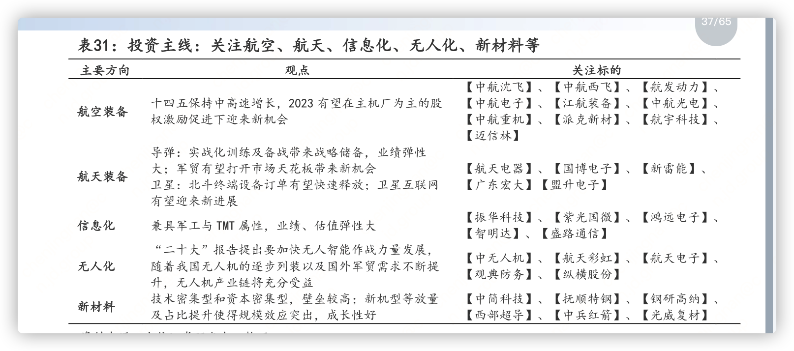
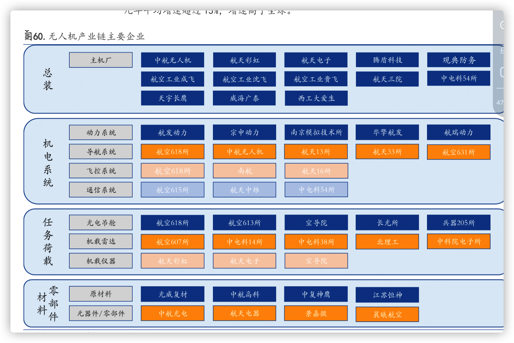

建议关注鼎龙股份，公司是国内唯一一家全面掌握 CMP 抛光垫全
流程核心研发技术和生产工艺的 CMP 抛光垫供应商，在国内抛光
垫市场中处于领先地位

建议关注濮阳惠成，公司专注顺酐酸酐衍生物和功能中间体产品的
研发和生产，受益于我国电子信息产业的快速发展、我国智能电网、

重点推荐合盛硅业，公司在工业硅及有机硅产业链完整，具备规模
优势、成本优势，上下游协同效应有望持续加强，随着在建项目的稳
步推进，公司业绩有望持续向好。 v 

美现役战斗机均为较为领先的三代机和四代机，占比分别为 83%和 17%，而我国
仍有近 50%的二代机亟需替代,四代机仅有 19 架，占比约为 2%，远低于美国。另外，当前美
国战斗机仅有重型和中型，而我国战斗机中轻型战斗机占比仍然较高；我们认为当前航空装
备需求迫切且确定性高，未来方向是数量升+结构优

